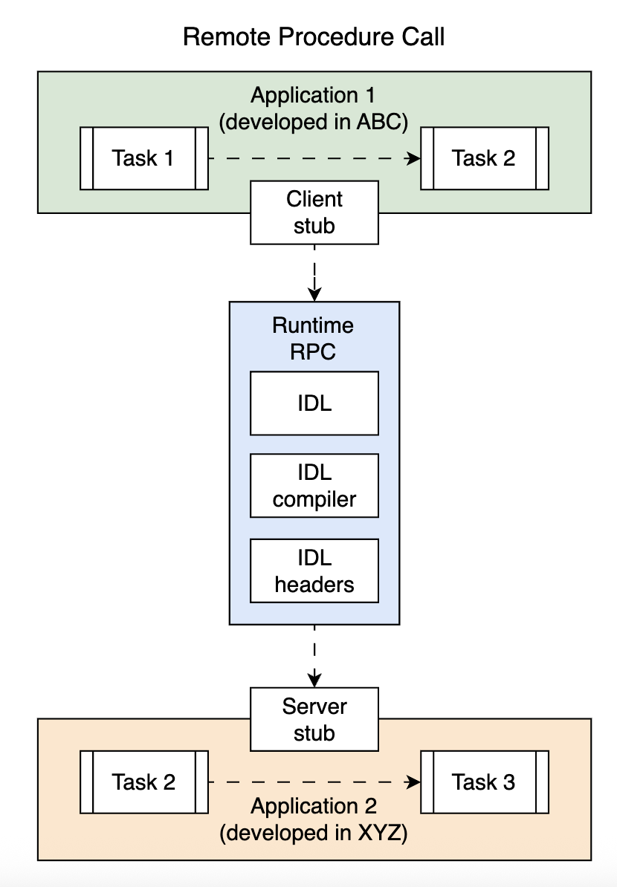
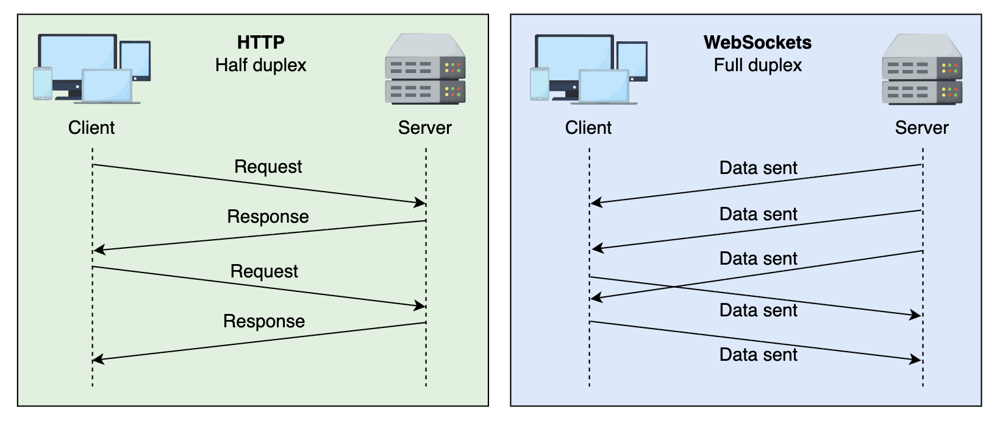

# Client-Server Communication Protocols

## Web protocols

Web protocols operate over TCP(Transmission Control Protocol)/IP, where a user clicks a link on a web page, and the browser uses DNS to resolve the domain name to its corresponding IP address before connecting to the server.

It then establishes a TCP connection, initiates a TLS handshake (if using HTTPS), and requests the web page and any related resource.

Finally, the browser renders the page, closing the TCP connections.

This information flow between clients and servers is facilitated by a hypertext transfer protocol (HTTP) protocol, as shown below:

Clients --> HTTP request --> Server
Clients <-- HTTP response <-- Server

Application-layer protocols such as the file transfer protocol (FTP), simple mail transport protocol (SMTP), HTTP, and so on use lower-layer protocols like transmission control protocol (TCP), user datagram protocol (UDP), and internet protocol (IP) to provide services to end users.

## Hypertext transfer protocol (HTTP)

The hypertext transfer protocol (HTTP) is a stateless, application-layer protocol for distributed and hypermedia information systems.

It’s the foundation of data communication and is considered the de facto standard for client-server resource sharing. Web servers and client applications (browsers) must adhere to the message formats and transmission methods provided in the HTTP specifications.

For instance, when we type a URL into a browser, the web server receives an HTTP request directing it to fetch and deliver the specified web page.

HTTP is based on request and response, where one program (the client) requests another program (the server), and the server returns a response. The client usually makes requests in the form of HTTP commands, and the server responds with data in the form of documents.

These commands are structured by different API architecture styles.

### HTTP methods

The HTTP protocol is packed with several methods that clients use to request an action from the server. These methods are discussed in the following table:

### Common HTTP Methods and Their Purpose

| HTTP Method | Purpose and Features                                                                | Status Codes                                           |
| ----------- | ----------------------------------------------------------------------------------- | ------------------------------------------------------ |
| GET         | Requests a resource from the web server.                                            | 200 OK, 404 Not Found, 304 Not Modified                |
| POST        | Sends user-generated data to the server.                                            | 201 Created, 400 Bad Request, 409 Conflict             |
| PUT         | Creates a new resource or updates the existing one. Completely replaces the target. | 200 OK, 204 No Content, 404 Not Found                  |
| PATCH       | Partially updates an existing resource. Only the specified fields are updated.      | 200 OK, 204 No Content, 404 Not Found, 400 Bad Request |
| DELETE      | Deletes a resource from the server.                                                 | 200 OK, 204 No Content, 404 Not Found                  |
| TRACE       | Echos the content of an incoming HTTP request. Mainly used for debugging.           | 200 OK                                                 |
| CONNECT     | Makes a secure connection with a web server.                                        | 200 OK (tunnel), 403 Forbidden (blocked)               |
| OPTIONS     | Queries options for a page supported by a web server.                               | 200 OK, 405 Method Not Allowed                         |
| HEAD        | Requests information regarding a resource. Faster, brief response.                  | 200 OK, 404 Not Found, 403 Forbidden                   |

---

### HTTP message flow

HTTP communication is initiated by the clients sending a request to the server, and as long as the request conforms to HTTP standards, the server will respond with the requested resources, regardless of the type of client

### HTTP request structure

An HTTP request message is composed of the following four components:

**_Method_**

HTTP provides built-in methods that determine what action a client wants to request/perform.

**_The request-target and version_**

It can be a URL or URI, a unique address or identifier that uniquely determines a resource’s location over the internet.

For example, the URL https://www.example.com/courses/course1 uniquely identifies an Example site's course titled course1.

**_Version_**
It also shows which version of HTTP is being used. The version part contains the HTTP version used for the request, for example, HTTP/1.1 or HTTP/2.0.

**_Headers_**

HTTP headers allow clients to pass additional information between the communicating entities. The request headers mainly contain the following information:

- Server information from where data is requested.

- Information about the browser being used by the user.

- The kind of data formats a client can accept.

**_Body_**

The body part of the HTTP request is used to communicate any application data a client wants to send to the server.

### HTTP response structure

The HTTP response has the same format as the request with the following modifications:

- The method in the request is replaced with the HTTP version in response.

- The URL in the request is replaced with a status code in response.

- The HTTP version in the request is replaced with the phrase in response.

### HTTP request and response example

A sample HTTP request and response is shown below, including all the parts:

REQUEST

```bash
POST /articles/index.html HTTP/1.1
Host: www.example.com
Connection: Keep-Alive
User-Agent: Mozilla/5.0
Content-Type: application/json
Content-Length: 80
Accept-Language: en-us
Accept-Encoding: gzip, deflate
{
  "Id": 45321,
  "Customer": "Mark Brown",
  "Quantity": 10,
  "Price": 199.0
}
```

RESPONSE

```bash
HTTP/1.1 200 OK
Content-Type: application/json
Content-Length: 123
{
  "Status": "Success",
  "Message": "Article created successfully.",
  "ArticleId": 45321
}
```

Note: HTTP is a stateless protocol used for communication between clients and servers, but it transmits data in plain text.
HTTPS enhances security by encrypting data using TLS/SSL, ensuring secure and private communication.

> Q: Which parts of the request and response messages are encrypted while using HTTPS?

> A: HTTPS is HTTP over the secure sockets layer (SSL); therefore, the HTTP request and response, including the headers and body, are encrypted using HTTPS. The DNS resolution and connection setup can reveal other details, such as the full domain or subdomain and the originating IP address.

But as we all know, HTTP has evolved and comes with different versions, i.e., HTTP/1.1, HTTP/2.0, etc. The following table summarizes the differences between different versions of HTTP:

### Comparison of Different Versions of HTTP

| Version  | Methods Supported                            | Header Support | Connection Nature | Other Features                                                                                     |
| -------- | -------------------------------------------- | -------------- | ----------------- | -------------------------------------------------------------------------------------------------- |
| HTTP/1.1 | HEAD, GET, POST, PUT, DELETE, TRACE, OPTIONS | Yes            | Persistent        | Extended methods, pipelining, encoding, virtual hosting, upgrade header, cache headers             |
| HTTP/2.0 | HEAD, GET, POST, PUT, DELETE, TRACE, OPTIONS | Yes            | Persistent        | Backward compatibility, multiplexing, header compression (reduces latency and optimizes bandwidth) |
| HTTP/3.0 | HEAD, GET, POST, PUT, DELETE, TRACE, OPTIONS | Yes            | Persistent        | Uses QUIC over UDP, solves head-of-line blocking, 3x faster than HTTP/1.1                          |

---

# Remote procedure call (RPC)

A remote procedure call (RPC) architecture is a service or action-oriented style of creating APIs, where resources are distributed among different services running on remote machines. RPC facilitates interprocess communication by enabling clients to run remote procedures (functions) in a simple local function-call-like abstraction.

A generic RPC architecture is shown in the illustration below:



Interprocess communication over an RPC architecture

## RPC Components Table

| Component                  | Description                                                                                                                                                                                  |
| -------------------------- | -------------------------------------------------------------------------------------------------------------------------------------------------------------------------------------------- |
| Client stub                | Representation of the function in the client-side environment. Receives the function call from the client application, which is packed into an RPC message and forwarded to the runtime RPC. |
| Runtime RPC                |                                                                                                                                                                                              |
| Runtime RPC > IDL          | Interface definition language, used to define functions at remote ends.                                                                                                                      |
| Runtime RPC > IDL compiler | Generates client- and server-side compatible code for client and server stubs.                                                                                                               |
| Runtime RPC > IDL header   | List of available functions that can be used by clients and servers.                                                                                                                         |
| Server stub                | Representation of the function in the server-side environment. Receives the RPC message from the runtime RPC, which is unpacked into a server-side function call.                            |

---

The RPC runtime is the actual software program that does the heavy lifting and glues all the components together. It communicates with the underlying operating system and network interface to transfer data over the wire.

## How does RPC work?

RPC follows a request-response model. The client initiates a call, and data is packed and forwarded to the RPC runtime. A network connection is established to transmit the request to the remote server. The server processes the request and sends back the response through the same process.

### Request and response

Before we discuss the request initialization, we must understand the two IDL header types.

**_Import module_**
A component added to the client side, specifying a list of functions it can call.

**_Export module_**
A component added to the server side, specifying a list of functions it can perform.

The import and export modules defined in the IDL headers maintain a list of remote functions provided by the API, along with the format of input parameters and returned responses.

A client initiates an RPC request, which must specify a function identifier and parameter list consistent with the signatures provided by the IDL import module.

Let’s look at a hypothetical example of an RPC available at the example.com/rpc-demo endpoint.

We’ll call the demo RPC that accepts a single string parameter of greeting. The request and response headers sent and received by a JSON-RPC client are as follows:

**_Request_**

The HTTP post request headers for the JSON-RPC service are as follows:

```bash
POST example.com/rpc-demo HTTP/1.1
Content-Type: application/json
Content-Length: xxx

{
"jsonrpc": "2.0",
"method": "demo",
"params": ["greeting": "Hi"],
"id": "99"
}
```

Response
For a successful API call, the returned HTTP response headers look like this:

```bash
HTTP/1.1 200 OK
Content-Type: application/json
Content-Length: xxx

{
"jsonrpc": "2.0",
"id": "99" ,
"result": "Hello!"
}
```

Note: For simplicity, we’ve removed unnecessary fields from the request and response headers given above.

# WebSockets

WebSocket was introduced in 2011 to enable **_full-duplex asynchronous communication_** over a single TCP connection to use resources efficiently.

HTTP connection restricts TCP to a one-sided communication, where the client always starts the communication due to the request-response model.

In other words, the client first sends requests, then the server responds to them, which is a half-duplex communication.

In contrast,**_ WebSockets fully utilize the TCP connection, allowing clients and servers to send or receive data on demand_**, as follows:



Half-duplex HTTP and full-duplex WebSocket connections

WebSocket leverages the core TCP channel utilizing its full-duplex nature. Data can be sent and received simultaneously by the client and the server. Websocket is a stateful protocol that performs relatively faster than HTTP because it’s lightweight and carries the overhead of large headers with each request.

## How does it work?

A WebSocket connection starts with an HTTP connection established through a three-way TCP handshake.
Afterward, an HTTP GET request is initiated to switch the protocol to WebSocket.
The connection upgrade request can be accepted or rejected by the HTTP server.

If the server is compatible with the WebSocket protocol and the upgrade request is valid, the connection is upgraded to a WebSocket connection.

The response contains the status code 101 (Switching Protocols) and the value for the field, Sec-WebSocket-Accept.

HTTP Upgrade headers
The headers of the initial switching protocol request are shown below:

The Upgrade request

```bash
GET / HTTP/1.1
Connection: Upgrade
Upgrade: websocket
Sec-WebSocket-Key: eB9AWsQe8+SDcwWRjpGSow==
sec-websocket-version: 13
```

The Upgrade response

```bash
HTTP/1.1 101 Switching Protocols
Upgrade: websocket
Connection: Upgrade
Sec-WebSocket-Accept: zglqWZt8l79gwpiFBgKihrobE8I=
```

Note: For simplicity, we have removed some fields from the headers above.

The headers above contain the following noticeable fields:

- **_Status code 101_** shows that the protocol is successfully upgraded and can send WebSocket frames.

- The **_Sec-WebSocket-Key_** is a base64-encoded 16-byte value that the server uses to verify that the upgrade request is coming from a legitimate client that understands the WebSocket protocol, and not a malformed HTTP request. This value is then encrypted using a hashing algorithm like SHA, MD5, and so on.

- The server decrypts the value of the **_Sec-WebSocket-Key_** and generates the **_Sec-WebSocket-Accept_** field by prepending a Globally Unique Identifier (GUID) value to the client-provided **_Sec-WebSocket-Key_**. The value of **_Sec-WebSocket-Accept_** is also encrypted and sent back to the client, indicating that the server has accepted the connection upgrade.

Initial control frames are exchanged once the connection is established and successfully upgraded to WebSocket protocol. WebSocket has two types of frames: control and data frames, identified by a 4-bit opcode.

> Q: Why is it difficult to scale WebSockets horizontally?

> A: Due to WebSocket’s stateful nature, both endpoints are bound to the channel, and we cannot add more machines to reroute requests and distribute the workload among different servers.

> While horizontally scaling a single WebSocket connection is difficult, distributing different WebSocket connections to different servers can be achieved by an appropriate intermediary, such as a load balancer or an API gateway.

After discussing different communication protocols, let’s recap the findings. The following table summarizes and compares the communication protocols against different features:

### Protocol Comparison Table

| Feature            | HTTP                            | RPC                                                   | WebSockets                                   |
| ------------------ | ------------------------------- | ----------------------------------------------------- | -------------------------------------------- |
| Communication type | Request-Response (Stateless)    | Request-Response (Can be Stateful)                    | Full-Duplex (Bidirectional)                  |
| Transport protocol | HTTP (Mostly over TCP)          | TCP (Uses HTTP/2 in gRPC)                             | TCP                                          |
| Message format     | Text (JSON, HTML, XML)          | Binary (Protobuf, Thrift, etc.)                       | Binary or Text (JSON, Protobuf, etc.)        |
| Performance        | Moderate                        | High (Optimized for speed)                            | High (Persistent connection)                 |
| Use cases          | Request-response interactions   | Service-service communication, Remote Procedure Calls | Real-time applications, Chat, Live Streaming |
| Connections        | Opens and closes per request    | Can maintain persistent connections                   | Persistent connection                        |
| Overhead           | High (Headers in every request) | Lower than HTTP (Binary format, efficient encoding)   | Low (Single connection, minimal overhead)    |

# Conclusion

This lesson discussed HTTP, RPC, and WebSockets, comparing their communication models, performance, and use cases. Each protocol serves different needs:

- HTTP for standard web requests
- RPC for efficient service-to-service communication
- WebSockets for real-time interactions

Allowing us to choose the best fit based on our use case.
