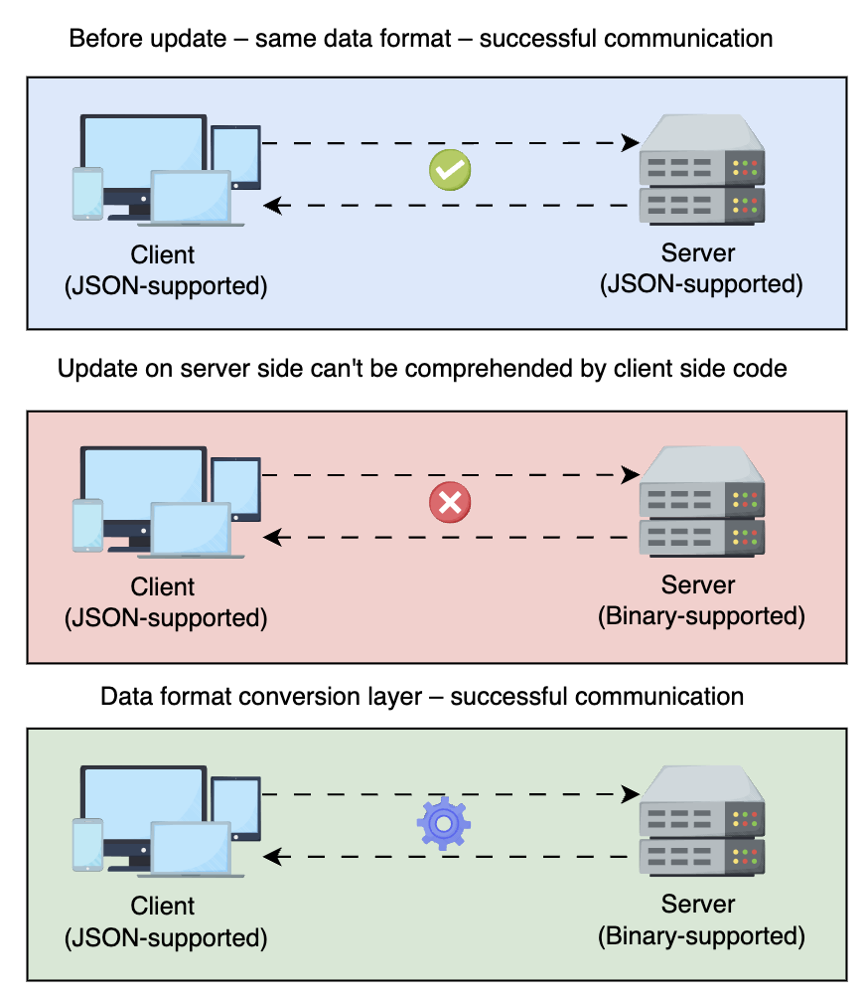
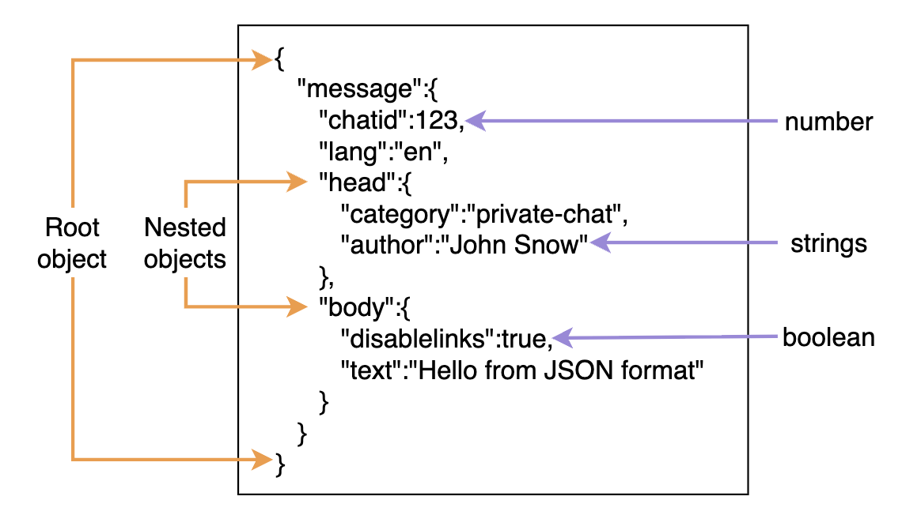
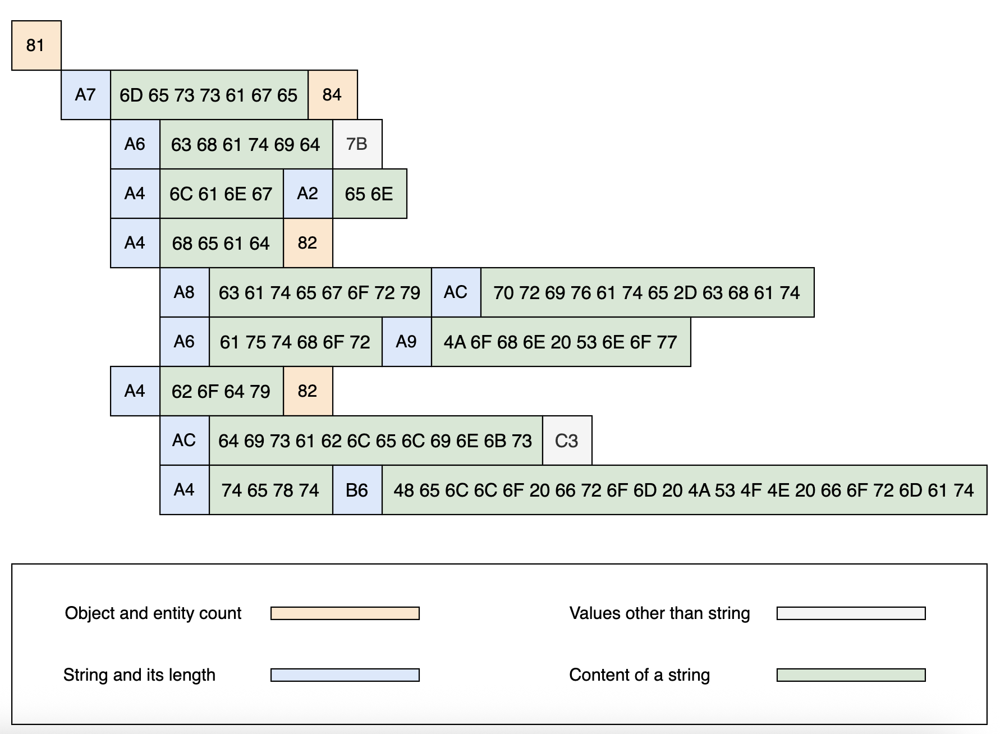

# Data Formats for Communication

Clients and servers communicate by exchanging data using a request-response model. An essential aspect of this communication is the data format(s) used for exchanging information.

This significant factor sets the difference between an effective and an inept API. One aspect of frontend System Design is the choice of a data format that both the client and server can understand conveniently and enhance the system’s performance.

The choice of data format is only the first step to a standardized information flow between the sending and receiving parties.
Rapidly changing industry demands make it inevitable to change or update the chosen data formats over time.

Making changes to the server side may also require updating the client side. It’s relatively easy to reflect changes for the browser-based client interfaces where a simple refresh may be enough to push the client to a newer version. But for the clients that use installed software—such as mobile applications, to interact with the service, we often use rolling software updates, where the more recent version is gradually installed on the client-side.

Therefore, data representation and data versioning are important concerns during design. The discussed scenario is depicted in the image below:


The impact of different data formats after updates

## Choosing a Data Format

The best data format for a design problem is a tradeoff between different factors and the features a specific format provides. In general, a format is considered to be a good choice if it supports the following:

- **Human-readable:** Easy to read and debug by developers
- **Low latency:** Fast to transmit over the wire
- **Standardized:** Follows a well-defined pattern in the industry
- **Machine friendly:** Needs less time to be processed by machines
- **Interoperable:** Easy to serialize and deserialize data into different formats
- **Flexible:** Easy to introduce and manage changes over time

## Choosing an Inappropriate Data Format

Selecting an inappropriate data format for communication between the frontend and backend can lead to increased computational overhead, unnecessary conversions, and potential data inconsistencies.

When the frontend expects data in a specific format (Format X) but the backend provides it in a different format (Format Y), an additional conversion layer must process the data before it can be used. Over time, as either the frontend or backend evolves, outdated conversion logic may lead to data corruption, inaccuracies, and unexpected application behavior.

For instance, a video streaming platform that expects JSON metadata for video details but receives XML responses from the backend will require continuous conversion before rendering. If the API format changes without proper handling, essential fields like video duration, captions, or resolutions may become unreadable or incorrectly mapped, degrading the user experience.


Data conversion layer between the frontend and the backend

Choosing the right data format upfront—whether JSON, Protocol Buffers (Protobuf), etc.—ensures that the frontend receives data efficiently, structured, and easily consumable.

We can divide the different data formats available into two broad categories:

1 - **Textual data formats**
2 - **Binary data formats**

Let’s explore both of the data formats.

### Textual Data Formats

JSON, XML, and CSV are data representation formats that use Unicode characters (text) and support encoding in many languages. The most popular way clients interact with web APIs is by serializing data into XML and JSON formats.

CSV is less powerful than XML and JSON because it doesn’t support the data hierarchy and is commonly used when dealing with data in tabular form.

These structures have a standardized encoding style, and clients can easily extract and consume data by deserializing it into their respective languages.

Text-based representation formats have the following common characteristics:

- **Schemaless structure:** Data-related information (metadata) is embedded within the format structure.
- **Machine-readable:** The data is well structured and can be easily interpreted by machines.
- **Human-readable:** Data is represented in Unicode characters that humans can read and understand.
- **Object representation:** Data can embed programming objects in a defined format.

The following sections discuss XML and JSON, two well-known text data formats for developing APIs.

#### XML

Extensible Markup Language (XML) is a restricted form/subset of Standard Generalized Markup Language (SGML) designed to store and exchange data on the web.

XML has a syntax similar to HTML documents. It uses tags to construct objects, but unlike HTML, tags are not predefined.

This means that users can create custom tags to define elements. Generally, tags are used as keys to identify data elements and can also have attributes defining metadata that can help data filtering and sorting, etc.

An element’s value is stored within an object’s opening and closing tags.

The structure of an XML message is shown below:

```xml
<?xml version="1.0" encoding="UTF-8"?>
<message chatid="123" lang="en">
  <head category="private-chat"> <warning>Some  alerts</warning>
  </head>

<body disablelinks="true">
    <author>John Snow</author>
   <text>Hello from XML format</text>
  </body>
</message>
```

#### JSON

JavaScript Object Notation (JSON) is a subset of the JavaScript language and is famous for its built-in browser support.

It efficiently handles client-side and server-side scripts with the added benefit of simplicity and readability.

It uses colon-separated key-value pairs to describe data attributes.

JSON supports four data types: strings, numbers, booleans, and null.

The data is structured using the following six characters:

- Left curly bracket ({): Marks the start of a data object.

- Right curly bracket (}): Marks the end of a data object.

- Left square bracket ([): Indicates the start of an array.

- Right square bracket (]): Indicates the end of an array.

- Colon (:): Separates the key/name from the value.

- Comma (,): Separate key-value pairs from each other.

Here is the JSON representation of the same message object that was discussed in the earlier section on XML format:


An example of JSON data format

JSON allows nested arrays and objects. In the code snippet above, the message is an object, and its members head and body are also objects that are nested inside it. All the keys are represented as a string, and its value must be a string, number, boolean, array, object, or null.

#### Comparison of Textual Data Formats

| Feature          | XML                                                            | JSON                                       |
| ---------------- | -------------------------------------------------------------- | ------------------------------------------ |
| Human-readable   | Yes, but requires more effort compared to JSON.                | Yes, key-value pairs are easier to read.   |
| Latency          | High, due to larger size.                                      | Low, because it’s compact.                 |
| Standardized     | Supports partial standardization (namespace, optional schema). | Not common; optional schema rarely used.   |
| Machine friendly | No                                                             | No                                         |
| Interoperable    | Used in multiple domains, can deal with various systems.       | Popular with JS-based systems, others too. |
| Flexible         | Full compatibility (forward/backward compatible).              | Full compatibility.                        |

> Q: Why is JSON so popular in web applications?

> A: JSON is designed to represent the data structures present in most programming languages ​​in a simpler way without having to learn the tree-based data binding provided by formats like XML. The semantics of JSON for representing data structures are similar to those of programming languages, which makes it easier to learn and interpret data objects from JSON. Additionally, JavaScript is the most commonly used language in web applications, further driving the adaptation of JSON in the web industry.

---

> Q: When should we prefer XML over JSON?

> A: Both XML and JSON have similar properties. However, XML may be preferable to JSON when the data contains complex structures, such as those found in books, articles, and other datasets. XML can represent documents containing various data structures because it represents data in a tree-like format, making it easier to manage different data structures in an organized manner. It also supports custom attributes and provides methods such as XPath and XQuery, which are suitable for large metadata sets representing complex structures.

### Binary Data Formats

Text-based data representation is often preferred when interacting with different clients, especially when client implementations are outside an organization’s control.

For internal use, such as in iOS and Android applications (where the organization controls both ends of the communication tightly), binary data formats are often used.

Binary encoding formats share the following benefits:

- **Machine-friendly:** Data is in binary format and can be processed with little or no preprocessing.
- **Schema dependent:** Data-related information is defined in the schema document.
- **Portability:** Binary formats can be easily deserialized into different languages with the same encoding/decoding schema.
- **Precision support:** Can more precisely store large numbers and floating-point numbers.
- **Standardized:** Uses a well-defined, well-documented schema and can be standardized across implementations.

**_What is a Schema Document?_**
A schema document contains templates on how to structure data into a specific format. For example, the following schema defined in JSON represents the structure of a post object to be encoded in binary format.

```json
{
  "type": "record",
  "name": "Post",
  "fields": [
    { "name": "postURL", "type": "string" },
    { "name": "postID", "type": "long" },
    { "name": "postTags", "type": { "type": "array", "items": "string" } }
  ]
}
```

Here, we are defining that the data is divided into different records, where each record is an object of class Post and it has the following attributes:

- The variable postURL is of type string.
- The variable postID is of type long.
- The variable postTags is an array of elements of the type string.

Many binary formats exist, such as MessagePack, Fast Infoset, BSON, WBXML, Protobuf, Thrift, Avro, etc.

Let’s see how the message object below looks when encoded in MessagePack, a binary variant of JSON.

JSON

```json
{
  "message": {
    "chatid": 123,
    "lang": "en",
    "head": {
      "category": "private-chat",
      "author": "John Snow"
    },
    "body": {
      "disablelinks": true,
      "text": "Hello from JSON format"
    }
  }
}
```

The binary version of the above message object is demonstrated in the image below:


#### Thrift and Protobuf

Protocol buffers (Protobuf) and Apache Thrift are the most commonly used binary data formats.

Google developed Protocol Buffers, and Facebook developed Apache Thrift.

Both these binary encoding libraries follow similar rules and have been open-sourced for standardized public use.

They have a similar-looking schema, shown below:

Apache Thrift (Facebook)

```bash
struct Node {
  1: required i64 nodeID,
  2: optional string nodeContent,
  3: optional list<string> nodeLinks
}
```

Protocol buffers (Protobuf) (Google)

```bash
message Node {
  required int64 node_id = 1;
  optional string node_content = 2;
  repeated string node_links = 3;
}
```

We can break these schema definitions as follows:

- **_Tags_**: Each field is identified by the numbers equivalent to the names.
  For example, 1 identifies the fields nodeID for Thrift and node_id for Protobuf.
  These tags are encoded in data rather than field names, allowing for a more compact representation.

- **_Labels_**: The markers required, optional, and repeated (Protobuf only) imply checks to determine whether to raise an error when encoding or decoding data. These markers are only added to the schema but are not encoded in the transmitted data.

- **_Types_**: Each field can define its data type (string, i64, int64, etc.) by specifying a type marker. Protobuf does not have a type to represent arrays, and it uses the repeated label to show that the data can have multiple occurrences.

- **_Names_**: The markers (nodeID, node_id, etc.) represent the names of the data entity. One thing worth noting is that these are not identifiers for fields, which allow the name to be changed without affecting the implementation.

Note: The use of the label, repeated, in Protobuf allows flexibility to change a single variable to an array of variables in different schema versions, but it’s only valid for optional fields, otherwise it can cause compatibility problems.

#### Apache Avro

Apache Avro is also an open-source binary encoding format developed by Hadoop.

It supports two schema styles: Avro IDL and JSON-based definitions. Avro doesn’t add tags and types like Thrift and Protobuf and uses a value-only data encoding style.

It relies on the schema version defined in the data reader to identify the fields when decoded. The Avro library, as shown below, resolves conflicts between the reader’s and writer’s schema.


Avro schema conflict resolution of a post record

Here, the field name is used as the field’s identifier, so the records can be in any order as long as the field name remains the same.

If the reader code finds a field not in the reader schema, it ignores that field. On the other hand, if the record doesn’t contain the fields expected by the reader schema, the reader code populates it with the default values ​​specified in the reader schema.

#### Comparison of Binary Data Formats

| Feature          | Thrift                                  | Protobuf                                 | Avro                                      |
| ---------------- | --------------------------------------- | ---------------------------------------- | ----------------------------------------- |
| Schema document  | Static                                  | Static                                   | Static and dynamic                        |
| Human-readable   | No                                      | No                                       | No                                        |
| Low latency      | Fast data transfer due to compact size. | Faster data transfer, more compact size. | Fastest data transfer, most compact size. |
| Standardized     | Yes                                     | Yes                                      | Yes                                       |
| Machine friendly | Yes                                     | Yes                                      | Yes                                       |
| Interoperable    | Yes                                     | Yes                                      | Yes                                       |
| Flexible         | Full compatibility                      | Full compatibility                       | Full compatibility                        |

> Q: You’re integrating a large video file player on the frontend. Should you use JSON, XML, or binary format for fetching media metadata, and why?
> A: Binary formats are better for large files and structured data like media metadata.
> They’re compact, faster to parse, and reduce payload size — ideal for performance-sensitive use cases. JSON/XML add overhead with human readability but are less efficient for large payloads.

---

## Conclusion

Choosing a data exchange format for an API is always debatable because each format is suitable for some use cases and may have drawbacks for others.

Here are some general recommendations:

- **JSON**: Ideal for small groups of systems, especially those developed in JavaScript, where human readability is essential.

- **XML**: Ideal for various systems with complex data structures that require markup and human readability.

- **Avro**: Ideal for large files, frequent interactions of data encoded using different schema versions, and significant encoding sizes.

- **Protobuf or Thrift**: Best when network latency, interprocess communication, and processing speed are paramount.

Other formats, such as YAML, FormData, etc., can also be considered. If needed, a custom format can be introduced when existing formats don’t meet requirements.
