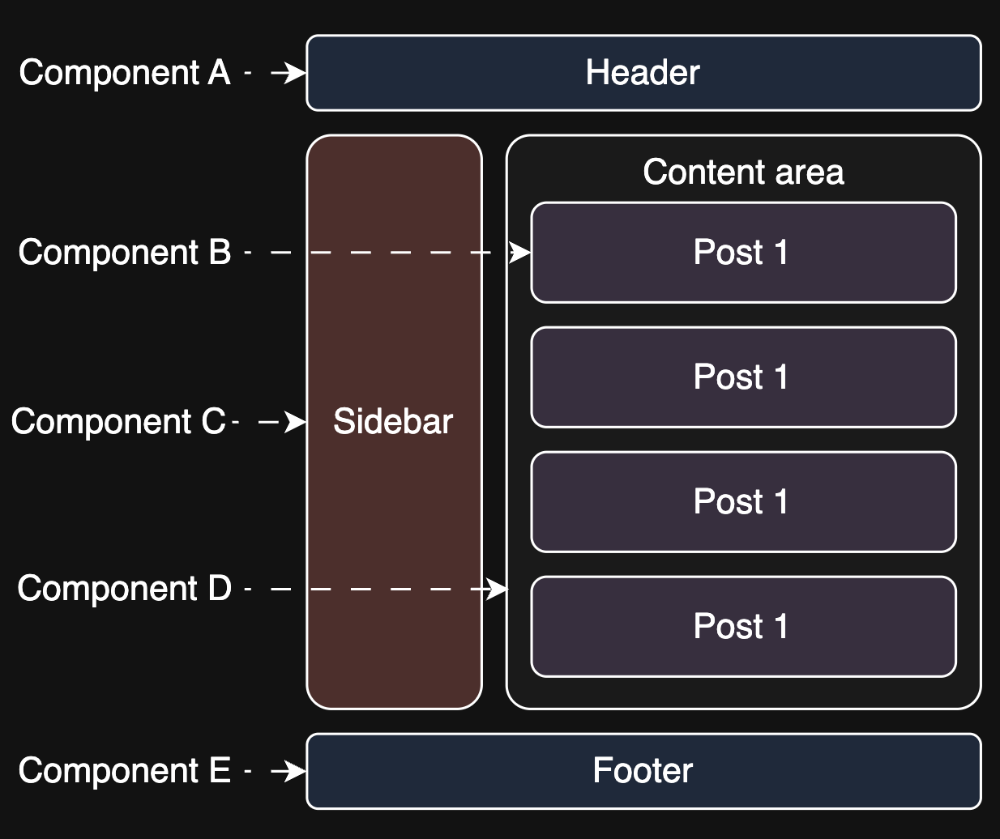

# Component-Based Architecture in Frontend Systems

Learn core component-based design principles, ensuring reusability, scalability, and maintainability in modern frontend applications.

In the early days of web development, UIs were often built monolithically; HTML, CSS, and JavaScript were entangled in a single file or loosely separated, often with repetitive code scattered across the app.

This led to common problems:

- Making one UI change meant editing multiple files or duplicating code.
- Reusing a UI pattern (like a button, input, or card) required copy-pasting.
- Debugging became a nightmare in large codebases with no clear structure.
- Consistency was hard to enforce, both visually and behaviorally.

As applications matured, developers needed a way to encapsulate UI behavior and styling into self-contained units, to build larger systems by composing smaller, reusable pieces like how microservices changed backend design.

This set the stage for a new approach to frontend design, one in which the UI isn’t a single large surface to be hacked together but a system of smaller, interchangeable parts that can be composed with purpose and reused intelligently, a component-based architecture (CBA).

---

## What is component-based architecture?

Component-based architecture (CBA) is a design approach in which a user interface is broken down into self-contained, reusable units called components. Each component encapsulates a specific piece of UI, including its structure (HTML/JSX), behavior (JavaScript/logic), and styling (CSS), making it a single responsibility unit within the larger application.

Instead of building an interface top-down in one large file, CBA enables you to compose interfaces bottom-up, like building with LEGO blocks. You might start with small elements (buttons, input fields), group them into reusable components (forms, cards), and then nest them into higher-level views (pages, layouts).

For example, a simple Button component might look like this in React:

```javascript
function Button({ label, onClick }) {
  return (
    <button className="btn" onClick={onClick}>
      {label}
    </button>
  );
}
```

This can now be reused across the app with different labels or behaviors, maintaining visual and behavioral consistency. Components are composable, meaning large interfaces are built by nesting smaller components:


An example of components nested to form a page

---

## Component life cycle

Once we define components, we must understand their life cycle; components go through phases; they are created, updated, and eventually removed when no longer needed. Managing these transitions properly ensures smooth user experiences and optimal performance. A typical component life cycle consists of three key phases:

### Mounting (initialization)

The component is born; it appears in the UI, loads data, and sets up interactions (e.g., fetching user info when a profile page loads).

### Updating (state/props changes)

The component adapts; it reacts to user inputs, re-renders when needed, and keeps the UI dynamic (e.g., a chat message appears instantly after being sent).

### Unmounting (cleanup)

The component disappears; it removes event listeners, clears memory, and prevents unnecessary resource consumption.

---

## How do components interact?

In a CBA, interaction between components is central to building dynamic and responsive user interfaces. Components must share data, communicate user actions, and react to changes, all while maintaining modularity and independence.

### Top-down data flow (Props)

In most component-based systems (especially in unidirectional data flow frameworks like React), data flows from parent to child through props.

Here, the name value is passed from the parent down to the child, a clean, predictable flow of data that supports modularity and testability.

```javascript
function WelcomeMessage({ name }) {
  return <h1>Welcome, {name}!</h1>;
}
<WelcomeMessage name="Alice" />;
```

Above, an example of data flow from parent to child using props

### Event communication (callback functions)

Components use callbacks to send data from child to parent; the parent passes a function as a prop, and the child executes it when needed.

```javascript
function Button({ onClick }) {
  return <button onClick={onClick}>Click Me</button>;
}
<Button
  onClick={() => console.log("Clicked, console logged from the callback!")}
/>;
```

Above, an example of event communication through callback function

This decouples the child from the parent’s internal logic while allowing communication.

### State lifting

When two sibling components must share a state (e.g., form input and a preview component), the state is often lifted to its common parent, which distributes data via props. This preserves the top-down flow and avoids tightly coupling components together.

### Context or global state (advanced)

For deeper or more distributed component trees, tools like React Context, Vuex, or external stores (Redux, Zustand, Pinia) share the state without prop drilling. This allows global or shared state (e.g., authentication, theme, language) to be accessed and updated anywhere in the component tree.

> Note: State management plays a vital role in this process. Some components manage their own local state (like a search bar updating as the user types). In contrast, others rely on global state tools to maintain consistency across the application.

---

## Component design principles

A component is more than just a piece of UI; it’s a unit of responsibility. And like any unit in software, poorly designed components can introduce complexity, bugs, and duplication. Great components follow principles that make them predictable, testable, and easy to work with.

Key principles:

- **Single responsibility:** A component should do one thing well.

  > Example: A UserCard should display a user’s profile; not fetch the data, format the date, and handle click actions all at once.

- **Reusability:** Components should be generic enough to be reused with props.

  > Example: A Button that takes label, variant, and onClick can be reused across forms, modals, and toolbars—instead of hardcoding styles or labels.

- **Composability:** Build complex UI by composing smaller components.

> Example: Think of a Modal composed of ModalHeader, ModalBody, and ModalFooter, each handling its own subresponsibility.

- **Isolation and encapsulation:** Encapsulate logic, styles, and markup; avoid leaking styles.

- **Naming and structure:** Use clear names and organize components in folders reflecting app hierarchy.
  Components should be organized in a folder structure that reflects application hierarchy, not arbitrary groupings (e.g., avoid putting everything into /components).

Well-designed components are the building blocks of frontend System Design. They create consistency, facilitate collaboration, and confidently enable future scaling.

### Q and As

> Q: Can components be too small?
> Yes. While small components are great for reuse and clarity, splitting them into tiny units (e.g., one for a label, another for a value) can make the code harder to read and maintain. The goal is meaningful separation—a component should encapsulate a logical UI element, not just an HTML tag.

---

> Q: How do component boundaries impact collaboration in teams?
> A: Clear component boundaries make it easier for teams to work in parallel without overlapping responsibilities or causing conflicts. They define ownership, reduce merge conflicts, and simplify onboarding. When boundaries are vague, work overlaps, bugs increase, and development slows down.

Once we start designing individual components well, the next challenge is organizing them across our application. This means establishing a clear component hierarchy in large systems that supports scalability, reusability, and team collaboration.

---

## Component hierarchy and application structure

The CBA scales best when components are organized visually, logically, and functionally into a clear, hierarchical structure. This hierarchy reflects UI layout and responsibility delegation, making the application easier to manage as it grows.

Typical hierarchy:

- App: Root of the application, bootstraps everything
- Layout: Global structure shared across pages (e.g., navbars, footers)
- Pages: View-level containers to define routes and organize logic
- Shared components: Reusable UI blocks like buttons, inputs, cards, etc.

```bash
[ App ]
  ├── [ Layout ]
  │     ├── [ Header ]
  │     ├── [ Sidebar ]
  │     └── [ Footer ]
  ├── [ Pages ]
  │     ├── [ HomePage ]
  │     ├── [ ProfilePage ]
  │     └── [ SettingsPage ]
  └── [ Shared Components ]
        ├── [ Button ]
        ├── [ Card ]
        └── [ Modal ]
```

Structure tips:

- Smart (container) components: Handle data fetching, state, and logic.
- Dumb (presentational) components: Focus only on displaying data via props.

---

## CBA vs. micro-frontends

At this point, we’ve seen how components are structured and organized within a single frontend application. But what if different teams own different parts of that app and need to develop, test, and deploy their features independently? That’s where people often confuse component-based architecture with micro-frontend architecture.

While both CBA and micro-frontend architecture (MFA) promote modularity and separation of concerns, they operate at very different scales in code and organizational boundaries.

CBA focuses on modularity within a single application. It helps break the UI into smaller, reusable, and testable components managed within the same codebase. It’s about organizing and composing code, not distributing ownership.

> Example: Button, Card, Header, Form, UserProfile

MFA is about splitting the entire application into independently owned and deployable parts, often by different teams. Each team builds and ships its micro-frontend independently, which is later composed at runtime or build-time.

> Example: Entire Search, Newsfeed, or Checkout as micro-frontends.

- **Scope:** CBA is intra-app; MFA is cross-app.
- **Ownership:** CBA often within a single team; MFA spans multiple teams.
- **Codebase:** CBA uses a shared codebase; MFA uses separate codebases.
- **Deployment:** CBA typically one pipeline; MFA supports independent deployments.
- **Communication:** CBA uses props/callbacks; MFA uses events/global state/APIs.
- **Use case:** CBA for UI reuse; MFA for org-scale autonomy.

---

## Challenges in CBA

While CBA offers clear benefits regarding modularity and reusability, it also introduces challenges—especially as applications grow and component trees deepen.

Understanding these pitfalls helps teams adopt CBA more thoughtfully and avoid common traps.

Component-based systems often start clean, but they can spiral into complexity without good design practices and discipline.

Let’s explore some of the most common challenges teams face when scaling a component-based frontend:

**_Prop drilling_**: Passing data through multiple levels of nested components to reach a deeply nested child leads to fragile and verbose code.
For example, passing a userId from the app level down through 5 components, even though only the last one needs it.

**_Over-abstraction_**: Creating generic components too early or for unclear use cases often results in bloated, hard-to-read components that are reused inconsistently. For example, a single FormField component that tries to handle every input type, label layout, validation rule, and icon combination.

**_State management_**: Deciding where the state should live—local, shared, lifted, or global—becomes tricky as components multiply and interact. For example, storing all states in one parent leads to bulky components, and duplicating states leads to inconsistency.

**_Styling conflicts_**: Without proper scoping, styles from one component can leak into others, unexpectedly breaking layout or visuals. For example, global CSS classes or ID selectors unexpectedly override each other.

**_Component sprawl_**: Over time, teams may create dozens of similar but slightly different components (Card, InfoCard, UserCard, ProductCard), increasing maintenance costs.

Common challenges and solutions:

| Challenge         | Solution                                                         |
| ----------------- | ---------------------------------------------------------------- |
| Prop drilling     | Use context API or global store for widely shared state          |
| Over-abstraction  | Abstract only when repetition is proven; keep components focused |
| State management  | Keep local state local; lift or share only when needed           |
| Styling conflicts | Use scoped CSS, CSS Modules, or utility-first frameworks         |
| Component sprawl  | Maintain a shared design system and audit components regularly   |

### Q and As

> Q: Why is it important to limit the global state in a component system?

> A: Global state is powerful but comes with a cost, as it increases coupling across components and can lead to unexpected side effects when the state changes.

> Limiting the global state helps preserve component independence and makes debugging and testing easier. Use local state by default and reach for global state only when necessary (e.g., auth, theme, language).

---

## Conclusion

This lesson explored how modern frontend systems are built using CBA, which breaks down user interfaces into reusable, isolated, and composable parts. We discussed the motivations behind this approach, how components interact, how to structure them hierarchically, and what design principles make them effective.

We also made an important distinction between CBA and micro-frontends, highlighting common challenges like prop drilling, state complexity, and styling conflicts and how to avoid them.

By understanding how to design and organize components well, we’re laying the foundation for building scalable and maintainable frontend systems, no matter the size of the project or team.
