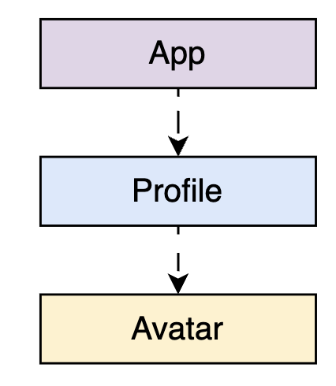
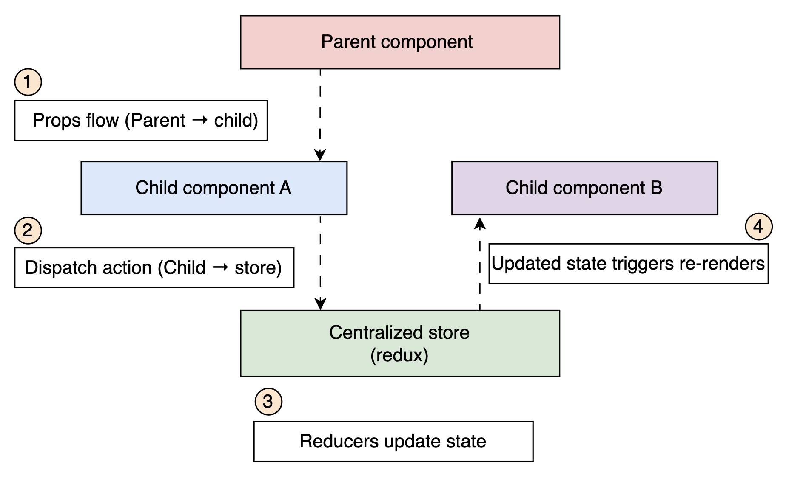
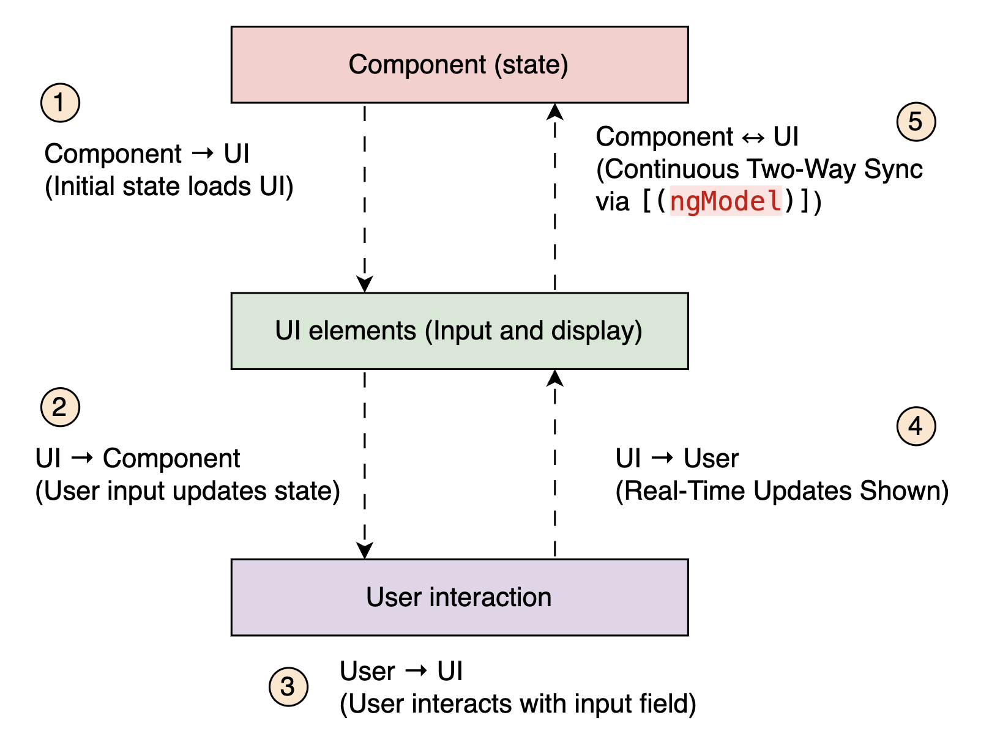

# Data Flow Patterns in Frontend System Design

Explore data flow patterns in frontend System Design, their trade-offs, use cases, and best practices.

So far, we’ve explored frontend architectures, components, micro-frontends, and data retrieval. But just as critical is understanding how data moves through a frontend system.

As applications grow, they shift from a few components to large, stateful systems. Data connects everything: API calls, user input, UI updates, and business logic. If that data is handled inconsistently or passed around without structure, it quickly leads to bugs and confusion.

In this lesson, we’ll look at common data flow patterns, their trade-offs, and when to use them to keep your frontend predictable and easy to maintain. Let’s get started.

---

## What is a data flow?

Data flow in frontend systems refers to the movement and transformation of data across UI components, dictating how it’s transmitted, updated, and rendered. It shapes the way components react, communicate, and stay in sync.

Rather than just passing data, a solid data flow structure helps coordinate updates across the app, avoids conflicting changes, and keeps the user interface consistent. Moreover, A clear data flow pattern predicts UI changes, simplifies debugging, and minimizes unnecessary rerenders, leading to better performance.

Let’s start by exploring the unidirectional data flow pattern, the most widely adopted flow model in frontend frameworks.

---

## Unidirectional data flow

Unidirectional data flow means that data always flows in one direction, typically from a parent component down to its child components, while events and updates bubble up through callbacks or dispatched actions. This pattern forms the backbone of frontend frameworks like React, Redux, and Vuex, and it’s widely adopted because of its clarity and predictability.

Let’s say we have a simple component hierarchy:



An example of unidirectional data flow

- The App component passes user data to Profile via props.
- Profile passes part of that data (like avatarUrl) down to Avatar.

If something changes in the child (like a button click), it notifies the parent via a callback, and the parent decides how to update the data (rerender).

A key advantage of unidirectional data flow is that it guarantees a predictable state. Because data follows a fixed path, developers can:

- Trace changes easily: Knowing that state updates occur in a structured sequence makes debugging straightforward.

- Avoid unintended mutations: Since state changes are controlled through actions rather than direct modifications, unintentional changes to shared state are minimized.

- Facilitate error tracking: Since state updates always originate from specific actions, identifying the root cause of a bug is much simpler.

For example, React’s unidirectional data flow with props and state management solutions like Redux.

**Props:** In React, parent components pass data to child components via props, ensuring data flows downward in a controlled manner.

**State management (Redux):** Redux enforces unidirectional flow by using a centralized store where:

- Actions trigger changes.
- Reducers update the store (a centralized data store).
- The updated state propagates to components via props or context.

This structured approach prevents unpredictable state mutations and simplifies debugging in complex applications.


Unidirectional data flow in a React app

### Use case: Newsfeed application showing a list of posts

In a newsfeed, data flows top-down: the main app fetches the posts and passes them to child components like PostCard.

```javascript
// App.jsx
function App() {
  const [posts, setPosts] = useState([]);

  useEffect(() => {
    fetch("/api/posts")
      .then((res) => res.json())
      .then(setPosts);
  }, []);

  return <Newsfeed posts={posts} />;
}
// Newsfeed.jsx
function Newsfeed({ posts }) {
  return (
    <div>
      {posts.map((post) => (
        <PostCard key={post.id} data={post} />
      ))}
    </div>
  );
}
```

A sample code to depict unidirectional data flow in newsfeed

How data flows:

- App owns the data (posts).
- Passes it down via props.
- Child components are purely presentational, using props from the parent.

Note: Platforms like Instagram or X typically follow this pattern where a parent component fetches feed data, and child components simply render it.

While unidirectional data flow offers clarity and predictability, it can feel verbose or rigid in certain scenarios, especially in form-heavy UIs or interactive inputs.

Take, for example, a text input field in a form. In a unidirectional flow, every change requires a handler, an update function, and prop drilling, which can become verbose when managing dozens of fields. In such cases, bidirectional binding can simplify the code by automatically keeping UI and state in sync. However, this convenience comes at the cost of predictability and should be used carefully, especially in larger systems where control and traceability matter more.

Let’s explore how bidirectional flow works, when it’s useful, and the trade-offs it brings.

---

## Bidirectional data flow

Bidirectional data flow is a pattern where data moves in both directions between components and the user interface. Changes in the UI update the underlying data model, and changes in the model are immediately shown in the UI. This real-time sync makes it useful for apps that need dynamic, interactive behavior.

This pattern is commonly used in frameworks like Vue (with v-model) and Angular (with ngModel), especially in forms and user input that require quick feedback.

This pattern follows a continuous loop:

- **_Component to UI (Model → View)_**: The component’s state initializes the UI elements, such as form fields or dynamic elements.
- **_User interaction (View → Model)_**: When the user interacts with the UI, those changes update the component’s state.
- **_Automatic synchronization_**: As the UI and the model are linked, updates are instantly reflected on both sides.

This direct link between the UI and data model eliminates the need for explicit state updates, making development smoother for certain types of applications.


An overview of bidirectional data flow

### Use case: Angular’s two-way data binding with ngModel

Angular provides built-in support for bidirectional data flow using the ngModel directive. This enables two-way data binding, where changes in an input field automatically update the corresponding component variable and vice versa.

In the following example code, we have Angular two-way binding:

Input field used for bidirectional data flow

```html
<input type="text" [(ngModel)]="userInput" />
<p>You typed: {{ userInput }}</p>
```

A component rendering input field value via data flow

Here, [(ngModel)]="userInput" establishes a direct link between the input field and the userInput variable in the component.

```javascript
export class AppComponent {
  userInput: string = ""; // This value updates dynamically
}
```

As the user types, the variable updates in real time, and the paragraph (\<p\>) reflects the changes instantly.


Bidirectional data binding in angular

Note: Typically, settings pages, search inputs, or real-time form previews, often use two-way binding for fast and direct interactions without boilerplate.

The table below highlights the key differences between these approaches, helping developers understand when to apply each based on the application requirements:

|                     Aspect |                                                      Unidirectional Data Flow                                                      |                                                       Bidirectional Data Flow                                                       |
| -------------------------: | :--------------------------------------------------------------------------------------------------------------------------------: | :---------------------------------------------------------------------------------------------------------------------------------: |
|        Data flow direction |                                   Data flows in one direction (Parent → Child → Action → State).                                   |                                   Data flows both ways (UI ↔ State), allowing direct interaction.                                   |
| Control and predictability | Preferred in large-scale apps for its structured and predictable state updates. Ideal for managing complex logic and shared state. | It can simplify UI-heavy components (e.g., forms) but may introduce unpredictable behavior if overused in large or shared contexts. |
| Performance considerations |                      More efficient as only required components will update, reducing unnecessary re-renders.                      |                       It may cause performance issues due to excessive UI updates when not managed properly.                        |
|          Ease of debugging |                            Easier to debug since data changes originate from a single source of truth.                             |                               Harder to debug because the state can be modified from multiple points.                               |
|           State management |                          The state is explicitly managed via controlled updates, making tracking easier.                           |                         The state is implicitly synchronized, increasing the risk of unintended mutations.                          |
|           Boilerplate code |                              Requires more initial setup (state handlers, props drilling, reducers).                               |                              Reduces boilerplate code, especially in forms and UI-heavy applications.                               |
|             Best use cases |                                Large-scale apps, complex state management (e.g., React with Redux).                                |                           Real-time updates, interactive UI elements (e.g., Angular forms with ngModel).                            |

This comparison highlights why unidirectional data flow is generally preferred for scalability and maintainability, while bidirectional data flow is useful in scenarios requiring instant UI updates and real-time interactions.

Note: In real-world frontend systems, however, we rarely work in absolutes. Applications often contain a mix of predictable flows and highly interactive elements. The hybrid data flow approach combines the strengths of both patterns to support responsive, modular, and maintainable frontend systems.

---

## Hybrid data flow

Modern frontend applications rarely adhere strictly to one data flow pattern. Instead, they adopt a hybrid approach, using unidirectional flow for most of the application’s state and bidirectional flow in areas where it’s more practical, such as form inputs or local UI interactions.

This pattern gives teams the best of both worlds: the structure and traceability of unidirectional flow and the simplicity and immediacy of bidirectional interactions without compromising maintainability.

Take the example of a form wizard with three steps:


A real-world use case for hybrid data flow

In the example above, a multistep form wizard is managed through a hybrid flow:

- Each step (like Shipping and Payment) manages its local state using two-way binding, allowing for smooth and responsive user input.

- At the same time, the Checkout container maintains a global view of the entire form’s data, handling validation, transitions, and final submission.

This approach lets each child component handle its logic in isolation while still syncing with the overarching global state, making the system modular and cohesive.

The following code presents the same multi-step checkout form in an e-commerce platform:

```javascript
import { useState, useEffect } from "react";

// Main container component (parent)
export default function CheckoutForm() {
  // Global state for the full form
  const [checkoutData, setCheckoutData] = useState({
    shipping: {},
    payment: {},
  });

  // Handler to update a specific section (e.g., shipping or payment)
  const handleSectionChange = (section, data) => {
    setCheckoutData((prev) => ({ ...prev, [section]: data }));
  };

  return (
    <div>
      <h2>Step 1: Shipping Details</h2>
      <ShippingForm
        data={checkoutData.shipping}
        onChange={(data) => handleSectionChange("shipping", data)}
      />

      <h2>Step 2: Payment Details</h2>
      <PaymentForm
        data={checkoutData.payment}
        onChange={(data) => handleSectionChange("payment", data)}
      />

      <h2>Step 3: Review & Submit</h2>
      <pre>{JSON.stringify(checkoutData, null, 2)}</pre>
    </div>
  );
}

// ShippingForm component: manages local state, syncs with parent
function ShippingForm({ data, onChange }) {
  const [localData, setLocalData] = useState(data);

  // Sync local changes back to parent
  useEffect(() => {
    onChange(localData);
  }, [localData]);

  return (
    <>
      <label>Address:</label>
      <input
        value={localData.address || ""}
        onChange={(e) =>
          setLocalData((prev) => ({ ...prev, address: e.target.value }))
        }
      />
    </>
  );
}

// PaymentForm component: same hybrid pattern as ShippingForm
function PaymentForm({ data, onChange }) {
  const [localData, setLocalData] = useState(data);

  useEffect(() => {
    onChange(localData);
  }, [localData]);

  return (
    <>
      <label>Card Number:</label>
      <input
        value={localData.cardNumber || ""}
        onChange={(e) =>
          setLocalData((prev) => ({ ...prev, cardNumber: e.target.value }))
        }
      />
    </>
  );
}
```

An overview of hybrid data flow for multistep checkout form

How data flows:

- The parent (Checkout) maintains a global form state using a unidirectional flow

- Each step manages its internal fields locally with bidirectional updates between inputs and the local state.

- Changes are synced back to the parent via onChange callbacks.

Note: Apps like Amazon or Netflix use this pattern in onboarding or checkout flows where modular forms need internal interaction centralized submission control.

However, a hybrid approach is not needed for every app. Let’s explore which patterns would be the best fit for our applications.

---

## Choosing the right pattern

There’s no single data flow pattern that works for every project. The right choice depends on your app’s needs, how complex it is, and what your team is trying to achieve. Picking the right data flow is a key design decision—it affects how well your team works together, how easily you can fix issues, and how smoothly your app can grow.

Here’s a quick summary of each pattern to help you understand when to apply them:

- Unidirectional data flow enforces a clear separation of concerns. Data always comes from one direction, making it easier to trace and control, especially in large, collaborative codebases.

- In bidirectional, two-way binding simplifies development in places where the model and the view need to stay tightly in sync without much complexity around who owns the data.

- Hybrid flow lets us manage critical states globally and small, reactive states locally, striking the right balance between structure and flexibility.

The following table provides a clear distinction which to choose between the three:

|        Pattern | Use Cases                           | Strength                                | Weakness                                |
| -------------: | :---------------------------------- | :-------------------------------------- | :-------------------------------------- |
| Unidirectional | Large apps, global state            | Predictable, testable, scalable         | Prop drilling, boilerplate              |
|  Bidirectional | Forms, inputs, simple apps          | Quick sync, fewer handlers              | Hard to debug, potential data conflicts |
|         Hybrid | Real-world systems with mixed needs | The balance between speed and structure | Requires discipline and clear contracts |

> NOTE: A good data flow isn’t the most clever, it’s the one that makes your app easy to understand, debug, and grow.

---

## Q and As

> Q: Why might a hybrid data flow model (unidirectional and bidirectional) be necessary in a social media app’s newsfeed?

> A: Unidirectional flow ensures consistent and traceable state updates for rendering content. But features like live comments, reactions, or online indicators need bidirectional flow (e.g., via WebSockets) for real-time interactivity. The hybrid model allows the system to be both predictable and reactive.

# Conclusion

Data flow is the invisible thread that connects everything in a frontend application, from a single input field to the entire system state.

Understanding how that data moves is key to building predictable, scalable, and easy-to-maintain interfaces.

This lesson covered key data flow patterns, unidirectional, bidirectional, and hybrid. Each has its place, and effective frontend design means choosing the one that fits your use case.

Rather than forcing a pattern, focus on designing flows that keep your system clear, testable, and scalable as it evolves.
