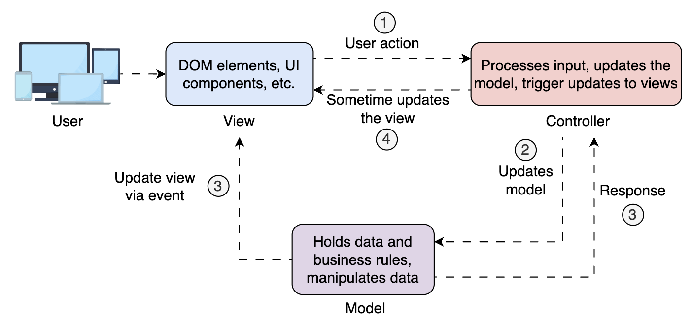

## MVC (Model-View-Controller)

go back to [Table of Contents](./fe-architectures.md)

Model-View-Controller (MVC) is one of the earliest and most influential software architectural patterns. It was originally formulated to help organize user interface code in desktop applications and later evolved to become a widely adopted standard in web and frontend development.

The core idea is to separate concerns, breaking our application into three distinct components that handle different responsibilities:

### Model

Holds the application's data and business rules. It doesn't know anything about the UI or how data is presented. Its job is to store and update data in response to interactions or operations triggered by the user or application logic.

In frontend apps, this could be:

- JavaScript objects representing the state
- Services fetching data from APIs
- Local storage/IndexedDB management
- Logic for transforming raw API responses

> **Tip:** Think of the Model as the brain that knows the data, where it comes from, and how it should be used.

### View

What the user sees—the presentation layer of the application. It renders the data provided by the Model and displays it on the screen.

**In MVC, the View is semi-passive:**

- It displays data but doesn't automatically sync with Model changes
- Requires the Controller to explicitly tell it when to update
- May contain some basic presentation logic
- Updates are manual and triggered by the Controller

In frontend, it contains:

- DOM elements
- HTML templates
- UI components in frameworks (React, Vue, etc.)

> **Note:** The View is intentionally kept simple, containing only the logic necessary to present the data to the user. However, unlike MVVM, it doesn't automatically react to data changes.

### Controller

Acts as the bridge between the Model and the View. It listens to user input (e.g., clicks, form submissions), decides what needs to be done, updates the Model, and may trigger updates to the View.

> **Note:** The Controller is the translator between the user and the system. It interprets user actions and determines what needs to happen in the system.



**In short:**

1. The user interacts with the View, e.g., clicks a button.
2. The Controller processes the input and updates the model.
3. The Model changes and notifies View of changes.
4. Finally, the View re-renders to reflect the new state.

**Example (in a simple JavaScript/HTML app):**

Suppose you have a form to add a new todo item:

```html
<input id="todo-input" type="text" />
<button id="add-btn">Add</button>
<ul id="todo-list"></ul>
```

The Controller logic might look like this:

```javascript
// Model
const todos = [];

// View update function
function renderTodos() {
  const list = document.getElementById("todo-list");
  list.innerHTML = "";
  todos.forEach((todo) => {
    const li = document.createElement("li");
    li.textContent = todo;
    list.appendChild(li);
  });
}

// Controller
document.getElementById("add-btn").addEventListener("click", function () {
  const input = document.getElementById("todo-input");
  if (input.value.trim()) {
    todos.push(input.value.trim()); // Update Model
    renderTodos(); // Update View
    input.value = "";
  }
});
```

Here, the Controller is the event listener for the button. It reads user input, updates the Model (todos array), and triggers the View update (renderTodos).

#### Key Controller Responsibilities

The Controller in this example demonstrates the core responsibilities:

- **Listens to user input:** Binds event handlers to capture clicks, form submissions, etc.
- **Decides what needs to be done:** The "handle" methods contain the logic to determine what action to take based on user input
- **Updates the Model:** Calls appropriate Model methods to change the application state
- **Triggers View updates:** Ensures the View reflects the current state of the Model

#### The "Translator" Role

Notice how the Controller acts as a translator - it takes raw user events (button clicks, form inputs) and translates them into meaningful business operations (add todo, delete todo, etc.).

It doesn't know how the data is stored (Model's job) or how it's displayed (View's job), but it orchestrates the flow between them.

This separation allows each component to focus on its specific responsibility while the Controller manages the coordination between them.

#### Event Handlers vs Controllers

Event handlers are the specific functions that respond to DOM events.

Controllers are the orchestrating layer that contains and coordinates multiple event handlers plus additional logic:

**Controllers Include More Than Just Event Handlers**

Controllers also handle:

- Coordination logic between Model and View
- Application flow and navigation
- Validation and business rules
- State management decisions
- Error handling strategies

# Example Frameworks

- **Ruby on Rails**: One of the most famous MVC frameworks, where controllers handle HTTP requests, interact with models, and render views.
- **Django**: A high-level Python web framework that follows the MVC pattern (referred to as MTV - Model-Template-View).
- **ASP.NET MVC**: A framework for building web applications using the MVC pattern in .NET.

### MVC Summary

While MVC aims to separate concerns, real-world apps are far from ideal and often blur these lines. For example, data-fetching services or transformation logic might blur the line between the Model and Controller.

MVC laid the foundation for modern frontend architecture. Its simplicity and clarity make it a great choice for:

- Beginners learning design patterns
- Small to mid-size applications
- Projects needing clean separation between data, logic, and UI

However, for reactive, data-driven apps where the view needs to auto-update when the model changes, MVC may show its limitations.

That's where MVVM comes in.
