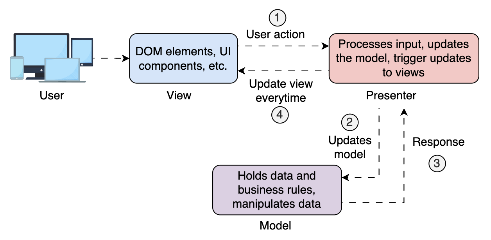

## MVP (Model-View-Presenter)

go back to [Table of Contents](./fe-architectures.md)

Model-View-Presenter (MVP) is an architectural pattern that, like MVC and MVVM, aims to separate concerns within an application.

Its distinguishing feature is the Presenter's explicit control over the View and the Model.

Unlike MVVM, which uses data binding, **_MVP avoids automatic binding_**.

The Presenter explicitly handles every interaction and UI update, offering greater control over the logic flow, making the application easier to test and debug.

MVP is a top choice in front-end development, especially when priorities are testability, control, and modularity. It's particularly popular in environments like native mobile apps (e.g., Android), desktop applications, frontends requiring strict separation of logic and UI, etc.

# Example frameworks

- **Android**: The Android framework uses MVP extensively, especially in its early days, to separate UI logic from business logic.
- **GWT (Google Web Toolkit)**: GWT applications often use MVP to manage complex UIs by decoupling the presentation layer from the business logic.
- **Vaadin**: This Java framework for building web applications uses the MVP pattern to separate concerns and improve testability.

The components of MVP are:

### Model

The Model is the same as in MVC and MVVM, it encapsulates the data layer.

### View

In MVP, the View is completely passive. It contains only the DOM rendering logic and UI structure and sets up event listeners to forward user interactions (like clicks or inputs) to the Presenter for handling.

> **Note:** The View has no authority to change the Model or make decisions. Instead, it notifies the Presenter when something happens and waits for instructions on how to update.

### Presenter

The Presenter is the brains of the operation. It:

- Receives input from the View
- Calls the Model for data updates
- Tells the View how to update based on the state

This separation means the Presenter can be fully unit-tested without UI dependencies.



The user interacts with the View, which delegates events to the Presenter. The presenter updates the Model or retrieves data.

# How is a Presenter in MVP different from a Controller in MVC?

The Presenter has full control over both the View and the Model. It directly updates the View and responds to user interactions in a structured, testable way.

In contrast, the Controller in MVC often acts as a mediator between the View and Model but doesn’t control the View directly, and its role can become loosely defined, especially in frontend implementations. The presenter explicitly leads the flow; the controller reacts more passively to input.

# Example

Model

```javascript
class CounterModel {
  constructor() {
    this.count = 0;
  }
  increment() {
    this.count++;
  }
  getCount() {
    return this.count;
  }
}
```

// View

```html
<div id="app">
  <button id="increment-btn">Click Me</button>
  <p id="counter-display">Count: 0</p>
</div>
```

// The View logic is implemented via JavaScript

```javascript
class CounterView {
  constructor() {
    this.incrementButton = document.getElementById("increment-btn");
    this.counterDisplay = document.getElementById("counter-display");
  }

  bindIncrement(handler) {
    this.incrementButton.addEventListener("click", handler);
  }

  showCount(count) {
    this.counterDisplay.innerText = `Count: ${count}`;
  }
}
```

Presenter

```javascript
class CounterPresenter {
  constructor(model, view) {
    this.model = model;
    this.view = view;

    this.view.bindIncrement(this.handleIncrement.bind(this));
    this.view.showCount(this.model.getCount());
  }

  handleIncrement() {
    this.model.increment();
    this.view.showCount(this.model.getCount());
  }
}
```
