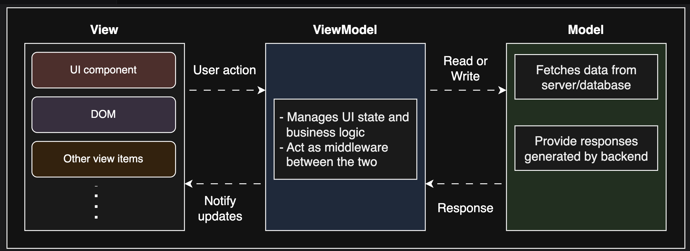

# MVVM (Model-View-ViewModel)

go back to [Table of Contents](./fe-architectures.md)



Model-View-ViewModel (MVVM) is another powerful architectural pattern designed to separate the UI (View) from business logic and state (Model) using a middle layer (ViewModel) that keeps them in sync. It's a popular pattern for frontend development that helps keep your code clean, testable, and easy to maintain, especially in apps with lots of user interaction.

Let's explore the components of the MVVM pattern:

## Model

The Model remains the same as in MVC, handling raw data, requests, etc.
Most importantly, in MVVM, the Model doesn't talk directly to the View but interacts with the ViewModel.

## ViewModel

The ViewModel is the heart of MVVM and serves as the middle layer between the View and the Model.

It:

- Prepares data from the Model in a format that's easy for the View to consume
- Listens to changes in the Model and updates the View automatically (and vice versa)
- Contains UI state, computed values, and presentation logic
- Handles user actions like clicks or input

> **Note:** While MVC separates the View from the Model conceptually, the Controller often ends up tightly coupled with both. MVVM introduces the ViewModel as an intermediary, enabling better decoupling by handling state and logic without direct reference to the View, making data binding more robust.

### View

The View is the user interface, but unlike in MVC, it's **reactive and declarative** and entirely driven by bindings to the ViewModel. The View doesn't contain logic or make decisions; it just binds to the ViewModel's data and renders it.

**In MVVM, the View is reactive:**

- It automatically updates when ViewModel data changes through two-way data binding
- No manual update calls needed (**_unlike MVC where Controller must explicitly trigger view updates_**)
- Declarative - you describe what the UI should look like based on data, not how to update it
- Contains minimal logic, mainly binding expressions and templating

# Example

Model

```javascript
class CounterModel {
  constructor() {
    this.count = 0;
  }
  increment() {
    this.count++;
  }
  getCount() {
    return this.count;
  }
}
```

View

```html
<div id="app">
  <button @click="increment">Click Me</button>
  <p>Count: {{ count }}</p>
</div>
```

ViewModel

```javascript
const app = new Vue({
  el: "#app",
  data: {
    count: 0,
  },
  methods: {
    increment() {
      this.count++;
    },
  },
});
```

# Key difference from MVC

In MVVM, when the ViewModel changes, the View automatically re-renders without any explicit coordination. This is opposite to MVC where the Controller must manually call view update methods like `renderTodos()`.

This automatic synchronization is what makes MVVM powerful for reactive UIs but can also make data flows less explicit and harder to debug.

Even though convenient, the automatic binding between View and ViewModel may lead to less control over when and how UI updates occur, especially in highly interactive or test-driven environments.

To address these limitations, we turn to a more explicit and controlled pattern: Model-View-Presenter (MVP).

In MVP, the Presenter takes on a more active role in managing the interaction between the View and the Model. It handles user input, updates the Model, and refreshes the View, providing a clearer separation of concerns.

# Key Differences from MVP

1. **Explicit Control**: In MVP, the Presenter explicitly controls the flow of data and updates between the View and the Model. This makes it easier to understand and debug the application's behavior.

2. **View-Driven Updates**: The View in MVP is more passive compared to MVVM. It doesn't automatically update in response to Model changes; instead, the Presenter must explicitly tell the View to refresh.

3. **Testability**: MVP's clear separation of concerns makes it easier to unit test the Presenter without involving the View or Model.

# Frameworks Examples

- **Angular**: Uses a form of MVVM with two-way data binding and a clear separation between components (View) and services (Model).
- **Knockout.js**: A JavaScript library that implements MVVM with declarative bindings and an observable pattern.
- **Vue.js**: While primarily an MVVM framework, it allows for a component-based architecture that can resemble MVP in certain designs.

# Conclusion

While MVVM offers powerful data binding and reactivity, MVP provides a more controlled and explicit approach to managing UI interactions.

The choice between these patterns depends on the specific needs of your application and your team's preferences.
