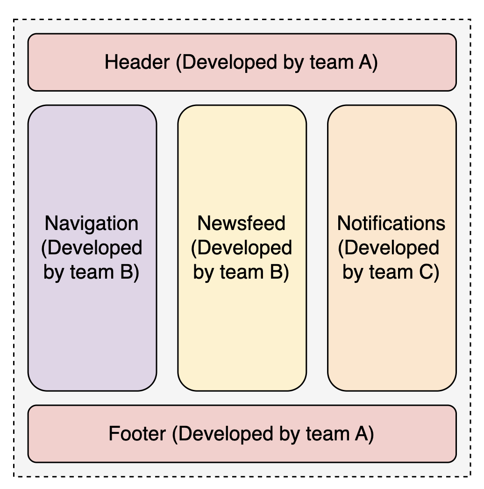
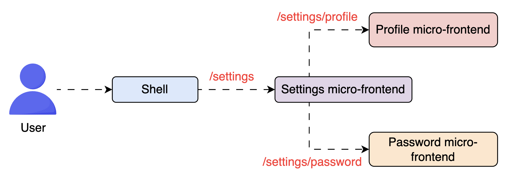
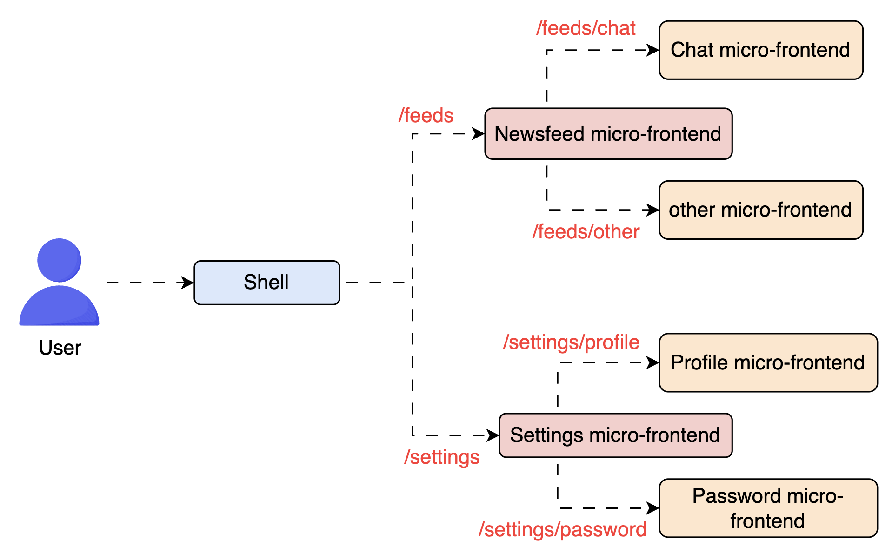

# Scaling Development Using Micro-Frontend Architecture

As frontend applications have grown in size, complexity, and user expectations, so have the challenges of scaling frontend development, technically and organizationally. Managing a single-page application (SPA) or multi-page application (MPA) works fine in small to mid-sized apps. A single team can oversee the entire UI, deploy changes quickly, and maintain consistent code practices.

But what happens when we’re building a large-scale application like a social media platform, e-commerce site, or streaming service with multiple feature-rich modules like home feed, search, notifications, messaging, and user profiles?

We eventually reach a tipping point where:

- The SPA monolith becomes fragile, tightly coupled, and slow to build or deploy.
- Teams step on each other’s toes, merging changes into a massive shared repo.
- Releasing one small update requires retesting the entire app.
- Onboarding new developers takes longer because of the overwhelming codebase.

This is the same set of challenges that once led to the rise of microservices on the backend, splitting a monolithic service into independent, loosely coupled services owned by autonomous teams.

So the question naturally follows:

> Note: If microservices work so well on the backend, why not apply similar principles to the frontend?

Let’s explore micro-frontend architecture meant to solve the above problem.

---

## What is micro-frontend architecture?

Micro-frontend architecture is a design approach that structures a frontend application as a composition of independent, self-contained feature modules (or “fragments”), each responsible for a specific domain or functionality. These units are developed using independent codebases and even (in some cases) different frontend frameworks or technologies deployed and owned by separate teams, similar to microservices on the backend.

Each module includes its own:

- Business logic
- UI components
- Styling
- Optionally, even its routing and state

Think of a web page as a city block. In a traditional monolithic frontend (SPA), the entire block is designed, constructed, and maintained by a single team, one massive blueprint for everything. In contrast, each building (header, newsfeed, sidebar, notifications) is independently designed, built, and maintained in a micro-frontend architecture.



An overview of micro-frontend architecture

> Note: From the user’s perspective, the app should feel seamless. From the team’s perspective, it’s modular, scalable, and loosely coupled.

Next, we will explore the strategies used to implement micro-frontends.

---

## Implementation strategies in micro-frontend

Micro-frontends aim to simplify frontend development by breaking the app into independently owned sections, but the actual implementation can differ greatly depending on the project’s needs and architecture. Different applications and teams require different flexibility, performance, and control degrees. That’s why several implementation strategies exist, categorized primarily into:

- **Build-time integration:** In build-time integration, all micro-frontends are bundled together during the build process. Each team publishes its micro-frontend as a package or remote module, and a central application (or shell) consumes and assembles them.

- **Run-time integration (client-side):** In this model, each micro-frontend is deployed independently and dynamically loaded into the shell application at runtime. Technologies like single-SPA, web components, custom JS loaders or iframes inject micro-frontends on the fly.

- **Server-side composition:** The backend is responsible for stitching together different micro-frontend outputs before sending the final page to the client. Each team exposes HTML fragments or components through APIs, which are then composed using server-side includes, template engines, or a BFF layer.

The following table compares the above approaches:

| Style                   | Pros                                                          | Cons                                                               | Use Cases                                                     |
| ----------------------- | ------------------------------------------------------------- | ------------------------------------------------------------------ | ------------------------------------------------------------- |
| Build-time integration  | Fast runtime, unified experience, shared dependencies         | Requires coordinated builds, less autonomy                         | Internal dashboards, early-stage micro-frontend adoption      |
| Run-time integration    | Independent deployments, team autonomy, tech flexibility      | More client-side complexity, duplication of dependencies           | Large SPAs, user-facing apps with modular teams               |
| Server-side composition | SEO-friendly, fast initial paint, low client-side JS overhead | Complex orchestration on the server, potential latency bottlenecks | News portals, search engines, landing pages with dynamic data |

NOTE ON IFRAMES: each micro-frontend runs in its own document context inside an iframe (full DOM/CSS/JS isolation).

Pros:

- Strong isolation (CSS/JS scope, crash containment, easy rollback).
- Security via sandbox/origin separation.
- Suitable for embedding third‑party or legacy apps with minimal refactor.

Cons:

- Performance overhead (extra document load, memory).
- Difficult global state sharing and tighter integration (more messaging).
- Routing/URL, accessibility, and SEO complications.
- Increased operational complexity (CI/CD for independent frames).

---

With implementation strategies in place (build-time, runtime, or server-side), the next major challenge in micro-frontend architecture is routing. How does navigation work across the app without breaking context or consistency when different UI parts are independently owned?

---

## Routing in micro-frontend applications

Routing in a monolithic SPA is relatively straightforward; a central router defines which component renders for which URL. It becomes more nuanced in a micro-frontend architecture, where teams may own and deploy different UI parts. We should explore how routes get matched to independently owned micro-frontends and how internal navigations happen without triggering a full reload.

Let’s look at the primary models used in micro-frontend routing.

### Centralized (global) routing

A shell application owns the global routing configuration in this approach. It determines which micro-frontend should be rendered for each route. For example: `/feed` loads the newsfeed micro-frontend, `/messages` loads the chat micro-frontend. The shell handles the route-to-component mapping and lazy-loads the appropriate module. It ensures consistency, as there is a single source of truth for routing.


Centralized routing in micro-frontends

**Challenge:** All micro-frontends must expose their routing paths clearly and remain in sync with the shell. To mitigate this challenge, we propose decentralized routing.

### Decentralized (nested) routing

Each micro-frontend owns its internal routing logic, often nested under a root route handled by the shell. For example, the shell loads the settings micro-frontend on `/settings`, but `/settings/profile` and `/settings/password` are handled internally by that micro-frontend.



Decentralized routing in micro-frontends

**Challenge:** It requires coordination to prevent conflicting routes and ensure deep linking works correctly. To mitigate this challenge, we can use a hybrid approach.

### Hybrid routing

A hybrid model combines both; the shell owns top-level routing, and micro-frontends manage their local sub-routes. This is the most common pattern in large systems. For example:

- A user navigates to `/dashboard/settings/password`
- Shell sees `/dashboard` and loads dashboard micro-frontend
- Dashboard micro-frontend handles `/settings/password` locally



A hybrid routing approach in micro-frontends

This separation of concerns gives teams freedom while still keeping top-level navigation predictable.

### IFrames approach routing patterns:

Shell owns top-level routes and embeds relevant iframe.
Pass sub-paths to iframe via URL fragment/query or postMessage.
Consider syncing history via a small router-proxy layer.

#### Some common tools and patterns used in routing for micro-frontends include:

- single-spa for shared routing management
- Web components with custom event handling for internal navigation
- PostMessage or shared router state for route syncing
- URL fragment strategies for isolated routing (e.g., hash routing)

#### Q & As

> Q: Would you split your login page into micro-frontends?

> A: Typically, no. The login page is a small, focused feature that doesn’t require collaboration across multiple teams. It’s critical for user access and must be fast, secure, and reliable. Introducing micro-frontend complexity here—like orchestration, routing, and shared state—offers little value and increases risk. Micro-frontends shine where autonomy and modularity are essential, not for isolated, foundational pages.

---

> Q: If two micro-frontends need to share a lot of data, should they still be separate?
> A: Maybe not. If two micro-frontends are tightly coupled through constant state sharing, they might be better off merged. Micro-frontends work best when boundaries are clean and dependencies minimal. Too much coordination can defeat the purpose of separation.

## Communication and state sharing in micro-frontends

Once routing is in place and micro-frontends can load independently based on URLs, the next challenge is how these pieces communicate. Even though they’re meant to be isolated, real-world UIs often require shared state or coordination across boundaries, especially in apps with authentication, themes, or shared user preferences.

---

While the goal of micro-frontend architecture is independent ownership, in reality, modules don’t exist in silos. They often need to share states or react to each other. For example:

- A login micro-frontend updates the user’s authentication status, which must be reflected in the navigation bar or profile menu.
- A language selector changes the app’s locale, impacting content rendered by multiple other micro-frontends.
- A notification module might need to alert the visible micro-frontend to refresh data or respond to user actions in real-time.

To support such use cases, micro-frontend communication must be carefully designed to prevent tight coupling while enabling essential interactions. The common communication strategies include:

- **Custom events (Pub/Sub pattern):** Micro-frontends can dispatch and listen to custom browser events to communicate. This enables loose coupling, especially for cross-feature notifications.

For example, the following code listens and publish custom events whenever they occur:

```javascript
// Publisher
window.dispatchEvent(new CustomEvent("user-logged-in", { detail: { user } }));
// Listener
window.addEventListener("user-logged-in", (e) => renderUser(e.detail.user));
```

- **Shared state via global store:** Some teams adopt a shared state container like Redux, Zustand, or even simple context providers, hosted in the shell app and exposed to micro-frontends via a global object.

- **Cross-window communication:** For hard-isolated micro-frontends (e.g., using iFrames), postMessage is used for sandboxed communication. It provides full isolation and security but requires manual and verbose handling of messages and listeners.

Use window.postMessage with a defined message contract and origin checks.

Keep messages small and idempotent; Implement timeouts/retries and versioning.

Prefer minimal shared state; use the shell for auth/session and expose required values.

- **Session management and authentication:** Managing user sessions in micro-frontends can be challenging, especially when modules are isolated. A centralized auth system (like OAuth) ensures consistent user identity across modules. However, since micro-frontends may not share runtime context, the session state (e.g., tokens or login status) must be explicitly shared via the global state.

> Note: A good rule of thumb is to keep the shared state minimal and intentional. Only share what must be global, like authentication, theme, or language, and let each micro-frontend manage its internal state.

### Q and As

> Q: In a micro-frontend architecture where each module manages its own local state, what trade-offs should teams consider when deciding whether to also use a shared global state for cross-cutting concerns like authentication, theme, or language?

> A: Using a shared global state helps synchronize important data across modules, ensuring consistency in areas like user sessions or app-wide preferences. However, it can reduce isolation between micro-frontends, introduce tight coupling, and complicate independent deployments. Keeping most state local preserves autonomy and modularity, but teams must carefully coordinate shared logic to avoid duplication or inconsistent behavior.

---

Now that we’ve explored how micro-frontends communicate and share state while aiming to stay modular, it’s important to acknowledge that this architecture comes at a cost.

Micro-frontends solve many problems and introduce new challenges and trade-offs that teams must manage carefully.

---

## Challenges in micro-frontend

Micro-frontends enable scalability, autonomy, and parallel development but also bring in architectural overhead, performance concerns, and complex coordination challenges. The following table provides an overview of challenges and their mitigation:

| Challenge                    | Why It Happens                                                                   | Potential Impact                                              | How to Mitigate                                                                         |
| ---------------------------- | -------------------------------------------------------------------------------- | ------------------------------------------------------------- | --------------------------------------------------------------------------------------- |
| Performance overhead         | Duplicate libraries and dependencies across micro-frontends                      | Slower load times, larger bundles                             | Use shared modules, lazy loading, module federation                                     |
| Design inconsistency         | Teams using different versions or interpretations of design systems              | UI feels fragmented, broken user experience                   | Enforce shared design libraries and visual testing                                      |
| Testing across boundaries    | Independently deployed features can’t be tested in isolation for full workflows. | Bugs emerge in integration, harder quality assurance coverage | Add end-to-end tests in the shell and define API contracts (defining expected behavior) |
| Routing and state complexity | Shared navigation and state need to be coordinated manually                      | Broken navigation, state desync                               | Centralize routing and document shared state and events                                 |
| Deployment complexity        | Each micro-frontend needs its pipeline and integration                           | Slower releases, harder CI/CD maintenance                     | Automate builds, use manifests and shell-based coordination                             |

> Note: Module federation is a feature of Webpack 5 that allows independently built and deployed JavaScript applications (like micro-frontends) to dynamically share code at runtime. It enables apps to expose and consume modules from each other without needing to recompile or bundle everything together.

### Q and As

> Q: If each team optimizes only their micro-frontend for performance, what issues might arise at the application level?

> A: They might unintentionally still bloat the overall app by duplicating shared dependencies, skipping lazy loading, or over-prioritizing their own component’s loading time, leading to poor aggregate performance and degraded user experience.

> Q: Could having too much autonomy in micro-frontends lead to a fragmented user experience? Where’s the balance?
> A: Without coordination, teams may diverge on design, interaction patterns, or responsiveness, making the app feel disjointed.
> The balance lies in enforcing shared standards (e.g., design system, routing strategy, communication protocols) while still allowing teams to own their features.

Understanding the challenges and trade-offs helps us realize that micro-frontends aren’t a magical solution. They solve specific organizational and architectural problems but come with real complexity. So, when should you embrace this model, and when is it better to keep things simple?

---

## When to use micro-frontends

Micro-frontends are powerful, but they’re not for everyone. They add architectural overhead, so adopting them intentionally is important, not just because they’re trending. Here’s how to evaluate whether micro-frontends are the right fit:

- Multiple teams work on different frontend parts, with independent roadmaps and ownership boundaries.
- The application is feature-rich and complex, with a long-term roadmap that would benefit from independent scaling.
- Teams must deploy independently without coordinating every release with other app parts.
- Different system parts must use different frontend stacks (e.g., legacy + modern migration).
- Frontend modules must align with microservices on the backend, reducing coupling across vertical slices.

> Note: A well-structured SPA or modular monolith may serve you better if you’re building something small, fast-moving, or single-purpose.

---

## Conclusion

Micro-frontend architecture helps teams work independently, release updates faster, and manage growing applications without getting in each other’s way. It brings the modular approach of backend systems to the frontend, making parallel development and team autonomy much easier.

But with this flexibility comes added complexity—in both the code and how teams coordinate. That’s why the best teams choose micro-frontends with purpose, not just to follow trends. It’s not about making the app look modern—it’s about helping teams move faster without causing issues. If your app is growing, your teams are expanding, and your release cycles are slowing down, micro-frontends could be the right next step for your frontend architecture.

The key problems to solve are:

- Bundling or orchestration (rendering)
- Routing
- Communication
- Sharing state
