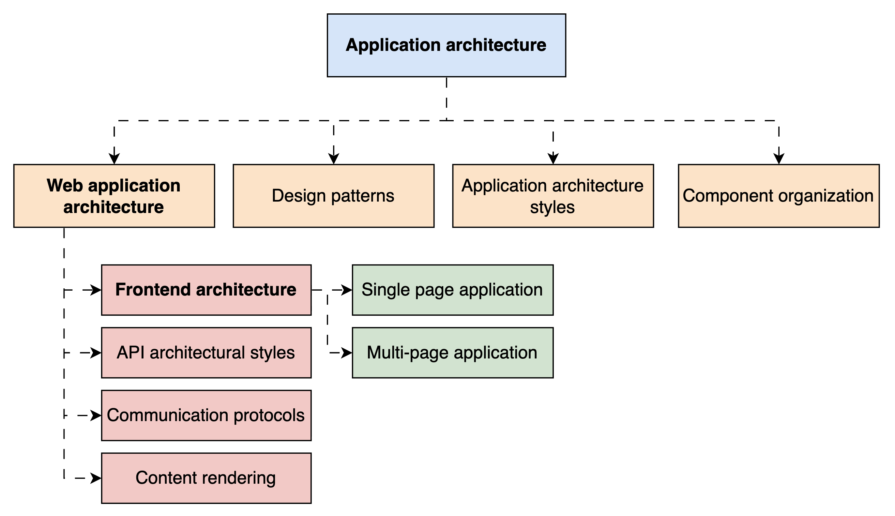
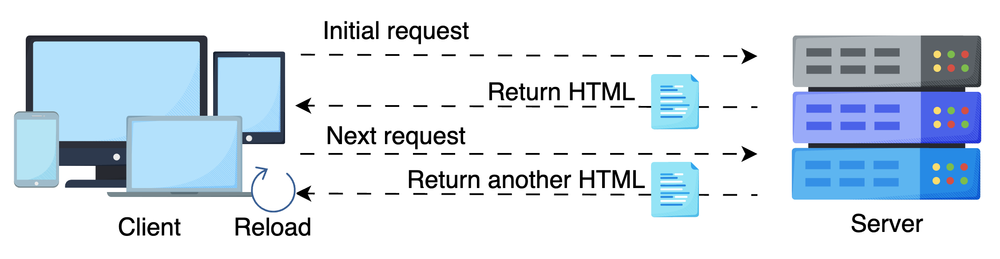

# SPAs vs MPAs: Choosing the Right Frontend Architecture

Understanding the architectural differences between SPAs and MPAs and their trade-offs.

In frontend System Design, architecture isn’t just about which framework we choose or how we organize our components; it’s about how our entire application is structured, delivered, and interacted with in the browser. It defines how the user experiences our product: whether the page reloads on every click or whether content updates seamlessly without a flicker.

Choosing the right frontend architecture is often the difference between an application that feels fast, fluid, scalable, clunky, inconsistent, and hard to maintain.

In this lesson, we’ll examine the two foundational frontend architectures, MPA and SPA, to understand how they work, when to use them, and how they influence the frontend system.

---

## What is frontend architecture?

Before exploring frontend architecture, we first need to understand its parent terms, i.e., web application architectures and application architectures:

**Application architecture** is the high-level blueprint defining any software application’s overall structure and design, whether a web, mobile, or desktop application, including both frontend and backend components. It encloses:

- How different layers (UI, business logic, data) interact
- Component organization
- Design patterns (e.g., MVC, MVP)
- Communication flows
- Application architecture styles (monolith vs. microservices) and deployment strategies (blue/green, canary, etc.)

> Note: Application architecture is a broad term, for example, deciding to build a large-scale e-commerce platform using microservices and event-driven communication.

**Web application architecture** is a subset of application architecture and focuses solely on how a web-based application operates. It defines:

- How the frontend and backend interact
- API design (REST vs. GraphQL)
- Authentication mechanisms
- Web protocols (HTTP/2, HTTP/3, WebSockets)
- CDN and caching strategy

Example: For e-commerce, it is like defining a React-based frontend communicating with a RESTful backend over HTTP/2 with token-based authentication.

**Frontend architecture** is specifically about how the frontend system is structured and behaves inside the browser. It guides:

- How the app is rendered (client vs. server)
- How pages are structured and loaded
- Navigation, routing, and state management
- How data flows and re-renders are handled
- The user experience during interactions

Example: For the same e-commerce site, deciding on how a React-based application will navigate, render, how data flows and rerenders, etc.

This is the level we focus on in this lesson, especially how pages are structured and loaded.

---

## Why frontend architecture matters

Let’s take a real-world example to understand the importance of frontend architectures.

Think about Amazon. When we click a product, it loads a new page with new headers, footers, and metadata. That’s a classic multi-page application (MPA) approach. It’s reliable, cache-friendly, and great for SEO, perfect for a platform focused on searchability and content indexing.

Now compare that to X (formerly Twitter) or Instagram. We don’t reload the page when we tap a new tweet or scroll through reels. The URL updates, content shifts, and everything feels instant. That’s a single-page application (SPA). The entire app loads once, and future interactions update what’s needed. This model supports speed, responsiveness, and interactivity, all critical for user engagement on dynamic platforms.

Choosing the right architecture affects:

- User experience: Is it fast, smooth, and seamless?
- Performance: Are we reducing payloads and redundant rendering?
- Maintainability: Can we scale the system as features grow?
- Device support: Will it work on mobile, smart TVs, or embedded browsers?

The right architecture isn’t just a technical choice; it shapes how users experience our application every second they interact with it. As user expectations grow, thoughtful architectural decisions become the foundation for delivering reliable, responsive, and scalable web experiences.

Frontend architectures have transformed from static multi-page applications to dynamic and hybrid models. Below is a summary of this evolution. Let’s explore each frontend architecture in detail.

---

## Multi-page applications (MPA)

A multi-page application (MPA) follows the traditional web model: every time a user interacts or navigates to a different page, the browser sends a request to the server, and the server responds with a full HTML page. The entire page, including layout, content, and resources, is reloaded.

> Note: This model is page-centric; every view is its own HTML document.

MPAs are still widely used for content-heavy, SEO-focused, or form-driven applications. However, as applications became more interactive and real time, MPAs began to reveal some challenges:

### Challenges with MPAs

| Challenge                                     | Description                                                                                                           | How to Counter                                                                                |
| --------------------------------------------- | --------------------------------------------------------------------------------------------------------------------- | --------------------------------------------------------------------------------------------- |
| Full page reloads and repeated asset fetching | Each navigation reloads the entire page, causing slow transitions and refetching of static resources like CSS and JS. | Use partial rendering, client-side routing, and cache shared assets via CDNs or HTTP headers. |
| Inconsistent state management                 | UI state (e.g., input values or filters) resets on each navigation.                                                   | Use localStorage, sessionStorage, or pass state via URL/query parameters.                     |
| Limited interactivity                         | Harder to implement real-time, dynamic behavior in server-rendered apps.                                              | Apply progressive enhancement or selectively add client-side JavaScript.                      |
| Rendering and data latency                    | UI feels sluggish due to backend delays or heavy rendering tasks.                                                     | Optimize server response times, lazy-load data, and apply skeleton loading patterns.          |
| Fragmented user experience                    | UI/UX can feel disconnected and jarring across pages.                                                                 | Use consistent layout templates and unified design systems across views.                      |

The table shows that MPAs struggle in environments where the user experience must be seamless (e.g., dashboards, chats), frequent interactions happen without page transitions, and shared components like navigation bars or side panels are rerendered.

> Q: If each navigation in an MPA causes a full page reload, could that ever be considered a good thing?

> A: Yes, especially in contexts where clean state isolation and reliability are more valuable than fluid UX.

> For example, reloading the page in financial dashboards, banking apps, or multi-step form submissions resets the application state entirely—which can prevent bugs, reduce memory usage, and eliminate edge cases caused by stale or shared states in SPAs.

> It also enforces a natural separation of concerns between pages, making logic more predictable and sometimes easier to test or secure. So, while full reloads may seem wasteful, predictability and robustness trump perceived speed in some domains.

### Partial hydration in MPAs

To overcome some inherent limitations of traditional MPAs, modern enhancements such as partial hydration are being implemented.

Hydration refers to attaching interactivity (JavaScript behavior) to a server-rendered HTML page. It lets the page become dynamic and responsive after being loaded. However, full hydration can be resource-heavy as it activates the entire page.

Partial hydration selectively hydrates only specific components that need interactivity—like a carousel, a comment box, or a live search bar.

This allows dynamic behavior in parts of the page without turning the whole app into a SPA. Tools like Astro and HTMX enable this selective enhancement, providing SPA-like interactivity within an MPA structure while preserving the SEO and performance benefits of server rendering.

Popular MPA frameworks include:

- Next.js: Supports MPA mode with server-side rendering for SEO and performance.
- Rails and Laravel: Mature ecosystems with robust routing, templating, and optimization features.

These frameworks ensure scalable and well-structured multi-page applications.

While MPAs laid the foundation for the early web, their limitations—such as full-page reloads, inconsistent state management, and limited interactivity—began to show as user expectations evolved.

Modern applications demanded speed, seamless transitions, and richer client-side experiences that traditional MPAs struggled to provide efficiently.

This growing need for fluidity, responsiveness, and dynamic data handling set the stage for a new architectural paradigm: the SPA.

---

## Single-page applications (SPA)

A single-page application (SPA) loads a single HTML page and dynamically updates the content using JavaScript and APIs.

The client handles routing and fetches only the data required for each view. This means navigation doesn’t reload the entire page; only the necessary parts are updated.

> Note: After the initial page load, all user interactions are handled via JavaScript. The application uses the browser history API and client-side routing to simulate navigation, while fetching data via APIs to update the DOM without a full reload.

SPAs revolutionized the web experience by enabling:

- Faster transitions between views
- Persistent layouts and state across pages
- Real-time updates without disrupting the UI

This shift made SPAs the preferred architecture for modern web applications like social feeds, collaborative tools, and real-time dashboards.

> Note: A well-designed SPA isn’t just about dynamic pages—it's about delivering speed and interactivity without compromising on scalability, accessibility, or discoverability.

### Q and As

> Q: Can an SPA still deliver a first meaningful paint faster than an MPA in some scenarios?

> A: Yes, though it may seem counterintuitive. While MPAs have a natural advantage in delivering a complete server-rendered HTML page, SPAs can close and even beat this gap when engineered correctly.

> Techniques like code splitting, lazy loading, tree shaking, and critical CSS inlining allow SPAs to load only what’s needed upfront. Preloading routes and aggressively optimizing JavaScript bundles can reduce the time to first paint (TTFP).

> In SPAs, as the layout shell is persistent and reusable; once the shell is cached, subsequent visits can feel almost instantaneous, a major advantage over MPAs, which rerender and reload everything each time.

> Q: Does choosing SPA lock you into a specific user experience model forever?

> A: Not forever, but it certainly shapes your future choices. SPAs naturally lead to persistent UI shells, client-side routing, and local state management, which are great for interactive apps but also deeply affect how features are designed and implemented.

> Switching away from SPA later isn’t impossible, but it requires major architectural refactoring, especially if your routing, data fetching, and rendering logic are tightly coupled to the client.

### SPA challenges and techniques

| Challenge                   | Description                                                             | How to Counter                                                                                                                                          |
| --------------------------- | ----------------------------------------------------------------------- | ------------------------------------------------------------------------------------------------------------------------------------------------------- |
| SEO limitations             | Content is rendered in the browser, so search engines may not see it.   | Generate HTML on the server using techniques like server-side rendering (SSR) or static site generation (SSG) and include proper metadata for crawlers. |
| Slow initial load           | Large JavaScript files slow down the first screen render.               | Split JavaScript into smaller chunks, load parts of the app only when needed (lazy loading), and remove unused code (tree-shaking).                     |
| Heavy JS dependency         | If JavaScript fails or is turned off, the app won’t work.               | Provide fallback content or error messages and ensure basic features work even if JS fails (progressive enhancement).                                   |
| State management complexity | As apps grow, tracking and syncing UI state becomes harder.             | Use state management libraries like Redux or Zustand, and define clear responsibilities for each part of the app’s state.                               |
| Security risks (e.g., XSS)  | More logic in the browser makes it easier for attackers to inject code. | Sanitize all input, use content security policy (CSP) headers, and store tokens in secure cookies.                                                      |
| Navigation issues           | Back/forward navigation and scroll position don’t work as expected.     | Use client-side routers (like React Router) that properly manage browser history and restore scroll positions.                                          |

A comparison of common web quality metrics, such as performance, accessibility, SEO, and PWA readiness, helps understand the practical trade-offs between SPAs and MPAs. SPAs tend to maintain a smoother user experience after the initial load, while MPAs often offer quicker first impressions but may feel less fluid during in-app navigation.

---

## Hybrid architectures: Blending MPA and SPA

As frontend systems evolved, the line between MPAs and SPAs began to blur. Today, many large-scale applications use hybrid architectures, blending the strengths of both models to deliver the best possible user experience. Instead of choosing one approach universally, teams decide on a per-route basis which rendering strategy makes sense.

### Common hybrid techniques

| Technique                    | Purpose                                                                    |
| ---------------------------- | -------------------------------------------------------------------------- |
| Server-side rendering (SSR)  | Improves SEO and first paint for content-heavy pages                       |
| Static site generation (SSG) | Pre-renders pages at build time for high speed and stability               |
| Client-side hydration        | Turns static/SSR content into interactive SPA on load                      |
| Route-based rendering        | Choose rendering strategy per route (e.g., product = SSR, dashboard = SPA) |

For example, a streaming platform might server-render its movie detail pages for SEO (like an MPA) while relying on a dynamic SPA shell for the actual playback experience. Similarly, e-commerce sites often render landing and product pages using static generation or SSR but switch to a fully interactive SPA for checkout and user dashboards.

Hybrid architecture gives us granular control over performance, SEO, and interactivity, tailoring the experience route-by-route based on real needs.

> Q: What architectural trade-offs would you face if you’re building a social media platform where both SEO (for profiles) and real-time interactivity (for feeds) matter equally?

> A: This is a classic case for hybrid architecture. You’d likely choose server-side rendering (SSR) or static generation for public profile pages to ensure they are indexable by search engines and fast on first load.

> Meanwhile, the newsfeed and messaging areas would use SPA architecture for smooth scrolling, real-time updates, and stateful interactions.

> The trade-offs include increased technical complexity—you must now support two rendering models, manage shared state carefully, and optimize build pipelines for SSR and client hydration.

> You’ll also need routing logic that supports both static and dynamic views. While this adds architectural overhead, it gives users the best experience tailored to the context.

## Architecture types summary

The following table summarizes the different architecture types, their characteristics, and use cases:

| Architecture Type               | Description                                                                           | Key Characteristics                                                                                           | Use Cases                                                               |
| ------------------------------- | ------------------------------------------------------------------------------------- | ------------------------------------------------------------------------------------------------------------- | ----------------------------------------------------------------------- |
| Traditional MPAs                | Early web apps where each page is a separate server-rendered document.                | Full page reloads on every navigation (server-side routing), no JavaScript-driven interactivity.              | Blogs, forums, early e-commerce platforms                               |
| Dynamic MPAs                    | MPAs enhanced with JavaScript for interactive elements and partial updates.           | Server-side routing, but with dynamic sections via JS; better UX than traditional MPAs, still page-based.     | E-commerce, CMS-based platforms                                         |
| Single-Page Applications (SPAs) | Applications load a single HTML page and dynamically update content using JavaScript. | Client-side routing (no full reloads), fast interactivity with AJAX/fetch, but more complex state management. | Social apps, dashboards, interactive tools                              |
| Hybrid Architectures            | Combines SPA and MPA benefits through SSR, SSG, or hydration techniques.              | Mixed routing (server + client), better SEO with improved interactivity and performance.                      | Content + interaction-heavy apps (e.g., newsfeeds, streaming platforms) |

> Note: Routing refers to how an application handles navigation and URL changes, either by requesting a new page from the server (server-side routing) or updating the view dynamically within the client (client-side routing).

---

## Conclusion

There’s no universal winner; only the architecture best fits our product’s goals, users, and context. MPAs are preferred when clarity, SEO, and simplicity matter. SPAs thrive when fluidity, interactivity, and performance take center stage. Hybrid models offer the best of both worlds if we’re willing to handle the complexity.

So next time you face the question: “Which architecture should I use?” don’t just follow trends. Ask:

- Who are my users?
- What matters more: discoverability or engagement?
- Do I need instant feedback or fast searchability?
- Am I designing for content or interaction?

The answers to these questions will guide you toward the right architecture, or combination of them, that’s functional and future-ready.
