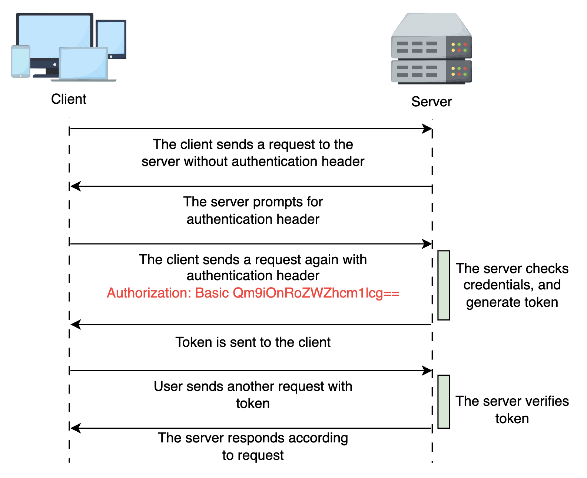
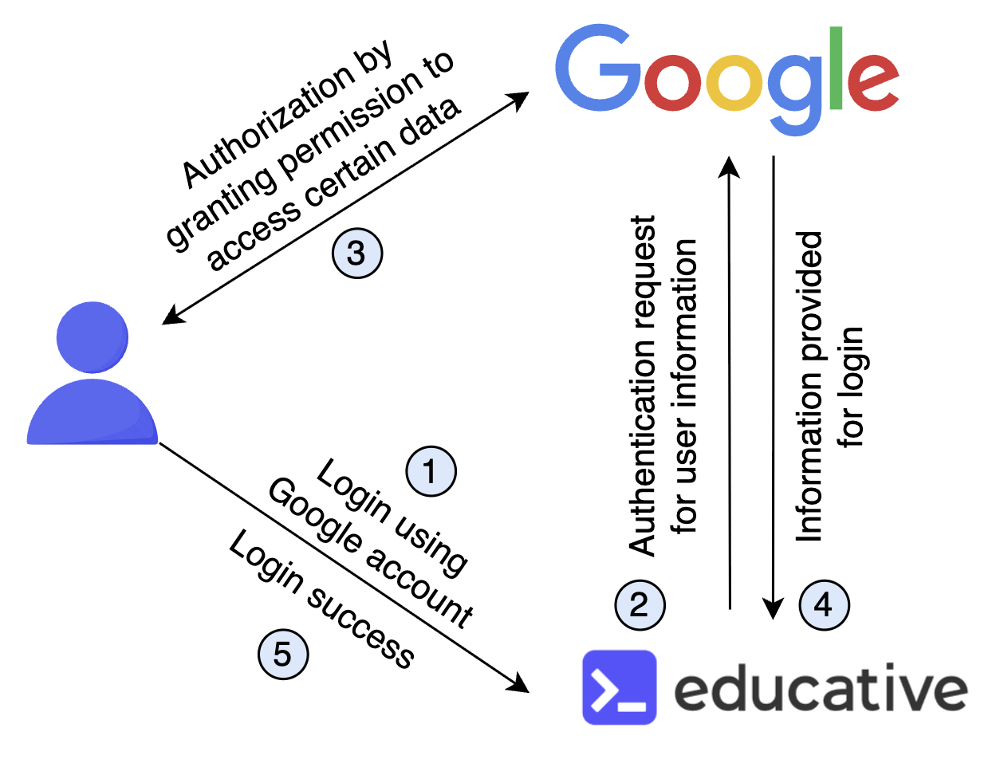

# Authentication and Authorization in Frontend Systems

Learn about the key protocols and frameworks for authentication and authorization in frontend System Design.

Frontend security is crucial because it is the first defense against malicious actors who might exploit vulnerabilities in a dynamic, interactive interface.

Attackers leverage weak authentication methods to inject harmful scripts, steal tokens, or perform unauthorized actions, leading to data loss, financial harm, and irreparable damage to user trust. Thus, understanding and implementing robust authentication and authorization mechanisms is indispensable for any System Design.

In this lesson, we explore the twin pillars of security, authentication and authorization, and why they are indispensable in designing secure, user-friendly systems.

---

## Authentication

Authentication (who you are?) is verifying a user's identity. It's the digital equivalent of showing our ID at the entrance of an exclusive club. The primary goal is to ensure that the person or entity attempting to access the system is indeed who they claim to be.

In the context of frontend System Design, authentication typically begins with a login form where users enter their credentials—commonly a username and password. But modern authentication is much more than a simple check against stored credentials; it involves sophisticated protocols, token management, and often multi-factor authentication (MFA) to enhance security.

### How does authentication work?

When users input their credentials, the frontend application doesn't merely validate the input; it initiates a secure dialogue with backend services.

Let's consider a typical login process in an online banking app:

1. **User input:** The user enters their username and password into a secure login form.

2. **Data transmission:** The frontend sends the credentials over an encrypted connection (HTTPS) to the backend authentication server.

3. **Credential verification:** The server compares the provided credentials with those stored in a secure database.

4. **Token issuance:** If the credentials match, the server issues a token, often a JSON web token (JWT), that serves as proof of the user's identity.

5. **Token storage:** The frontend stores the token, typically in memory, cookies, or local storage, to include in future requests.

### Authentication techniques

Authentication methods have evolved significantly to address modern security challenges. Here are some of the common types used in frontend systems:

#### Basic authentication

This is one of the simplest forms, where the user's credentials (username and password) are sent with each request, often encoded in Base64. While easy to implement, it lacks robustness because credentials are transmitted with every request, even over HTTPS. For instance, a client with the username "Bob" and password "pass123" will be embedded in the header as follows:

```javascript
Authorization: Basic Qm9iOnBhc3MxMjM=
```

Note: The **_Authorization_** request header represents the username and password as User:pass123 encoded in the Base64 format. The Basic keyword before the encoded text signifies that this request header is for basic authentication.

Once entered, this username and password are sent to the server, which verifies the user. This process is illustrated below:


Basic authentication of a request

#### Token-based authentication

JWTs are a collection of encrypted strings denoting a header, a payload, and a signature that travel through HTTP requests. After successful authentication, the server issues a token the client uses for subsequent requests.

Unlike the previous protocols, tokens can be used for authentication and authorization because they carry information about the holder. This method reduces server load by eliminating the need to query the database repeatedly.


Authentication using tokens

#### API keys for authentication

#### OAuth 2.0

It is widely used for third-party authentication and authorization. It allows users to authenticate using existing accounts from providers like Google, Facebook, or GitHub. OAuth 2.0 grants tokens that enable limited access to user data without exposing their credentials.


Authentication and authorization using third party service

#### Multi-factor authentication (MFA)

MFA adds an extra layer of security by requiring multiple verification forms, such as a password and a one-time password (OTP) sent to the user's mobile device. This method significantly reduces the risk of unauthorized access, even if a password is compromised.

#### SAML

SAML is commonly used in enterprise environments. It uses XML-based assertions to pass user identity information between an identity provider (IdP) and a service provider (SP), streamlining single sign-on (SSO) experiences. It has both authentication and authorization capabilities for exchanging user data between entities.

#### OpenID Connect (OIDC)

OIDC is a modern, lightweight authentication protocol built on top of OAuth 2.0. It uses JSON-based ID tokens to securely transmit user identity information from an identity provider (IdP) to a service provider (SP). Commonly used in consumer-facing and mobile applications, OIDC enables seamless SSO experiences. While OAuth handles authorization, OIDC specifically adds authentication, making it ideal for securely verifying user identity across multiple applications.

The following table provides a comparative overview of these authentication methods:

| Method                            | Description                                                                                          | Pros                                                                       | Cons                                                               |
| :-------------------------------- | :--------------------------------------------------------------------------------------------------- | :------------------------------------------------------------------------- | :----------------------------------------------------------------- |
| Basic authentication              | Sends username and password with each request, typically encoded in Base64.                          | Simple to implement; widely supported.                                     | Insecure if not over HTTPS; credentials are repeatedly sent.       |
| Token-based (JWT)                 | Issues a token after authentication for stateless, client-server communication.                      | Scalable; reduces server load; flexible token management.                  | Requires secure storage; tokens can be vulnerable if mishandled.   |
| OAuth 2.0                         | Allows third-party authentication using existing credentials from identity providers.                | Enhances user convenience; reduces password fatigue.                       | Complex to implement; token management can be tricky.              |
| Multi-factor authentication (MFA) | Combines multiple verification methods (password + OTP, biometrics, etc.) for enhanced security.     | Adds significant security; reduces risk of unauthorized access.            | Can impact user experience; requires additional infrastructure.    |
| SAML                              | Uses XML-based assertions for enterprise-level SSO between identity and service providers.           | Ideal for enterprise SSO; secure assertions.                               | Complex; requires specialized infrastructure and configuration.    |
| OIDC                              | Extends OAuth 2.0 by adding authentication capabilities, enabling secure user identity verification. | Simplifies authentication; supports SSO and federated identity management. | Requires identity providers; can be complex to configure securely. |

---

## Authorization

Once the user's identity is authenticated, the next crucial step is authorization, determining what resources or actions the authenticated user can access. While authentication answers "Who you are?" authorization addresses "What can you do?" This distinction is critical in ensuring that even after a user's identity is confirmed, they are restricted to only the actions and data that align with their role or permissions.

In a well-architected frontend system, authorization dictates what elements are rendered, which buttons are clickable, and what data the user can view or modify. For example, consider an online project management tool: a project manager might have the authority to create, edit, or delete projects, while a team member may only be allowed to view and update the status of tasks assigned to them.

### Authorization techniques

Unlike authentication, which typically involves distinct methods like basic Auth or OAuth—authorization in frontend systems is enforced through various techniques. The server uses the tokens generated during authentication to verify the authorization levels. Here are some common methods to implement authorization effectively:

#### Route guards

Many frontend frameworks provide route-guarding mechanisms that intercept navigation and verify permissions before allowing access to a route. For example, Angular's CanActivate or React Router's custom guard components can prevent unauthorized users from accessing sensitive pages.

#### Component-level checks

In component-based frameworks, we can conditionally render UI elements based on the user's role or permission set. This might involve using higher-order components, conditional rendering logic, or attribute directives. For example, React developers might use conditional expressions in JSX to show or hide buttons based on the user's permissions.

#### Middleware-based authorization

Even though much of the logic is enforced on the client side, backend middleware plays a crucial role. By verifying the token's permissions on each API request, the backend middleware ensures that unauthorized requests are blocked even if the frontend is manipulated.

#### Declarative authorization with libraries

Some libraries allow us to declare authorization policies as configuration. These libraries enable us to define and enforce policies centrally so that the UI components render appropriately based on those rules. Libraries such as CASL (for React) or similar tools help manage complex permission logic in a declarative way.

Different types of access levels define authorizations for different users. The subsequent section explores these types to implement authorization effectively.

### Types of authorization

Authorization can be implemented in several ways, each suited to different types of applications and organizational needs. The primary models include:

#### Role-based access control (RBAC)

In RBAC, permissions are assigned to roles rather than individual users. Users are then granted roles based on their responsibilities. For example, an administrator role might allow access to all system functions, whereas a standard user role may only permit access to non-critical features. This approach simplifies permission management by grouping users and assigning common privileges.

#### Attribute-based access control (ABAC)

ABAC takes a more granular approach by considering multiple attributes (such as user department, time of access, and location) before granting access. Instead of fixed roles, access decisions are made based on policies that evaluate these attributes. This highly flexible model can accommodate complex security requirements but may require sophisticated policy management.

#### Policy-based access control (PBAC)

PBAC is an authorization model where access decisions are driven by clearly defined policies rather than just user roles or attributes. It builds upon models like RBAC and ABAC by introducing a centralized, flexible policy engine that evaluates contextual conditions, attributes, and rules before granting access.

While ABAC focuses on attributes, PBAC emphasizes the policy as the central unit—making it especially valuable in environments requiring fine-grained control, compliance, traceability, and dynamic access evaluation. For example, a PBAC policy might say:

**Policy:** "Only users from the finance department can download reports during business hours if their account is verified."

This approach supports auditable, explainable decisions, making it ideal for organizations with regulatory requirements or complex workflows.

#### Discretionary access control (DAC)

In DAC, the data owner determines access rights. This method provides high flexibility but can lead to inconsistent permission settings across the system. DAC is common in environments where users need to share data selectively.

The following table summarizes the key characteristics of these authorization models:

| Authorization Model                   | Description                                                                                | Pros                                                                 | Cons                                                                           |
| :------------------------------------ | :----------------------------------------------------------------------------------------- | :------------------------------------------------------------------- | :----------------------------------------------------------------------------- |
| RBAC (Resource Based Access Control)  | Grants access based on a user's assigned roles.                                            | Simple to implement, easy to manage in small to medium systems.      | Becomes inflexible in dynamic or large-scale systems; role explosion.          |
| ABAC (Attribute Based Access Control) | Grants access based on user, resource, and environmental attributes.                       | Fine-grained control supports dynamic decisions.                     | Complex to configure and manage; harder to audit.                              |
| PBAC (Policy Based Access Control)    | Grants access based on centralized, defined policies that consider attributes and context. | Highly flexible, auditable, and ideal for compliance-driven systems. | Requires policy engine and well-defined governance; higher initial complexity. |
| DAC (Discretionary Access Control)    | Access is controlled by the resource owner (user-defined permissions).                     | Flexible and user-controlled; easy for ad hoc sharing.               | Prone to misconfigurations and weaker security in collaborative environments.  |

While much of the authentication process happens on the backend (like token verification and access control), it's equally important for the frontend to be session-aware and responsive.

A secure frontend should be able to adapt dynamically to the user's authentication state—whether they're logged in, logged out, or have an expired session.

This means the frontend must initiate auth flows (e.g., login, sign-up) and respond intelligently to backend signals—such as redirecting unauthorized users, rendering error states, or refreshing session-based UI.

---

## Integration in frontend design

A robust frontend System Design seamlessly integrates both authentication and authorization, initiating secure communication with the backend and ensuring the UI responds dynamically to the user's state. The process begins at login and continues throughout the user's session, where frontend responsiveness plays a key role in delivering a secure and user-centric experience.

### Login phase

The user provides credentials, and the authentication mechanism verifies their identity. Upon success, the server issues a token containing user identity and role/permission data. This token is stored securely on the client side (e.g., via httpOnly cookies or secure session storage), and the frontend prepares to reflect the authenticated state.

### Session management

Once authenticated, the frontend includes the token in subsequent requests and adjusts the UI based on the user's role and permissions. For example, navigation menus or dashboards may render differently for standard users vs. administrators. The frontend also needs to respond if the session is invalidated or the user logs out, updating the interface in real time to reflect the change.

### Dynamic UI rendering

The frontend conditionally renders UI components based on the authorization data within the token. If a user's role changes or their permissions are updated, the frontend must adapt dynamically, sometimes even requiring a new authentication cycle to refresh the session.

### Error handling and token expiration

Tokens are often set with expiry times to minimize the risk of misuse. The frontend must be designed to gracefully handle scenarios where a token expires or is tampered with. This might involve prompting users to re-authenticate or redirecting them to an error page. By handling these edge cases smoothly, developers can ensure that users remain secure without experiencing undue frustration.

A practical example of this integration is seen in online collaboration tools. Consider a platform like a shared document editor where users can be assigned varying permissions such as view-only, comment, or edit. When users log in, the token confirms their identity and details their specific permissions. The frontend then leverages this data to render only the functionalities pertinent to that user. Suppose a user with view-only permissions tries to access editing tools. In that case, the interface hides these options or displays an appropriate error message, ensuring each user's interaction is secure and tailored to their role.

Now that we've explored authentication and authorization and how they work, let's discuss the best practices that help us achieve them securely and efficiently.

---

## Authentication and Authorization Best Practices

| Authentication Best Practices                                                                 | Authorization Best Practices                                                                              |
| :-------------------------------------------------------------------------------------------- | :-------------------------------------------------------------------------------------------------------- |
| Use MFA for added security.                                                                   | Apply roles based on the principles of least privilege.                                                   |
| Enforce strong password policies and regular updates.                                         | Establish clear role definitions and permissions.                                                         |
| Encrypt sensitive authentication data, both in transit and at rest.                           | Secure tokens and session data for authorization.                                                         |
| Use token-based systems, e.g., JSON web tokens (JWT), OAuth, etc., to manage authentication.  | Use role-based access control (RBAC) and attribute-based access control (ABAC) where complex rules apply. |
| Implement session timeout and automatic logout for inactive sessions or single sign-on (SSO). | Regularly review and update access permissions.                                                           |
| Monitor unusual log activities and failed login attempts.                                     | Monitor access logs to detect unauthorized privilege escalations.                                         |

---

## Tips for secure frontend design

Designing a secure frontend system is akin to building a fortress: every entry point must be guarded, every pathway monitored, and every potential vulnerability addressed. Here's a high-level blueprint that summarizes the integration of authentication and authorization:

### User interface design

We should begin with a clean, intuitive interface that guides users through authentication. Ensure that login forms, registration pages, and error messages are designed to be user-friendly and secure.

### Authentication mechanism

We must choose an authentication method that aligns with the application's needs. For instance, OAuth 2.0 may be the best choice if third-party logins are essential. We should also implement robust password policies and consider MFA for additional security.

### Token management

Based on our application's security needs and risk profile, we must decide on the best token storage strategy, HTTP-only cookies, local storage, or in-memory storage. We must also implement mechanisms to refresh or invalidate tokens as needed.

### Authorization logic

We should embed user role and permission data within the token and design the frontend to dynamically render UI components based on this data. Whether using RBAC, ABAC, or a hybrid model, ensure that the frontend enforces authorization at every level.

### Error handling and session management

We should develop clear strategies for handling expired tokens, unauthorized access attempts, and other security-related errors. This includes showing helpful error messages, triggering re-authentication flows, and preventing access to restricted views. This will improve security and enhance the overall user experience.

### Continuous auditing and monitoring

We should implement logging and monitoring systems to detect suspicious activities. We should also regularly audit our authentication and authorization mechanisms to ensure they remain robust against emerging threats.

The following illustration provides a blueprint to enhance frontend design:


Authentication and authorization in frontend

### Advanced considerations in modern frontend security

As frontend technologies evolve, so do the security challenges. Developers must be aware of the following advanced considerations:

#### Progressive web apps (PWAs) and offline capabilities

PWAs enhance user experience by offering offline capabilities and faster load times. However, caching sensitive data or tokens locally introduces additional security challenges. Developers must ensure that tokens and other sensitive information are not inadvertently stored in caches that unauthorized parties can access.

#### Single-page applications (SPAs) and routing

SPAs rely heavily on client-side routing, meaning sensitive routes must be protected at the backend and within the frontend. Conditional rendering based on authorization data becomes even more critical to prevent users from navigating to restricted sections via URL manipulation.

#### Third-party integrations

Modern frontend systems often integrate with various third-party services for analytics, payment processing, and social login. Each integration introduces its own set of authentication and authorization challenges. For example, when using OAuth 2.0 for social logins, the frontend must handle redirection flows securely and ensure that tokens from external providers are correctly validated and managed.

#### Micro-frontends

In architectures where micro-frontends are used, each micro-application might have its own security context. Coordinating authentication and authorization across these boundaries requires a unified security strategy, often leveraging centralized authentication services and shared token management solutions.

---

## Conclusion

In frontend system design, security is as essential as usability and performance. A secure frontend guards against unauthorized access and ensures a smooth and trustworthy user experience. From handling authentication tokens and securing local storage to enforcing access control in the UI and managing sensitive flows like login and logout—frontend security is the first line of defense users interact with. Whether implementing simple auth flows or integrating complex policies like RBAC or PBAC, the frontend plays a pivotal role in enforcing, reflecting, and responding to security decisions made by the backend.

In a landscape where user trust is non-negotiable, a secure frontend isn't optional, it's foundational.
