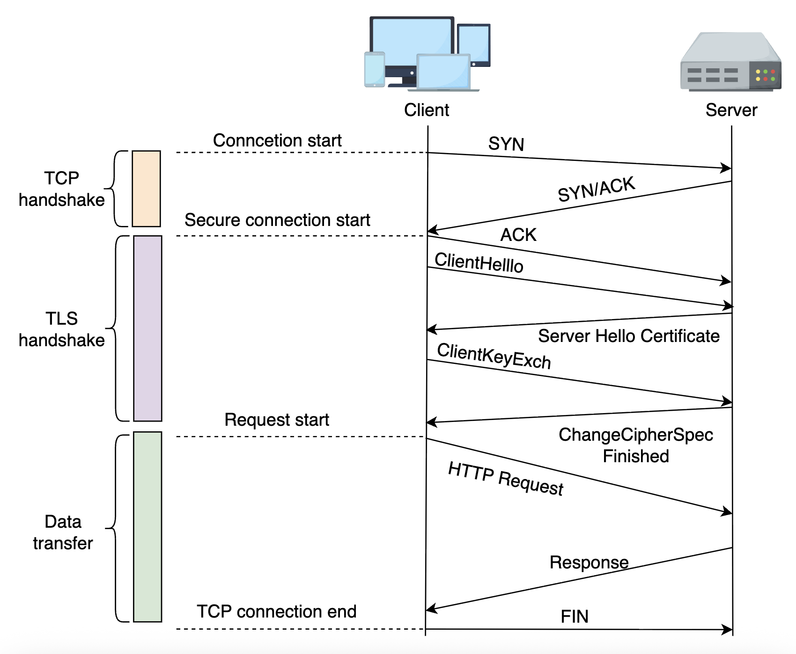
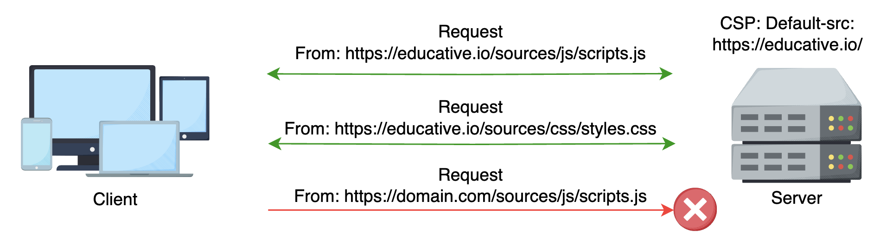

# Secure Data Transmission, Content Policies, and Vulnerabilities

Learn about secure data transmission, content policies, and common vulnerabilities in client-side applications.

In 2017, Equifax faced a major data breach that exposed sensitive information of over 145 million people. While backend flaws played a role, a key issue was how data was handled and secured during user interactions. When data isn't properly protected as it moves through a system, it becomes an easy target for attackers. In today's frontend system design, keeping data safe starts at the user interface, not just the backend.

The frontend is the first point where users connect and data is exchanged. By securing how data is sent, setting clear rules for what content can load, and guarding against common threats, we can build strong frontend systems that protect user information and earn their trust.

In this lesson, we will explore the following:

- **Secure data transmission:** How using HTTPS and robust encryption protocols can shield data as it travels between clients and servers.
- **Content security policies (CSP):** Strategies for defining strict resource loading rules to prevent malicious content from compromising our application.
- **Common vulnerabilities:** A closer look at threats like XSS, CSRF, and clickjacking, and the best practices to mitigate them.

Let's explore how these elements form the frontline defense in protecting user interactions and maintaining the integrity of modern web applications.

---

## Secure data transmission

Data in transit is like a confidential conversation moving through a crowded room. It can be intercepted, listened to, or manipulated by malicious actors without proper protection. This is why secure data transmission is fundamental to any secure frontend design.

Let's start by exploring the role of communication protocols in securing data in transit.

### The role of HTTPS

Hypertext transfer protocol secure (HTTPS) is the cornerstone of online secure communication. It combines the standard HTTP protocol with transport layer security (TLS), which ensures encryption, authentication, and data integrity for secure communication over the web. TLS (formerly known as SSL) encrypts the data exchanged between the user's browser and the web server, ensuring it remains indecipherable even if the data is intercepted.

When we access a website over HTTPS, our browser initiates a TLS handshake with the server. During this handshake, the server presents a digital certificate issued by a trusted certificate authority (CA). This certificate confirms the server's identity and establishes the encryption keys to secure the communication. The entire process ensures that both parties, our browser and the server, are confident in each other's authenticity and that the data exchanged is kept private, as shown below:


A secure connection for communication between a client and a server

**Note:** Digital certificates issued by servers function similarly to user login credentials (typically username and password) but for server authentication.

Using HTTPS is not just a recommendation, it's a necessity. Without HTTPS, any data transmitted between the client and server, such as login credentials, personal information, or payment details, is sent in plain text. This makes it vulnerable to eavesdropping, man-in-the-middle attacks, and data tampering. Modern browsers even flag HTTP websites as "Not Secure," signaling users that their data might be at risk.

In addition to encryption, HTTPS offers data integrity. Any data exchanged cannot be altered without detection, protecting against subtle attacks where malicious actors could inject harmful content or commands into the data stream. HTTPS also provides authentication through digital certificates, assuring users they communicate with a legitimate server and not an impostor.

The following table summarizes the key differences between HTTP and HTTPS:

| Aspect           | HTTP                     | HTTPS                                     |
| :--------------- | :----------------------- | :---------------------------------------- |
| Encryption       | None                     | TLS/SSL encryption; typically AES 128/256 |
| Data integrity   | Susceptible to tampering | Protection against data manipulation      |
| Authentication   | No identity verification | Uses certificates to authenticate servers |
| Browser warnings | Marked as "Not Secure"   | Trusted by modern browsers as secure      |

Let's look at the best practices we must keep in mind to secure data transmission while designing frontend systems.

### Best practices for secure data transmission

To ensure secure data transmission, developers and system architects should follow these best practices:

- **Always use HTTPS:** We must ensure that every resource—images, scripts, and APIs—loads over HTTPS. Mixed content (where some resources load over HTTP) can create security gaps.

- **Implement HTTP strict transport security (HSTS):** HSTS is a policy mechanism instructing browsers to interact with a website only over HTTPS. Once a browser receives an HSTS header, it will refuse to connect via HTTP, even if the user manually enters an HTTP URL.

- **Use up-to-date encryption protocols:** We should use TLS 1.2 and TLS 1.3, as they are currently recommended. Older protocols like TLS 1.0 and TLS 1.1 have known vulnerabilities and should be avoided.

- **Regularly update certificates:** We must keep track of and renew our digital certificates before they expire. An expired certificate can leave our site vulnerable or cause trust warnings for our users.

**Note:** Ensuring that our data is securely transmitted establishes a robust foundation for further security measures, creating a safe pathway for sensitive information as it travels across the digital landscape.

---

## Content security policies (CSP)

Secure transmission is like ensuring the conversation happens in a quiet, secure room. In that case, content security policies (CSP) are like setting strict rules about who is allowed in that room. CSP is a powerful tool designed to prevent various attacks, particularly cross-site scripting (XSS), by controlling which resources a web page can load.

Content security policy is an added layer of security that helps detect and mitigate certain types of attacks, including XSS and data injection attacks. It allows web developers to create an allowlist of sources from which the browser can load content. This includes scripts, stylesheets, images, fonts, and other resources. If a resource isn't from a trusted source defined in the policy, the browser will block it from loading.

For example, a CSP might specify that scripts can only be loaded from our domain and a couple of trusted external domains. This ensures that if an attacker injects a malicious script into our application, the browser will refuse to execute it because it's not from an allowed source.

A typical CSP header might look like this:

```javascript
Content-Security-Policy: default-src 'self'; script-src 'self' https://safesite.com; style-src 'self' 'unsafe-inline';
```

In this example, the policy tells the browser that:

- The default source for all content is the same origin as the document.
- Scripts are only allowed from the same origin or the safesite.com domain.
- Styles can be loaded from the same origin, and inline styles are explicitly allowed ('unsafe-inline'), which can introduce security risks unless properly managed.

### How does CSP mitigate attacks?

Enforcing a strict CSP reduces the risk of loading malicious content into our application. For instance, if an attacker attempts to inject a script tag pointing to a malicious external site, the browser will block it because the source isn't listed in our CSP. Similarly, if a hacker tries to load an image with embedded malicious code from an unapproved domain, CSP will prevent it from being displayed.

The following illustration represents how CSP works:


Mitigating attacks using CSP

### Best practices for effective CSP

To implement an effective CSP, we should consider the following guidelines:

- **Define strict allowlists:** We should only allow content from trusted sources and avoid using wildcards (e.g., \*), which can weaken our policy.

- **Avoid inline scripts and styles:** Inline scripts and styles can be an XSS attack vector. Instead, we must move them to external files and only allow those from trusted sources.

- **Review and update policies regularly:** As our application evolves, so should our CSP. We should regularly audit your policy to reflect security needs and external resource dependencies.

- **Test thoroughly:** We should use browser developer tools and CSP reporting features to identify and fix potential violations before rolling out changes to production.

---

## Vulnerabilities in frontend

Even with secure data transmission and strict content policies, our application is not immune to vulnerabilities. The most common threats include cross-site scripting (XSS), cross-site request forgery (CSRF), and clickjacking.

Understanding these vulnerabilities and implementing best practices to mitigate them is crucial. Let's discuss these different threats and mitigation strategies.

### Cross-site scripting (XSS)

Cross-site scripting (XSS) is an attack where intruders inject malicious scripts into a trusted website. When users load the compromised page, the injected script executes, potentially stealing sensitive data, hijacking sessions, or performing unwanted actions on behalf of the user.

There are three main types of XSS attacks:

- **Stored XSS:** The malicious script is permanently stored on the target server (e.g., in a database) and is served to users as part of normal content.

- **Reflected XSS:** The malicious script is reflected off the web server, such as in an error message or search result, and executed immediately.

- **DOM-based XSS:** The attack exploits vulnerabilities in client-side code, where the malicious payload manipulates the browser's Document Object Model (DOM).

To mitigate XSS, we should focus on the following:

- **Sanitize and validate user input:** We should never trust user input and must use robust libraries to sanitize data before storing or **_displaying it._**

- **Implement CSP:** As discussed earlier, CSP can prevent the execution of unauthorized scripts.

- **Escape output:** We should ensure any dynamic content is properly escaped before rendering it in the browser.

**Example:** A common XSS vulnerability occurs when user input is directly inserted into the DOM without proper sanitization.

For instance, consider the following insecure JavaScript code:

Insecure code prone to XSS vulnerability

```html
<!-- Insecure: Directly inserting user input into the DOM -->
<div id="userComment"></div>
<script>
  // Assume 'comment' is obtained from a query parameter or user input
  var comment = location.search.split("=")[1];
  document.getElementById("userComment").innerHTML = comment;
</script>
```

If an attacker passes a malicious script as the comment value (e.g., `<script>alert('XSS Attack!');</script>`), the browser will execute that script, potentially stealing cookies or performing other malicious actions.

To prevent this, we should always sanitize or escape user input.

Many frameworks provide built-in methods to handle this. Here's a more secure version using text insertion instead of HTML:

A sanitized code to avoid XSS vulnerability

```html
<!-- Secure: Inserting text content to prevent script execution -->
<div id="userComment"></div>
<script>
  var comment = decodeURIComponent(location.search.split("=")[1]);
  // Using textContent instead of innerHTML escapes any HTML tags
  document.getElementById("userComment").textContent = comment;
</script>
```

### Cross-site request forgery (CSRF)

CSRF attacks trick authenticated users into performing unwanted actions on a web application in which they are currently authenticated.

For example, a malicious website could instruct a user's browser to send a request to transfer funds or change account settings on another site where the user is logged in.

Mitigation strategies include:

- **Anti-CSRF tokens:** We can generate unique tokens for each user session and include them in forms and API requests. The server verifies these tokens before processing the request.

- **SameSite cookie attribute:** We can configure cookies with the SameSite attribute to restrict them from being sent in cross-site requests.

- **Double-submit cookies:** We can send the same CSRF token in two places, one as a cookie and the other as a custom request header. The server validates the request by ensuring both values match, confirming it originated from the legitimate client.

**Example:** CSRF attacks occur when a user's authenticated browser is tricked into sending unintended requests.

Consider a simple form that lacks CSRF protection:

Code lacking CSRF protection

```html
<!-- Insecure: A form without a CSRF token -->
<form action="https://example.com/updateProfile" method="POST">
  <input type="text" name="username" value="currentUsername" />
  <button type="submit">Update Profile</button>
</form>
```

If the user is logged in (If the user's browser has an active authenticated session, for example, a session cookie or bearer token), an attacker could craft a hidden form on another site that submits a request to updateProfile, thereby changing the user's profile without their knowledge.

To prevent this, we can introduce a unique CSRF token generated by the server and include it as a hidden field in every form. The server validates this token with every request:

Code with CSRF protection

````html
<!-- Secure: A form with a CSRF token -->
<form action="https://example.com/updateProfile" method="POST">
  <input type="hidden" name="csrfToken" value="generated_unique_token_here" />
  <input type="text" name="username" value="currentUsername" />
  <button type="submit">Update Profile</button>
</form>
```html

<!-- Secure: Including a CSRF token -->
<form action="https://example.com/updateProfile" method="POST">
  <input type="hidden" name="csrfToken" value="generated_unique_token_here" />
  <input type="text" name="username" value="currentUsername" />
  <button type="submit">Update Profile</button>
</form>
````

**Note:** The hidden CSRF token ensures that the request originates from a trusted source, allowing the server to verify its authenticity before processing the action. On the server side, we must ensure that the received csrfToken matches the expected value stored in the user's session.

### Clickjacking

Clickjacking is a technique where an attacker tricks a user into clicking on something different from what the user perceives, often by overlaying transparent layers over legitimate web pages. This can lead to unauthorized actions, such as changing settings or unintentionally revealing confidential information.

To prevent clickjacking, we can use:

- **X-Frame-Options header:** We can set this HTTP header to prevent our website from being framed by external domains. The DENY or SAMEORIGIN values are commonly used for prevention. For example, the following code sets X-Frame-Options header:

Code to avoid clickjacking using HTTP header

```javascript
// Secure: Setting the X-Frame-Options header in Express.js
app.use((req, res, next) => {
  res.setHeader("X-Frame-Options", "SAMEORIGIN");
  next();
});
```

This header instructs the browser not to display our site in a frame, protecting our users from clickjacking attacks.

- **Frame-busting scripts:** We must implement client-side scripts that prevent our content from being embedded in frames, although these are considered less reliable than HTTP headers.

The following table summarizes these common vulnerabilities and their mitigation strategies:

| Vulnerability | Description                                                                                      | Mitigation                                                                    |
| :------------ | :----------------------------------------------------------------------------------------------- | :---------------------------------------------------------------------------- |
| XSS           | Injection of malicious scripts into trusted web page, later executed by victim's browser.        | Input sanitization, output escaping, CSP, and use of secure frameworks        |
| CSRF          | Forces authenticated users to execute unintended actions on a trusted site without their consent | Anti-CSRF tokens, SameSite cookie attribute, and double-submit cookies        |
| Clickjacking  | Tricks users into clicking on concealed, malicious elements.                                     | X-Frame-Options header, frame-busting scripts, and use of CSP frame-ancestors |

---

## Best practices for mitigating vulnerabilities

A secure frontend environment is achieved through proactive defenses and continuous monitoring. Here are some overarching best practices:

- **Keep dependencies up-to-date:** Many vulnerabilities arise from outdated libraries or frameworks. We must regularly update software to patch known vulnerabilities.

- **Conduct regular security audits:** Automated tools and manual penetration testing can help uncover potential security gaps.

- **Educate team:** We should ensure developers understand secure coding practices and the latest threats. We can conduct regular training and code reviews for effective frontend security.

- **Implement defense in depth:** We should use multiple layers of security so that if one layer fails, others remain to protect your system.

---

## Additional security in frontend design

While secure data transmission, CSP, and mitigation of common vulnerabilities form the core of our security strategy, there are additional factors to consider in a modern frontend environment.

Additional security consideration in frontend design:

- **Secure APIs:** To stay secure, frontend apps must interact with backend APIs that enforce authentication, authorization, rate limiting, and input validation, even if the frontend is compromised.

- **Client-side storage:** Store sensitive data securely using HTTP-only cookies and avoid exposing tokens to JavaScript when possible.

- **Logging and monitoring:** Implement event logging and real-time monitoring on both the frontend and backend to quickly detect and respond to suspicious activity.

- **Penetration testing:** Conduct tests to uncover vulnerabilities such as XSS or broken access control, ensuring compliance and proactive security.

---

## Conclusion

Frontend System Design security starts with securing data between client and server, controlling what content can be loaded, and being ever-vigilant about potential vulnerabilities. We can secure data transmission through HTTPS, strict content security policies, and proactive mitigation strategies against XSS, CSRF, and clickjacking.

A practical implementation might involve the following steps:

1. Begin by enforcing HTTPS on all endpoints, ensuring that every piece of data is encrypted and verified.

2. Configure the server to send a robust CSP header, defining which sources can load content on the client side.

3. Regularly audit code and external dependencies for vulnerabilities and employ automated tools to monitor for any security incidents.

4. Educate the development team and continuously refine your security policies as new threats emerge.

As we design and maintain our applications, we should remember that security is not a one-time task. It requires continuous evaluation, adaptation to emerging threats, and an ongoing commitment to best practices.
Begin by enforcing HTTPS on all endpoints, ensuring that every piece of data is encrypted and verified.

Configure the server to send a robust CSP header, defining which sources can load content on the client side.

Regularly audit code and external dependencies for vulnerabilities and employ automated tools to monitor for any security incidents.

Educate the development team and continuously refine your security policies as new threats emerge.

As we design and maintain our applications, we should remember that security is not a one-time task. It requires continuous evaluation, adaptation to emerging threats, and an ongoing commitment to best practices.
