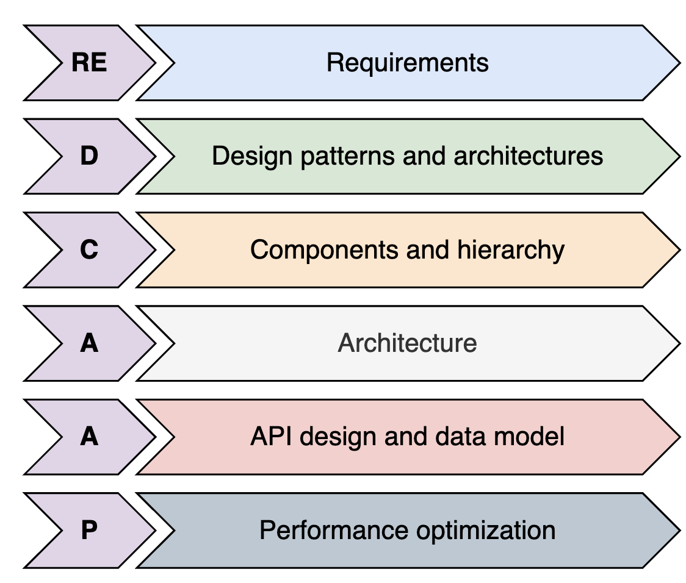

# The REDCAAP Approach for Designing Frontend Systems

Understand REDCAAP, a framework to tackle and design any frontend System Design problem.

Designing a frontend system that scales well and stays easy to maintain isn’t easy. Modern frontend applications are complex, often requiring efficient component management, structured state handling, seamless backend integration, and performance optimizations.

With so many moving parts, approaching frontend design without a clear framework can lead to confusion, unnecessary rework, and long-term technical debt. A systematic approach helps break the problem into manageable pieces, ensures no critical detail is missed, and encourages consistent, scalable solutions.

**Note:** To solve this, we use a structured REDCAAP method to approach any frontend System Design challenge.

## What is the REDCAAP framework?

REDCAAP is a step-by-step framework that guides the entire design process of a large-scale frontend system. From defining system requirements to optimizing performance, REDCAAP helps ensure that every fundamental aspect of a solid frontend system is thoughtfully considered and addressed.

The following breakdown explains what REDCAAP stands for:

### The breakdown of the REDCAAP framework

The breakdown of the REDCAAP framework

## Why a structured approach?

Adopting a structured approach like REDCAAP offers multiple advantages:

- Breaks down complex frontend design problems into smaller, manageable steps.
- Ensures maintainability and scalability by addressing key system components upfront.
- Improves decision-making for choosing architectures, design patterns, and optimization techniques.
- Enhances interview performance by providing a clear and structured method for answering any System Design questions.

Regardless of the application you are designing, REDCAAP not only structures your design process but also helps you ask the right questions at every stage.

**Tip:** One major advantage of a systematic approach like REDCAAP is that it helps you tackle even unfamiliar or complex frontend problems step by step.

Let’s now discuss each step of the REDCAAP framework in detail.

---

## Requirements (RE)

Every great frontend system starts with a well-defined set of requirements. So, the first step in frontend System Design is understanding the system’s requirements. Without a clear understanding of the system’s goals, it’s easy to make design choices that result in performance issues, a poor user experience, or an architecture that doesn’t scale.

In this step, we focus on two types of requirements:

- **_Functional requirements _**
  describe what the system needs to do—its core features and how users interact with them.
  For instance, in a chat application, functional requirements might include real-time messaging, typing indicators, message read receipts, and user presence updates.
- **_Non-functional requirements_**, on the other hand, determine how well the system should perform.
  These include constraints such as latency, availability, scalability, and responsiveness.
  For a video streaming application, non-functional requirements might demand low buffering times, adaptive video quality, and fast content delivery.

**Note:** By clearly outlining functional and nonfunctional requirements upfront, we ensure that the frontend system is designed to meet user expectations while remaining scalable and performant.

---

## Design patterns and architectures (D)

Once the requirements are clear, the next step is to choose suitable design patterns and architectures that help organize the frontend system in a structured and efficient way. Design patterns are essential because they improve maintainability and prevent code duplication. In this step, we will talk about the following:

- MVC vs. MVVM vs. MVP: These architectural patterns define how UI, logic, and data interact. We’ll assess the best suited for clearly separating concerns, testability, and dynamic updates.

- SPA vs. MPA: This decision addresses how the application loads and navigates, whether through a single dynamic interface or multiple page reloads. Each has performance and SEO trade-offs.

- Monolithic SPA vs. micro-frontend: Depending on scale and team structure, we’ll choose between a single bundled interface or multiple independently developed and deployed frontend units.

- Component-based vs. monolithic UI: When building a UI, we must decide between building with reusable components or a more centralized approach, weighing modularity and performance.

- Unidirectional vs. bidirectional data flow: How data flows through the application—predictably in one direction or interactively in both—directly affects state management and real-time responsiveness.

Selecting the right design pattern ensures that the frontend remains scalable, modular, and well-structured, making adding new features easier and maintaining long-term stability.

---

## Component and hierarchy (C)

Frontend applications should be built as a collection of modular, reusable components, ensuring each component follows a single responsibility principle. A modular approach makes it easier to develop, test, and optimize individual parts of the UI. In this step, we will cover:

- How to break down a UI into independent, reusable components
- The importance of a hierarchical structure
- State management within components, avoiding unnecessary re-renders and optimizing updates

We’ll also look at how a component hierarchy is more than just a UI tree—it defines clear boundaries and roles for each component. This structured approach improves code maintainability, reusability, and overall application efficiency.

Press

- to interact

### Component’s hierarchy

Component’s hierarchy

**Note:** A well-defined component hierarchy ensures a clean, efficient, modular frontend system.

---

## Architecture (A)

This step will explore frontend System Design, focusing on how modular frontend components form a cohesive user interface. We’ll also discuss how these components map to backend services. This step bridges the gap between UI composition and backend integration, laying the foundation for a responsive, maintainable, and scalable system. This ensures each part of the system works well on its own and performs smoothly when integrated with backend services.

Press

- to interact

### Modular frontend mapping to backend (services)

Modular frontend mapping to backend (services)

---

## API design (A)

A well-designed API is essential for fast, efficient, and predictable frontend-backend communication. How data is fetched, structured, and transmitted directly impacts frontend performance, responsiveness, and scalability. In this step, we focus on how frontend systems interact with backend services by covering key API design aspects, including:

- Start by choosing the right API architectural style, communication protocol, and data format.
- Define clear, modular, and purpose-driven API endpoints to support frontend interactions effectively.
- Define optimized data models and API architectures that minimize over-fetching and under-fetching, ensuring that the frontend gets the data it needs in the most efficient format.

Press

- to interact

**Note:** This step ensures that the frontend system efficiently retrieves and presents data, reducing unnecessary complexity while maximizing performance and scalability.

---

## Performance optimization (P)

A good frontend should be fast, accessible, compatible, secure, and scalable—ensuring a smooth user experience on any device. In this step, we’ll focus on optimizing the following key NFRs:

- Performance: Ensuring fast rendering, optimized network requests, and smooth interactions.
- Compatibility: Supporting multiple devices, browsers, and screen resolutions.
- Accessibility (a11y): Designing inclusive applications for users with disabilities.
- Security: Protecting user data and preventing frontend vulnerabilities.
- Localization and internationalization: Making sure the frontend supports multiple languages, currency formats, and regional settings.

A performance-optimized frontend ensures low latency, reduced load times, and improved user experience, making the system highly efficient at scale.

---

## Conclusion

The REDCAAP framework provides a structured approach to breaking down frontend System Design problems, ensuring that solutions are scalable, maintainable, and well-optimized. By following this strategic method, candidates can confidently analyze system requirements, propose efficient architectures, and optimize frontend applications for real-world scenarios.
