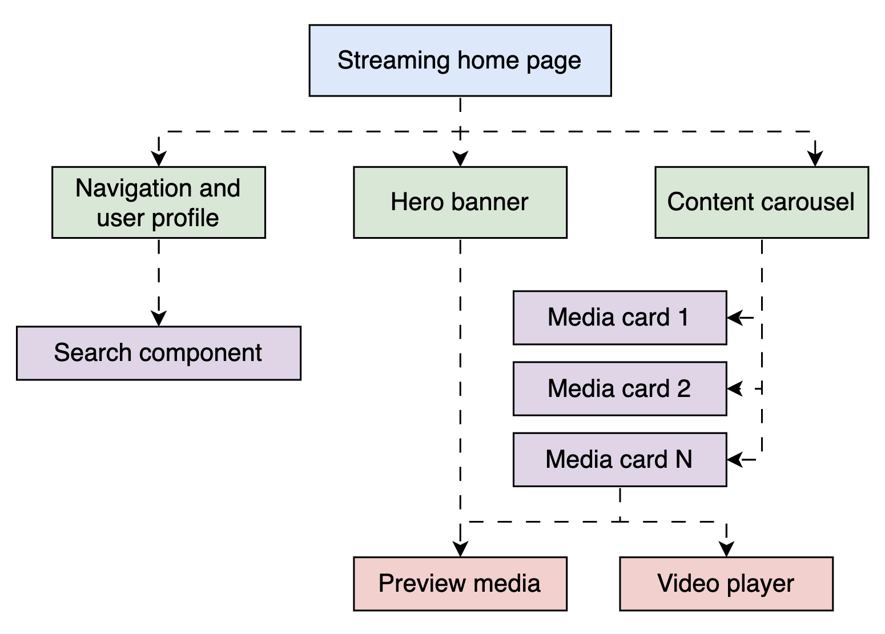
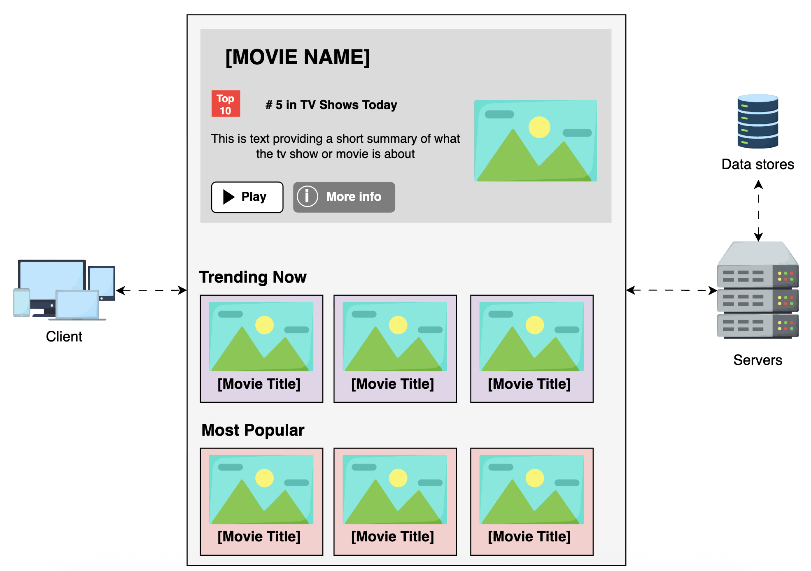
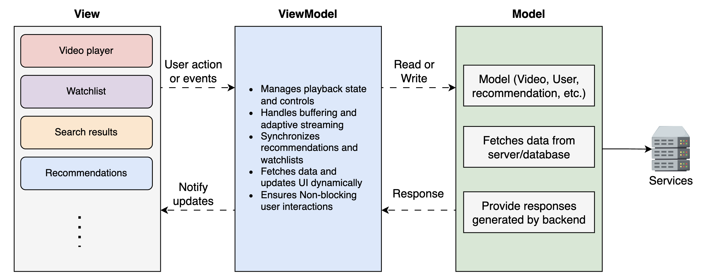
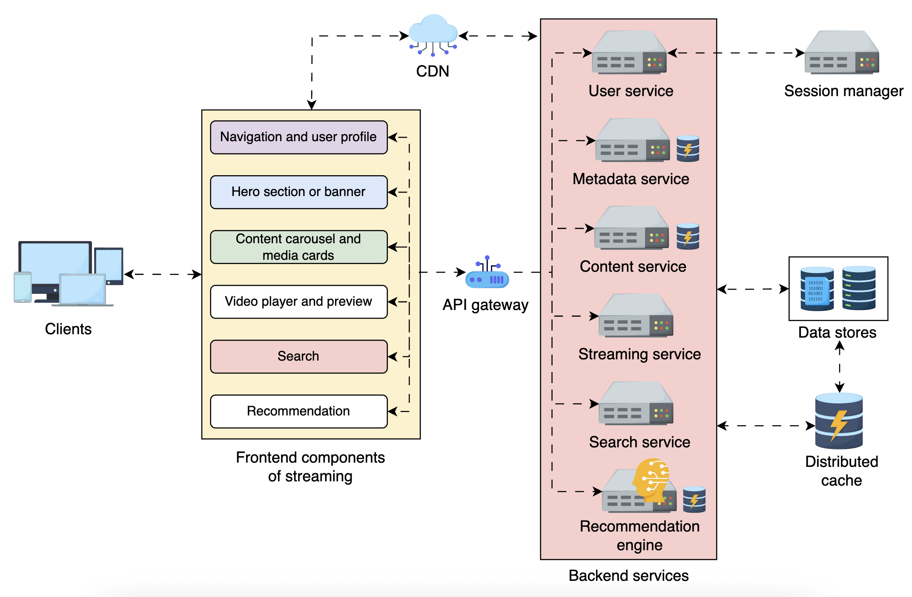

# Netflix / YouTube — Streaming Use Case

A compact, formatted page capturing non-functional requirements, architecture decisions, and chosen approaches for a streaming application (video playback, recommendations, interactions).

## Non‑Functional Requirements (NFRs)

- **Performance:** Fast load times, low startup latency, smooth playback and scrubbing, efficient bandwidth usage.
- **Reliability:** High uptime, low error rates, graceful degradation for poor networks, retry/backoff strategies.
- **Scalability:** Handle large concurrent viewers, spikes from popular content, and global traffic distribution.
- **Security & Privacy:** Protect user data, secure stream URLs, DRM where required, secure APIs and authentication.
- **Maintainability:** Clear separation of concerns, modular code, observability (metrics, logs, traces) and automated CI/CD.

## Decisions: Aspects, Options, Chosen Approach

| Aspect                | Options                               | Chosen approach & justification                                                                                                                                                         |
| --------------------- | ------------------------------------- | --------------------------------------------------------------------------------------------------------------------------------------------------------------------------------------- |
| Architecture pattern  | MVC, MVVM, Flux/Redux                 | **MVVM** — promotes clear separation between UI and state, reactive updates for player state (buffering, quality), easier testing.                                                      |
| Frontend architecture | SPA, MPA, Hybrid                      | **SPA** — seamless transitions between videos and UI panels, lower perceived latency for navigation and playback controls.                                                              |
| Application structure | Monolithic SPA, Micro-frontends       | **Monolithic SPA** (initial) — simpler deployment and lower runtime overhead; consider micro-frontends later for independent release cadence of large features (e.g., recommendations). |
| UI design             | Component-based, Monolithic templates | **Component-based UI** — encapsulated player, metadata, comments, and recommendations components improve reusability and testability.                                                   |

## Short rationales and notes

- Start with a monolithic SPA built with clear component boundaries. This minimizes initial operational complexity while delivering fast, integrated UX.
- Use MVVM or a reactive state library (e.g., React with a view-model layer or Vue) to keep playback state predictable and decoupled from rendering.
- Plan for future decomposition: when team size or release complexity grows, extract heavy modules (recommendations, analytics, comments) as micro-frontends.
- Observability: instrument player events (startup time, buffering events, bitrate switches) and backend metrics (CDN hit ratio, origin latency) for SLOs.

---

File reformatted for readability and consistency; tell me if you want additional sections (CDN strategy, player architecture, adaptive bitrate specifics, or diagrams).

# Components

- Main page
  - Navigation
    - User Profile
    - Search
  - Hero/banner
  - Content list/carousel
    - Media cards (thumbnails)
  - Video preview
  - Video player

Users accessing the streaming platform engage with various frontend components that dynamically fetch and render content.

User actions like watchlist updates or ratings are sent asynchronously to the backend.

This is a high-level frontend System Design of streaming service

# MVVM Architecture

The Model-View-ViewModel (MVVM) architecture ensures smooth playback, real-time interactions, and efficient state management without blocking the UI in a video Streaming platform.

It separates concerns, making managing dynamic UI updates, buffering progress, and video playback state more efficient.

## How MVVM works

**_View (UI components)_** → The video player, watchlist, recommendations, and search UI display content and handle user interactions like play, pause, seek, and quality selection.

**_ViewModel (state and business logic)_** → Acts as a middleware between the View and Model, handling UI state management, buffering logic, user actions, and API responses while keeping the UI responsive.

**_Model (data and API layer)_** → Fetches structured data from content services, recommendation engines, and streaming servers, ensuring smooth media delivery.

# Comms

Let’s explore how each frontend component connects to the backend, ensuring a robust System Design.

**_Navigation and user profile_**
The navigation component interacts with the **_user service _** to fetch account details, preferences, and watch history. The user service connects with the session manager to maintain the user’s state across devices or just keeps track of the session in the users service.

**_Hero section/banner_**: The hero section interacts with the **_recommendation engine_** to display trending or personalized content based on watch history, engagement, and regional preferences.

**_Content carousel_**: The carousel component fetches categorized media from the **_content service_**, which retrieves structured metadata from the **_metadata service_** (also used by the media card for thumbnails). Lightweight details load first, with lazy loading fetching additional content as users scroll.

**_Preview media and video player_**: The video player interacts with the **_streaming service_**, which retrieves video segments from the **_CDN_** using a manifest file, ensuring seamless playback and adaptive streaming.

**_Search and recommendations_**: The **_search service_** enables real-time lookup and cached query results for faster searches, while the recommendation engine refines content suggestions dynamically based on user behavior, enhancing discovery and engagement.

# Preloading and adaptive UI rendering

## Preloading

A great streaming experience depends on how intelligently the frontend anticipates user actions.

When to preload:

- User behavior and interaction patterns
- Playback continuity
- Screen positioning and visibility

## Adaptive UI

How adaptive UI rendering works
**_Scroll speed and interaction-based rendering:_**
Fast scroll brings only images and some text, previews and extensive metadata are not fetched until there is a clear intention to interact (slow down, move cursor or selection)

**_Connection-aware content loading:_** The frontend adapts to network conditions, preloading lower-quality content on slow connections and higher-quality content when bandwidth allows.

**_Progressive content loading_**
Rather than overloading the system upfront, content is loaded in stages based on priority. This is called progressive enhancement, where the system renders content in the following stages:

Stage 1: Load lightweight UI elements (placeholders, skeleton loaders, minimal thumbnails).

Stage 2: Fetch visible thumbnails (in the viewport) and essential text.

Stage 3: Load additional metadata, ratings, and background images as the user slows down or interacts.

Stage 4: Only when a user hovers or clicks, fetch detailed media previews or video clips.

# Architectural style

## Data retrieval method

REST is the better choice for video streaming because it efficiently delivers video content, integrates well with CDNs, and leverages caching for performance optimization. Each backend service (e.g., metadata, recommendations) already handles filtering internally, reducing the need for GraphQL’s flexible querying

GraphQL’s common usage (single POST endpoint with variable request bodies and arbitrary, nested field selections) breaks the assumptions HTTP caches and CDNs rely on (stable URL + method + headers → cache key).

## HTTP Protocol

A mix of HTTP/2 and HTTP/3, allowing the client and server to negotiate the best available protocol at runtime.

HTTP/2 offers strong compatibility and efficient multiplexing, while HTTP/3, built on QUIC, reduces latency and performs better in lossy or mobile networks.

This hybrid approach ensures optimal streaming performance across various devices, browsers, and network conditions.

## Data formats

As video playback requires efficient data handling, binary formats are used for media files ensuring fast, scalable, and optimized streaming performance.

JSON remains the best choice for metadata, user data and any data that is not media,

## Data retrieval strategy/pattern

For on-demand video streaming, polling (REST API calls) is sufficient for fetching content like video files, metadata, and recommendations.

**_As the data is mostly static after retrieval_**, there’s no need for WebSockets or SSE, making polling the most efficient and scalable choice.

However, if we opt to include live streaming, a hybrid approach is preferred—WebSockets for interactive features and SSE for real-time updates, ensuring low latency and efficient resource usage.

## Endpoints

Playback media

    - Fetch_**
    -> GET /v1.0/manifest?itemID HTTP/2
    retrieves media manifest with data used by the media player. Contains essential information like available resolutions, segment URLs, and subtitles.

    - Playback
    -> GET /v1.0/playback?vidSegIdidSegID=abc&range=xyz&resolution=1080p HTTP/2
    Once we have the manifest file, we can use the data to fetch video segments using segment URLs based on network conditions.

    - Playback Configuration
    -> POST /v1.0/playback HTTP/2
    Sends usage statistics or state to the server for analysis and optimization.

    - Show Content
    -> GET /v1.0/showfeed?userID, page, limit, genreFilters (optional) HTTP/2
    Return user feed or list of related videos

    - Search Content
    -> GET /v1.0/search?query=...filters... HTTP/2

Rate Content
-> POST /v1.0/rate HTTP/2

Create Comment
-> POST /v1.0/comment HTTP/2

## Endpoints table

| Function               | API Method | Endpoint                | Data Entities                                   |
| ---------------------- | ---------- | ----------------------- | ----------------------------------------------- |
| Fetching manifest file | GET        | /v1.0/manifest/{itemID} | itemID                                          |
| Playback media         | GET        | /v1.0/playback          | userID, itemID, vidSegID, resolution, subtitles |
| Playback configuration | POST       | /v1.0/playback          | userID, itemID, currentPosition                 |
| Show content feeds     | GET        | /v1.0/showfeed          | userID, page, limit, genreFilters               |
| Search content         | GET        | /v1.0/search            | query, genreFilters[], region, page, limit      |
| Rate content           | POST       | /v1.0/rate              | userID, itemID, rating, comment                 |
| Add comment            | POST       | /v1.0/comment           | userID, itemID, text, parentCommentID           |

# NFRs

## Compatibility

| Compatibility Factor                                 | Compatible Decision                                                                                                                                                                                                                                                                                                                                                                                                                                     |
| ---------------------------------------------------- | ------------------------------------------------------------------------------------------------------------------------------------------------------------------------------------------------------------------------------------------------------------------------------------------------------------------------------------------------------------------------------------------------------------------------------------------------------- |
| HTTP/2 and HTTP/3 protocol -> issue: diff bandwidths | Supports multiplexing to reduce latency for devices with limited processing power.  Clients automatically negotiate the best protocol based on capabilities and network conditions.  HTTP/3 improves compatibility with mobile and high-latency networks, while HTTP/2 ensures reliable fallback for older devices and browsers.  Enables efficient resource loading, ensuring compatibility with bandwidth-limited devices           |
| REST architectural style                             | Enables platform-agnostic communication, allowing different frontend clients to interact with the same backend seamlessly.  Allows easy adaptation to evolving frontend and backend changes without breaking compatibility.  Standardized HTTP methods ensure interoperability across devices and platforms.  REST’s stateless and uniform interface ensures consistent device communication, improving cross-platform compatibility. |
| Device compatibility                                 | Responsiveness for various screen sizes, ensuring optimal playback.  Optimizing video resolution and bitrate adaptation based on device capabilities.  Implementing touch-friendly controls and remote navigation support for TV interfaces.                                                                                                                                                                                                |
| Browser compatibility                                | Adheres to W3C video playback standards to ensure smooth playback across browsers.  Uses polyfills and codecs to support various video formats (MP4, WebM, HLS, DASH).  Regular testing across browsers to ensure video streaming consistency.                                                                                                                                                                                              |
