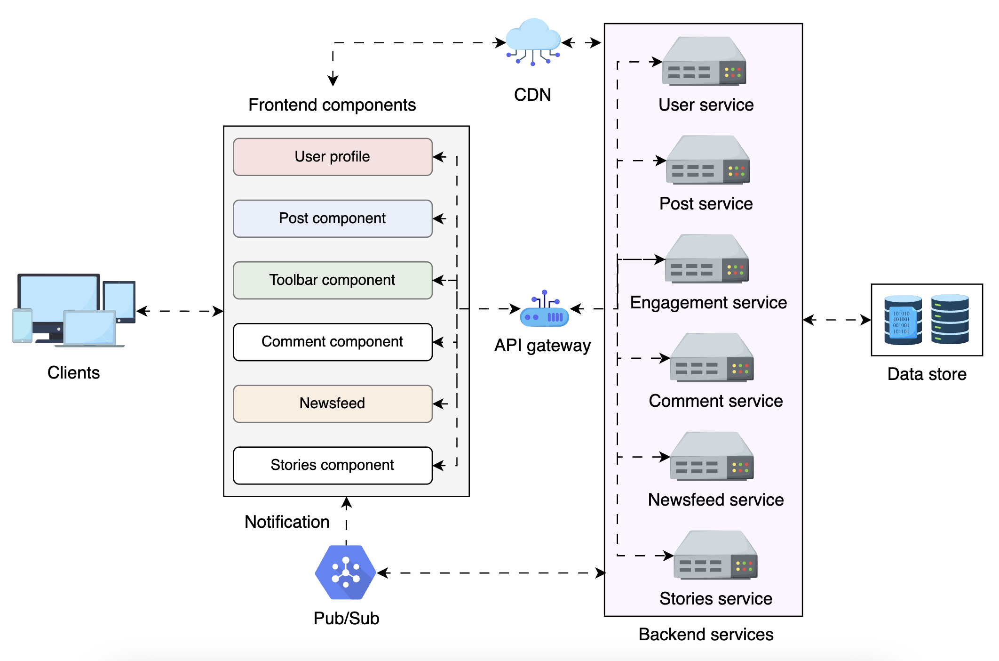

The core idea of this approach is to align modular frontend components with specific backend microservices, creating a clear, structured relationship. Each component has a dedicated backend service responsible for handling its specific functionality, leading to better separation of concerns and improved system performance, as follows:

Post component → connected to a post service that handles creating, reading, updating, and deleting posts.

Comment component → connected to a comment service for managing comments on posts.

Toolbar component → connected to an engagement service (e.g., like/dislike, share).

Stories component → linked to a stories service that fetches and manages user stories.

Newsfeed component → connected to a newsfeed service for generating personalized feeds. At the frontend, the newsfeed connects all other components; on the backend, the newsfeed service also communicates with other services to fetch posts, comments on each post, and engagement numbers for each.

---

We have used other crucial components in ensuring the frontend system’s efficiency, scalability, and responsiveness. Here’s how each contributes:

**_API gateway: Routing/Authentication/Caching Requests/Rate limiting_**
In a newsfeed system, the API gateway acts as a single entry point for frontend requests, routing them to relevant backend services like post, user, engagement, and newsfeed. It also manages rate limiting to prevent excessive API calls from infinite scrolling, caching frequently accessed newsfeed data to reduce redundant requests, and authenticating user sessions to ensure secure interactions.

**_Content delivery network (CDN): Caching static assets (video, icons, images)_**
A CDN optimizes newsfeed performance by caching static assets like profile pictures, post images, and video thumbnails closer to the user’s location. This reduces latency and server load, ensuring that posts and media content load instantly as users scroll. Additionally, preloading techniques allow faster rendering of upcoming posts in the feed, enhancing the overall experience.

**_Pub/Sub or SSE : Realtime updates pushed/published from the server_**
In a newsfeed system, pub/sub enables real-time updates, ensuring users see new posts, likes, comments, and shares instantly without refreshing the page. When a user interacts with a post (e.g., liking it), a publish event is triggered, notifying subscribers (other users), and the UI is updated dynamically. This supports live notifications, trending content updates, and interactive engagement, making the newsfeed highly responsive.

**_Data stores: Blob for media (served with the CDN), SQL for user data, metrics, etc_**
A newsfeed system requires structured and unstructured storage to manage different data types. A blob store handles media files like images, videos, and GIFs, ensuring efficient storage and retrieval. Meanwhile, an SQL database stores structured data, including posts, user profiles, engagement metrics (likes, comments, shares), and ranking scores for personalized feeds.
