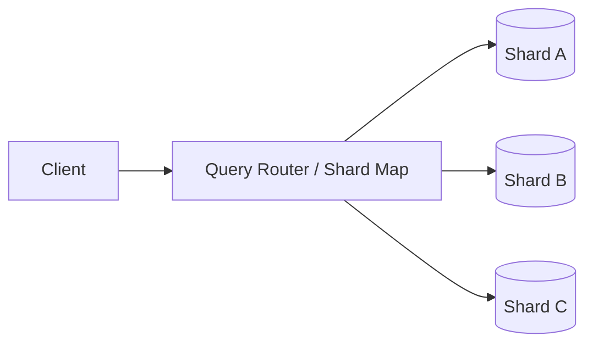
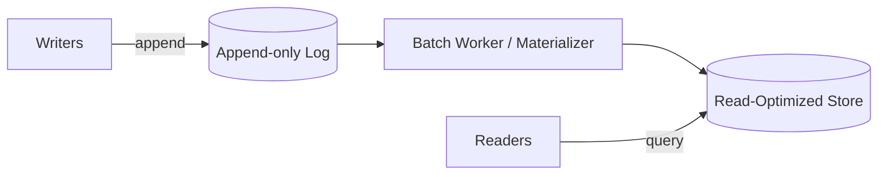

# System Design — Key Concepts (Interview Notes)

A compact reference for interview answers. Aim for clarity, trade-offs, and measurable design choices.

## 1) Load balancing

- What it is: Distributing incoming traffic across multiple servers to improve availability, throughput, and latency.
- Why it matters: Prevents single points of failure, enables horizontal scaling, and smooths traffic spikes.
- Common approaches:
  - DNS round-robin (simple, coarse-grained)
  - Hardware/load‑balancer appliances (L4/L7)
  - Software proxies (HAProxy, Nginx, Envoy)
  - Cloud-managed load balancers (ALB, ELB, Cloud Load Balancer)
- Algorithms to mention: round-robin, least-connections, IP-hash (sticky sessions), consistent hashing (for cache-aware routing).
- Trade-offs & considerations:
  - L4 vs L7: L7 can route by URL/headers but uses more resources.
  - Session affinity: easier but reduces even distribution; prefer stateless services + shared session store.
  - Health checks and graceful drain to avoid sending traffic to unhealthy instances.
- Interview talking points: show how you'd place LB at edge + internal LBs for service meshes, and describe metrics (latency, error rate, saturation) you’d monitor.

### Diagram (Mermaid)

```mermaid
flowchart LR
  Client[Client Requests]
  LB[Load Balancer (Edge)]
  Client --> LB
  LB -->|route| S1[App Instance 1]
  LB -->|route| S2[App Instance 2]
  LB -->|route| S3[App Instance 3]
  subgraph internal
    S1 --> DB[(Database)]
    S2 --> DB
    S3 --> DB
  end
```

ASCII fallback:

    Client ---> [Load Balancer]
                /   |     \
         [App1] [App2] [App3]
            \      |     /
               \   |  /
                 [DB]

## 2) Data partitioning (Sharding)

- What it is: Splitting a dataset across multiple database instances so each shard holds a subset of the data.
- Why it matters: Enables horizontal scaling of storage and writes, reduces per-node load, and improves parallelism.
- Shard key strategies:
  - Range-based: easy for range scans, risks hotspotting.
  - Hash-based: uniform distribution, harder for range queries.
  - Directory/Lookup-based: external mapping (flexible but adds extra lookup cost).
- Rebalancing & resharding:
  - Important to plan for online resharding and migrate data with minimal downtime (rolling migrations, consistent hashing helps).
- Trade-offs & considerations:
  - Cross-shard transactions and joins are expensive — either avoid, use two-phase commit, or accept eventual consistency.
  - Hot shards: detect and remediate (split shard, change key, introduce cache).
- Interview talking points: explain chosen shard key, how you handle rebalancing, and how you serve cross-shard queries (fan-out, scatter-gather, or denormalization).

### Diagram (Mermaid)



ASCII fallback:

    Client --> [Router/Shard Map]
               /      |       \
          [Shard A][Shard B][Shard C]

## 3) Cache strategies

- Purpose: Reduce latency and load on primary data stores by storing frequently accessed data in a fast layer.
- Cache types:
  - In-process (local memory) — ultra-fast, per-instance.
  - Distributed cache (Redis, Memcached) — shared, supports higher capacity and eviction across instances.
  - CDN edge caches — static assets and API responses near users.
- Cache patterns:
  - Cache-aside (lazy load): app checks cache, on miss loads from DB and writes cache.
  - Read-through / Write-through: cache acts as the primary access layer.
  - Write-back (write-behind): buffer writes in cache and persist asynchronously (riskier).
- Eviction & consistency:
  - Eviction policies: LRU, TTL-based expirations.
  - Invalidation strategies: explicit invalidation, short TTLs, or versioning (cache busting).
- Trade-offs & considerations:
  - Stale reads vs load on origin — choose based on correctness needs.
  - Cache stampede: use locking, request coalescing, or probabilistic early regeneration.
- Interview talking points: pick a pattern (cache-aside usually), explain TTLs, eviction, and how to avoid stampedes and cache poisoning.

### Diagram (Mermaid)

```mermaid
flowchart LR
  App[Application]
  App -->|get(key)| Cache[Redis / Memcached]
  Cache -->|miss| DB[(Primary DB)]
  DB -->|data| Cache
  Cache -->|data| App
```

ASCII fallback:

    [App] -- get(key) --> [Cache]
         (hit) -> returns
         (miss) -> [DB] -> [Cache] -> [App]

## 4) Read vs Write optimization

- Problem framing: Systems often need choices favoring low read latency (read-heavy) or high write throughput (write-heavy).
- Read-optimized techniques:
  - Denormalize data for cheaper reads (duplicate data into read models).
  - Use read replicas (replication) and route reads there.
  - CQRS: separate read and write models and storage tuned for each.
  - Aggressive caching & CDNs.
- Write-optimized techniques:
  - Partition (shard) writes to distribute load.
  - Use append-only logs and batch processing (event sourcing) to absorb bursts.
  - Tune storage for writes (WAL, sequential writes), use write buffers.
- Consistency trade-offs:
  - Strong consistency (single primary) vs eventual consistency (replicas, async replication).
  - Discuss how the system meets correctness requirements: client reads after writes, monotonic reads, or relaxed guarantees.
- Metrics & throttling:
  - Monitor RPS, write latency, replication lag, error rate, and queue lengths.
  - Apply backpressure, rate limiting, and graceful degradation when write load is high.
- Interview talking points: pick concrete examples and explain why (e.g., social feed: write-heavy ingestion + read-optimized denormalized views).

### Diagram (Mermaid)



ASCII fallback:

    [Writers] -> [Append Log] -> [Workers] -> [Read Store] <- [Readers]

## Quick interview checklist

- Define the traffic profile (read/write ratio, QPS, latency SLOs).
- Pick a concrete approach for each area and state the trade-offs.
- Explain monitoring and failure modes (what can fail and how to detect/mitigate).
- Mention data consistency and how the system preserves correctness.

---

File created as a short, portable cheat-sheet — expand any section with architecture diagrams or example tech choices as needed.
