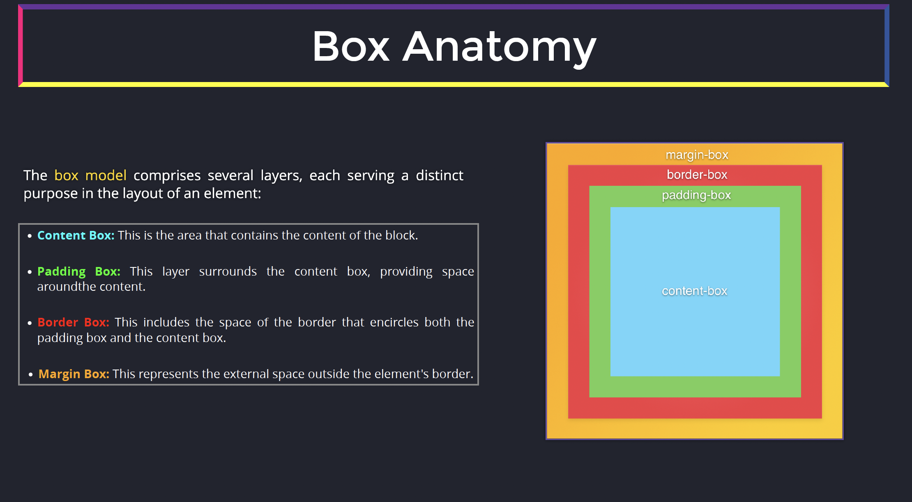
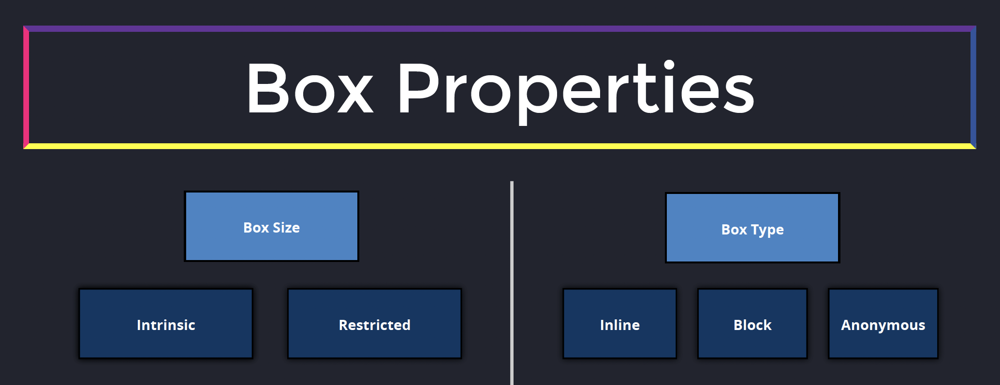
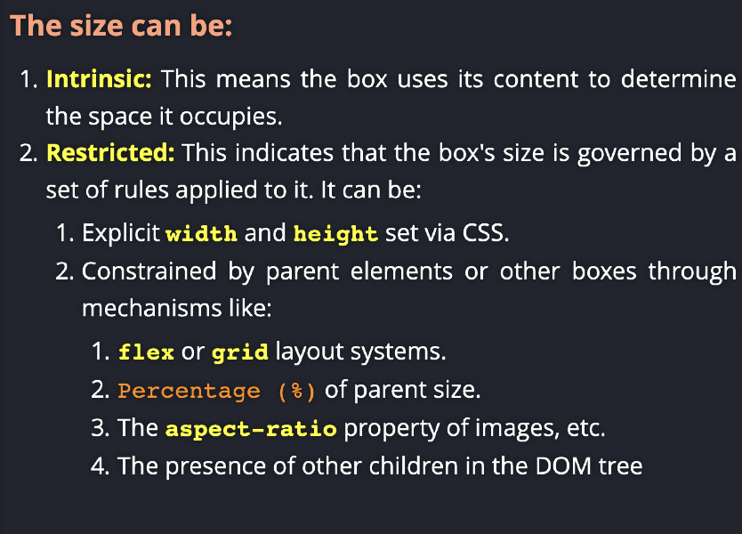
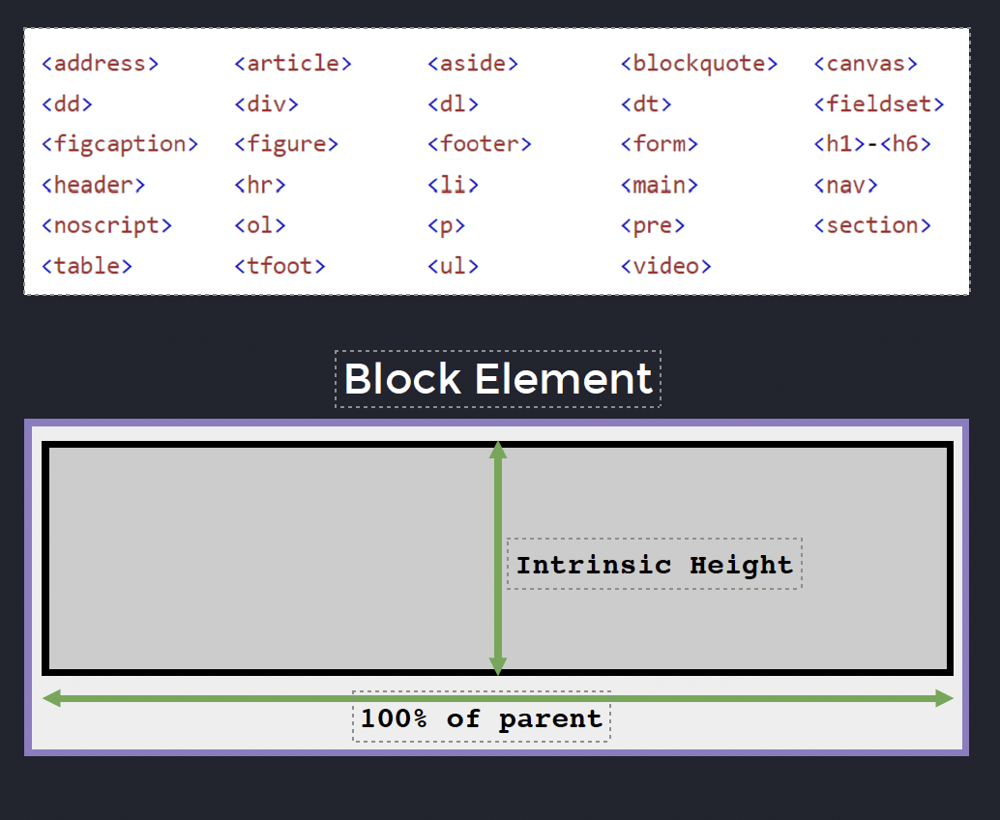

# Box system

box have width ... TBD

inline elements... TBD



Box props: size and type


Box size


Box type
There are several types of boxes

- block  level ( including, but not restricted by display: block )
- inline  level
- Anonymous box

Box type: block

- The element is rendered like a block.
- Block level element takes 100%  of the parent container width
- The height  of the content is equal to the intrinsic size. (intrinsic height means the height is determined by the inner content height)
- The element is rendered from top to bottom.
- Participate in Block Context Formatting (BCF)



Box type: Anonymous

```html
<div>
  <p>This will be wrapped into TextNode</p>
</div>
```

This will be an anonymous box

# Formatting contexts

Set of formatting rules to which elements are assigned

By default all elements have either:

- box (e.g. div)
- inline (e.g. span)

- inline-box ?? not sure if any html element by default belongs to the inline-box...

Then some others may be "created" (using the **_display_** property) by the user, with CSS, like:

- Flex
- Grid

# Positioning system

Normal flow Top-Bottom , LeftToRight
The boxes or inline elements are by default rendered like that.
We can remove elments form the normal flow using the position property

position: static | relative | absolute | sticky | fixed

static is applied by default

s:
So the key differences or the browser renders the element that is positioned relative, the same as the normal flow. But the final position is determined by the top, right, bottom, and left properties in CSS. The change to the position doesn't impact other elements.

Also when we apply position relative, we create a new stacking context, some kind of new realm, where we put over all our relative elements.
And these elements now are completely isolated from everything that was within the normal flow.

## Containing element
