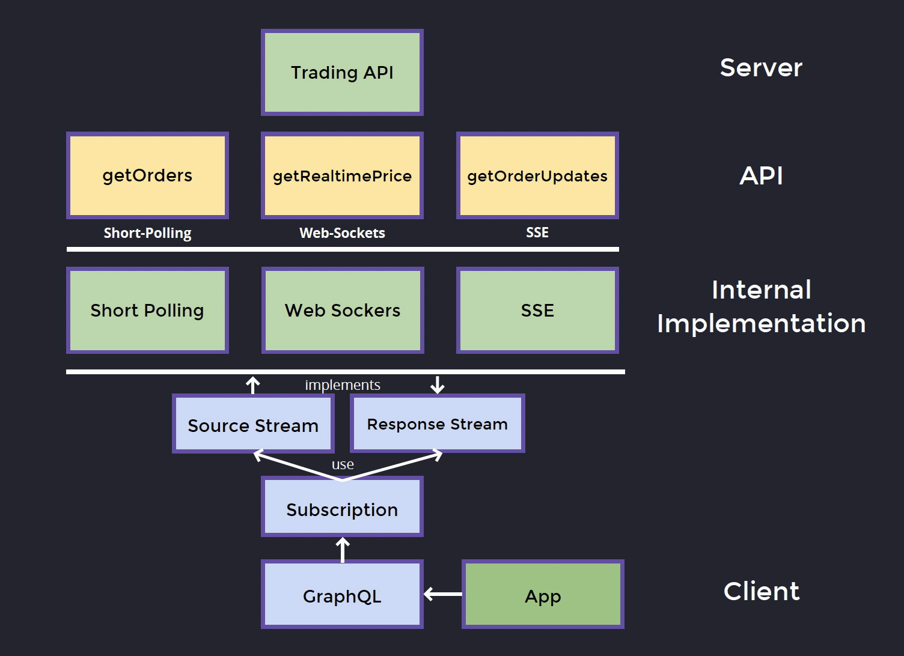

# REST

<!-- ...existing code or add REST content here if needed... -->

# GraphQL

GraphQL introduces additional complexity:

1. **Additional client library** to work with server GraphQL API
2. **Additional client caching layer**
3. **Additional state manager** – GraphQL Client is responsible for syncing state between client and the server
4. **Potential impact on your web-bundle size**

---

### Decision Flow

> Having said that, most use cases are just ok with REST.  
> **GraphQL provides the most value in complex apps.**

---

## When to Use GraphQL

### Complex Server Orchestration

When the server side has to deal with complex data aggregations.

**Example:**

In this case, GraphQL helps by encapsulating the complexity of data orchestration and retrieval.

---

### Need to Expand What REST Returns

When you have resources divided by domain (orders, customers, items, shipping addresses) and need to mash up specific data for the UI, REST would typically require multiple endpoint calls to merge the data.

---

#### REST Solutions for Data Mashup

REST does have several techniques to solve this:

1. **Composite/Aggregator Endpoints**  
   Create specific endpoints that aggregate data from multiple domains.

2. **Backend for Frontend (BFF) Pattern**  
   Create UI-specific APIs that return exactly what each screen needs.

3. **Query Parameters for Expansion**  
   Allow clients to specify what related data to include.

---

#### When to Choose Each Approach

| Scenario                                      | REST: Composite/BFF                          | GraphQL: Single API               |
| --------------------------------------------- | -------------------------------------------- | --------------------------------- | --- |
| Simple apps with fixed UI requirements        | ✅ Use composite endpoints or BFF            | ❌ Overkill                       | s   |
| Multiple client types (web, mobile, partners) | ⚠️ Need multiple BFF endpoints               | ✅ Single flexible API            |
| Frequently changing UI data requirements      | ❌ Requires backend changes                  | ✅ Frontend-driven queries        |
| Complex nested data relationships             | ⚠️ Multiple round trips or complex endpoints | ✅ Single query with precise data |

---

#### Recommendation

**Use REST with BFF/composite endpoints if:**

- Your UI data requirements are stable
- You have simple data relationships

**Use GraphQL if:**

- You frequently need different combinations of data
- Multiple client types with different data needs
- Complex nested relationships between domains
- Frontend teams want flexibility in data fetching

> For your specific case with orders, customers, items, and shipping addresses, if you find yourself constantly creating new composite endpoints for different UI screens, GraphQL would provide more flexibility and reduce backend development overhead.
