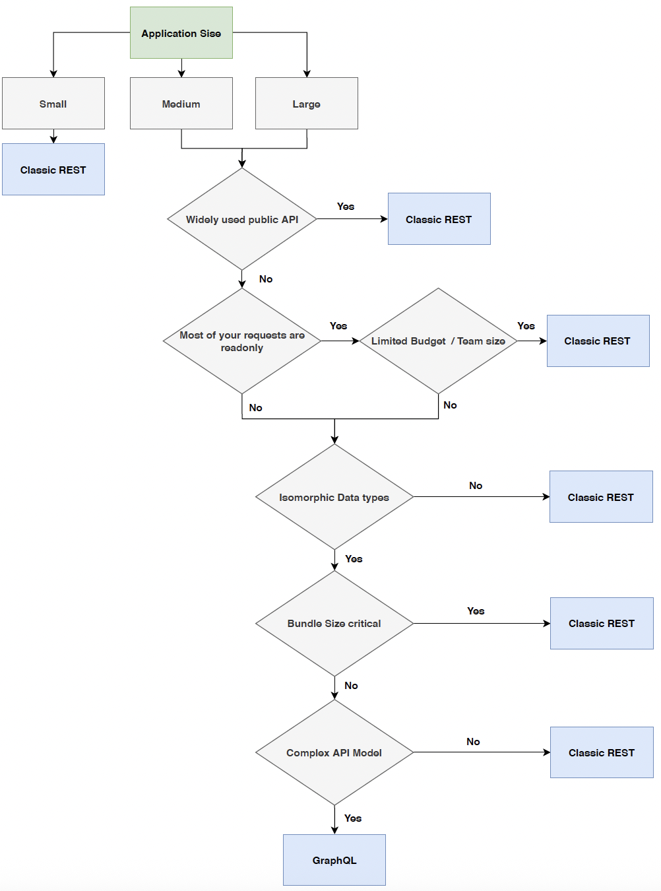

# REST

# GraphQL

GraphQL introduces additional complexity:

1. Additional client library to work with server GraphQL API
2. Additional client caching layer
3. Additional state manager - GraphQL Client is responsible for syncing state between client and the server
4. Potential impact on your web-bundle size

Decision flow:

