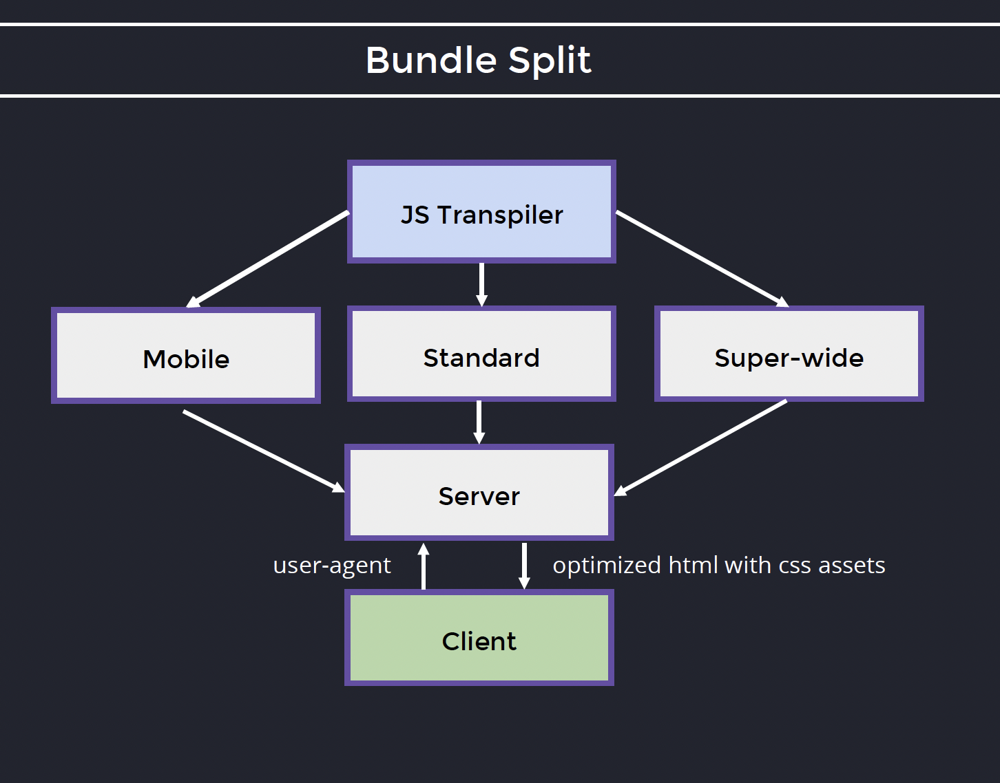

# CSS, Images, and Rendering Performance Optimization

---

## Bundle Split

Similar to JS bundle build optimization:  
Depending on the user agent—**mobile**, **standard**, or **super wide**—deliver the corresponding CSS bundle.



---

## Minification and Compression

Example with **Tailwind**:

- **Uncompressed:** 2413.4kB
- **Minified:** 1967.4kB
- **Gzip:** 190.2kB
- **Brotli:** 46.2kB

---

## Critical CSS Style Extraction

There are two types of styles within the app:

- **Critical:** Application won’t be rendered properly and can’t be used without these.
- **Non-critical:** Pop-ups, advanced graphic features, inactive pages. Application will be able to work properly without these.

**Best Practice:**  
Put the critical styles inline in the HTML page to avoid the need to retrieve the CSS file for a fast, workable view.  
This means the important content is styled immediately without waiting for the full CSS file to load.

Leave the secondary content to be styled by the full CSS file once it has loaded.

---

### Example

#### Non-optimized

```html
<html>
  <head>
    <link rel="stylesheet" href="https://cdn.com/desktop.css" />
  </head>
  <body></body>
</html>
```

#### Optimized

```html
<html>
  <head>
    <style>
      #root {
        /* Styles */
      }
    </style>
  </head>
  <body></body>
</html>
```

---

### Fetching Non-critical Styles

**Using `media="print"` (hacky but effective):**  
Tell the browser the style is used for printing (the browser will not fire the request until done loading).

```html
<html>
  <head>
    <style>
      #root {
        /* Critical Styles */
      }
    </style>
    <link
      rel="stylesheet"
      href="https://cdn.com/non-critical.css"
      media="print"
      onload="this.media='all'"
    />
  </head>
  <body></body>
</html>
```

**Alternatively, use `rel="preload"`:**  
The browser will still fire the request immediately.

```html
<html>
  <head>
    <style>
      #root {
        /* Critical Styles */
      }
    </style>
    <link rel="preload" href="https://cdn.com/non-critical.css" as="style" />
  </head>
  <body></body>
</html>
```

---

## Summary

- Split the bundle per client type (mobile, standard, super wide)
- Minify and compress CSS files
- Extract critical CSS styles and inline them in the HTML
- Use media attributes or preload links to fetch non-critical styles

---

# Images

## Choose the Right Format

**Animated Content:**

- GIF (very heavy)
- MP4 (better compression)
- WebP (best compression)

**Icons and Logos:**

- SVG
- Compressed SVG (better)

**Raster Graphics (pixel-based):**  
Images like UI elements, illustrations, screenshots, or graphics with sharp edges and flat colors. These are not photographs, but rather digital artwork or interface assets.

**Photos:**  
Actual photographs—images captured by cameras, with lots of color gradients and detail.

- PNG
- WebP (better) (97% of clients support it)

**Photos:**

- JPEG
- WebP
- AVIF (best compression) (93% of clients support it)

---

## Compress

- Image compression is essential.
- SVG compression (usually done automatically by bundlers). If you use SVG, use SVG path compression.

---

# Fonts

## Font Loading

```css
@font-face {
  src: "https://my-custom-font.com/font/";
  font-display: auto;
}
@font-face {
  src: "https://my-custom-font.com/font/";
  font-display: fallback;
}
@font-face {
  src: "https://my-custom-font.com/font/";
  font-display: optional;
}
```

- **auto:** Browser waits for 3 seconds to load.
- **fallback:** Render unstyled text immediately, switch if font is loaded within 3 seconds.
- **optional:** Render unstyled text immediately, switch only on refresh if it's downloaded.
