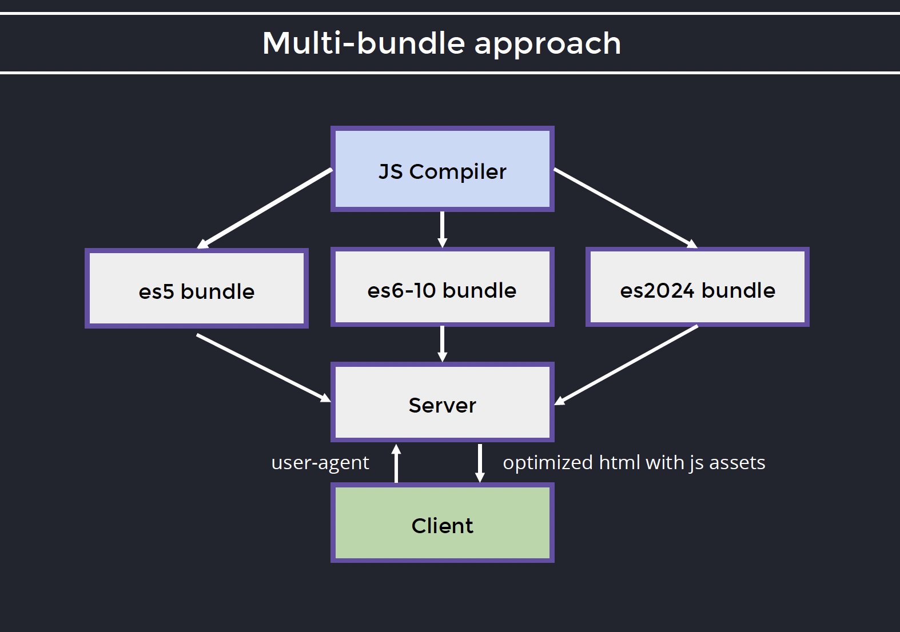
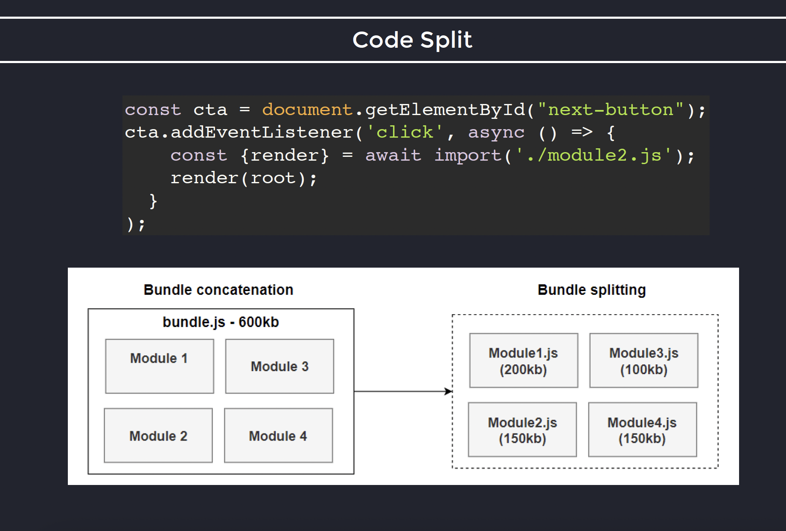
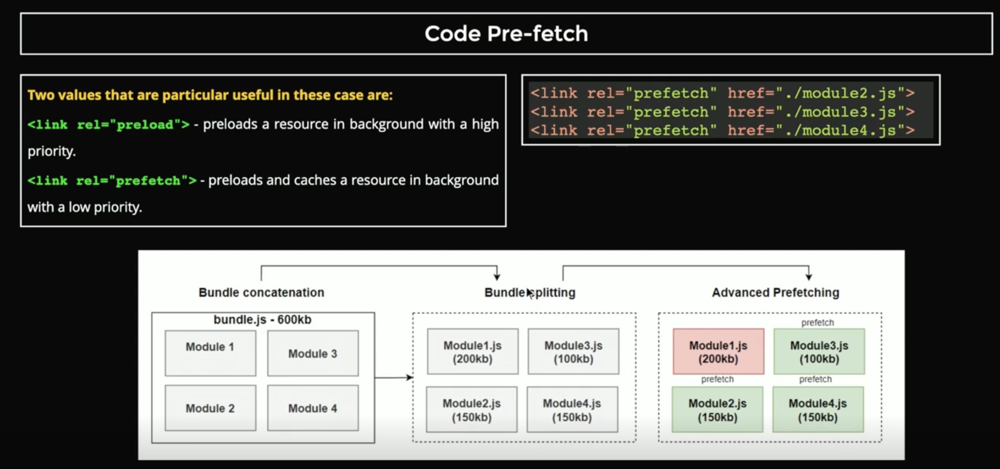
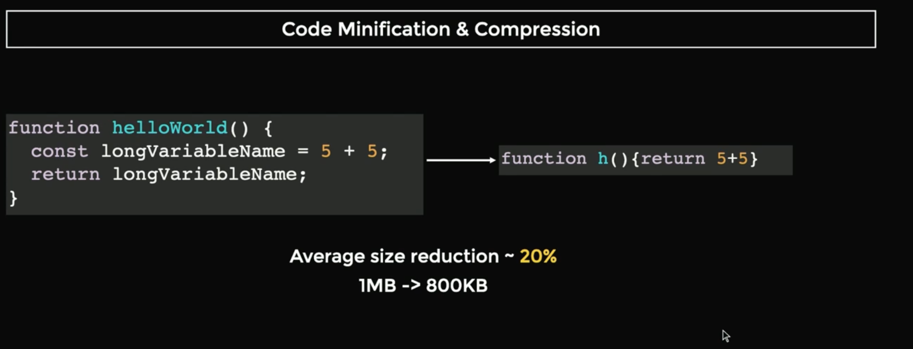
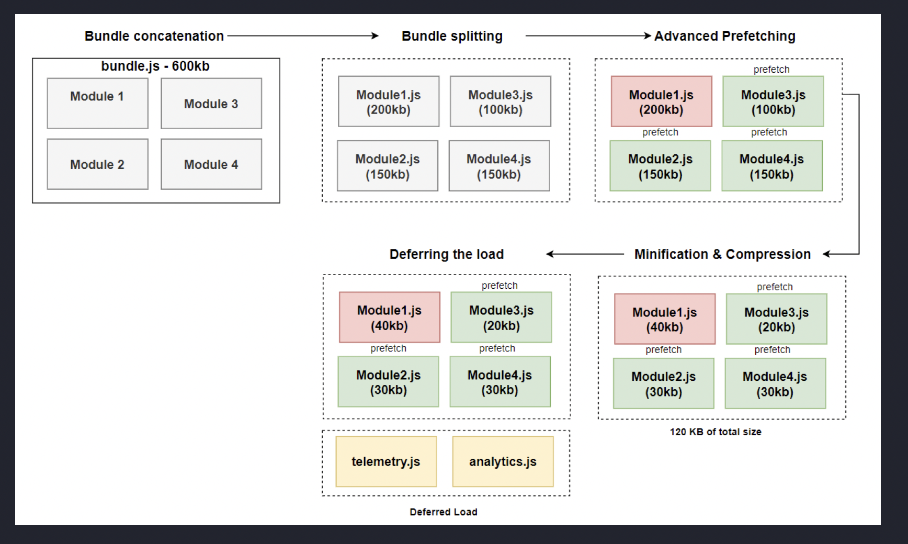

# Bundle optimization

Guess the bundle size?

We want to use matchAll function in our website, so.

Function: String.prototype.matchAll
ES5 Bundle Size: 16.9 KB
ES2020 Bundle size: 69 B

How to keep compatibility?
Polyfills
Polyfills in JavaScript are pieces of code (usually JavaScript itself) that implement features from newer versions of the language on older browsers or environments that do not natively support those features.

Do we actually need polyfills?
Here are a few facts:

1. ES6 has a support of 98.2%
2. ES7-10 has a support of 96%
3. ES11 - 90%
4. ES12 - 89%

So we are providing polyfills for a very minor part of the clients

How can we optimise this?
Build diff bundles, for different targets (ES5, ES6-10, es2024)
And instruct the server to deliver the corresponding bundle using the user agent header.


JS bundle delivery optimization

# Code split

One giant bundle, traditionally done to send it at once, not we dont need to do that anymore with HTTP2, so we are encouraged to split the bundle.

Split the code in separate modules.


JS bundle code split

We can take this even further and tell the modules to load in the background, pre-fetch them.


JS bundle code splitted and pre-fetched.

# Code minification and compression



## compression

There are two main options

- gzip is very good and is supported in most of thebrowser

- brotli is 5-30% more efficient than gzip, but less supported by older browsers

## deferred load

Load scripts when others have finished, used for non-critical resources. e.g. analytics, telemetry, etc.
First the app modules then those non-critical resources.

Normal loading order

```html
<script src="module1.js"></script>
<script src="analytics.js"></script>
<script src="telemetry.js"></script>
<script src="module2.js"></script>
```

Deferred loading order

```html
<script src="module1.js"></script>
<script src="analytics.js" defer></script>
<script src="telemetry.js" defer></script>
<script src="module2.js"></script>
```

# Conclusion

Applying these techniques can significantly improve the performance of your web applications by reducing load times and optimizing resource usage.

1. Bundle build optimization (ES5, ES6, etc)
2. Code splitting (in diff modules)
3. Code minification and compression
4. Deferred loading

Bundle optimization techniques

