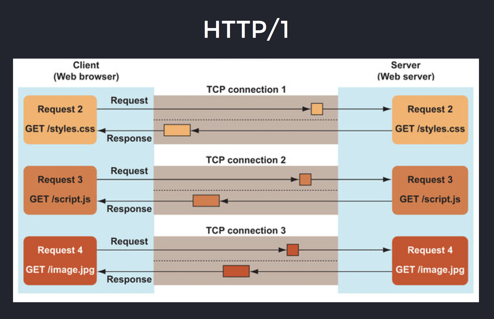
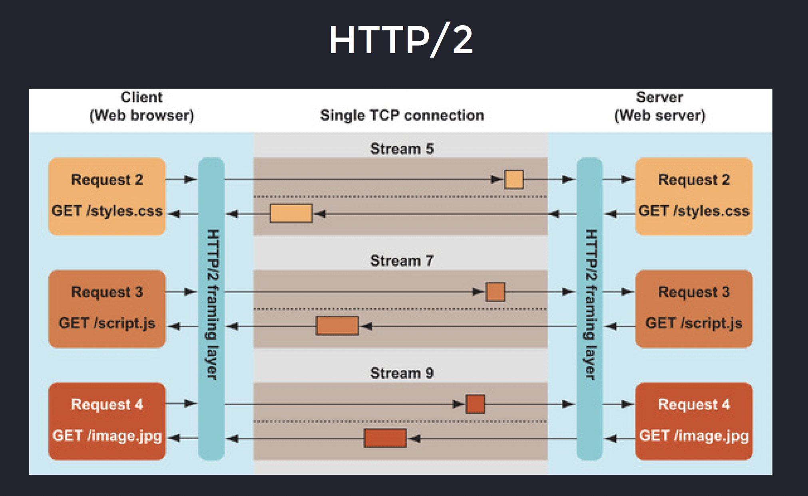

# Performance optimisation

# Web Vitals

## LCP - Largest Contentful Paint

What it measures: Loading performance.

Goal: LCP <=2.5 seconds of page load start for a good user experience.

## INP - Interaction to Next Paint

What it measures: Responsiveness/Interactivity
Updated the app, it may take some time to refresh the UI due to the flow, ideal reflow under 200 ms
Goal: INP <= 200ms for a good user experience.

## CLS - Cumulative Layout Shift

What it measures: Visual stability. It happens when there were some minor UI changes, e.g. small animation or resize components, that may impact the rest of the elements, the stability.
Goal: CLS <= 0.1 for a good user experience.

Al lthese metrics can wbe checked using lighthouse in the browser

# Network performance

Easiest way to increase performance is to change the server to the latest HTTP version

## HTTP 1.1

Loading efficiency limitations:

1. we request some html page
2. the server responds with the requested page
3. Browser start to render a web-page and **_sequentially_**
   load every resource
4. The page is rendered only when all critical resources on
   the html page are fully loaded
5. After rendering is completed, browser will be executing
   some additional request made by async scripts

   A workaround about this is that the browser opens more, up to 5 per domain, TCP connections to bring stuff in parallel.
   If you want more than 5 TCP conns, you need to shard the resources in diff domains, as the 5 TCP conns limit in the browser is per domain, so you will need a images domain, a scripts domain, etc, increasing maintenance.

   This is the original reason webpack was created, to bundle all resources in one file and bring it at once.

   Another issue is sending the headers uncompressed, in every request.
   Example, average
   HTTP/2+ provides 98% header compression
   HTTP / 1.1 Header overhead -> 5KB
   HTTP / 2 Header overhead -> 12.5 bytes

   Another issue is the 3 ways-handshake

   

   Now its becoming an anti-pattern because we have HTTP 2 that allows multiplexing.

   Migration is easy as HTTP 2 is backward compatible with HTTP 1.1.

   HTTP and 3 they use multiplexing

   

Single TCP connection, and up to 200 parallel streams loading the data
