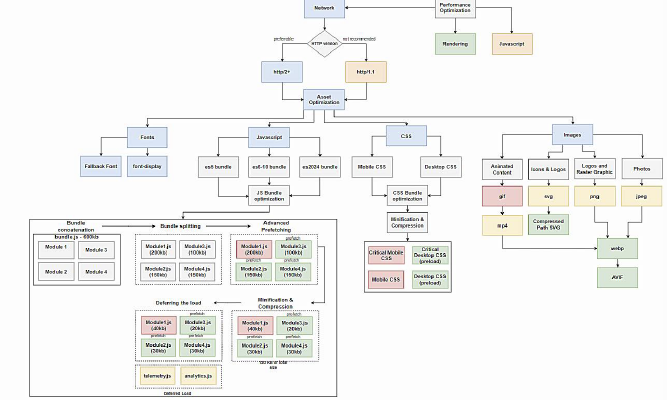
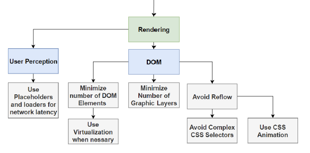
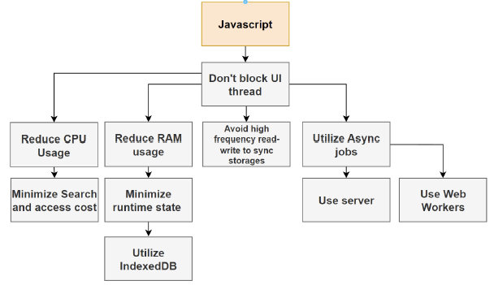

# Networking performance

- Use fast protocols (HTTP/2, HTTP/3)
- Optimize assets for faster transmission
  - Fonts
    - Fallback font
    - font-display
  - Javascript
    - JS bundle optimisation for target user-agent (bundle for ES5, for ES6 for ES2024 , etc)
    - Bundle splitting / code splitting (separate in modules to load in parallel)
    - prefetching
    - minification & compression
    - deferred loading of non-essential resources
  - CSS
    - CSS bundle optimisation for target user-agent (bundle for ES5, for ES6 for ES2024 , etc)
    - minification & compression
    - inline critical styles, defer non-critical to files
  - Images
    - Use the right format per image usage, icons, photos, etc (WebP, AVIF, etc)
    - Use responsive images (srcset) adapt image serve to browser screen size
    - Use image compression

# Rendering performance

- User Perception -> Use Placeholders and loaders for network latency
- DOM
  - Minimize number of DOM Elements -> Cant reduce? -> use Virtualization
  - Minimize Number of Graphic Layers (use them wisely)
  - Avoid Reflow (use different stacking context to isolate the element)
    - Avoid Complex CSS Selectors (use frameworks or naming strategy to avoid deep selectors)
    - Use CSS Animation (they are GPU accelerated, better performance, it does not block the rendering thread)

# Javascript performance

KEY: Don't block UI thread

- Reduce CPU Usage -> Minimise search and access cost
- Reduce RAM usage -> Minimize runtime state -> Utilize IndexedDB
- Avoid high frequency red-writes to sync storages (localStorage, sessionStorage)
- Utilize async jobs
  - use server
  - web workers

**Note:** `localStorage` and `sessionStorage` are synchronous browser APIs and always block the UI thread. They cannot be accessed asynchronously. For async storage, use [IndexedDB](https://developer.mozilla.org/en-US/docs/Web/API/IndexedDB_API) or libraries like [localForage](https://localforage.github.io/localForage/).
