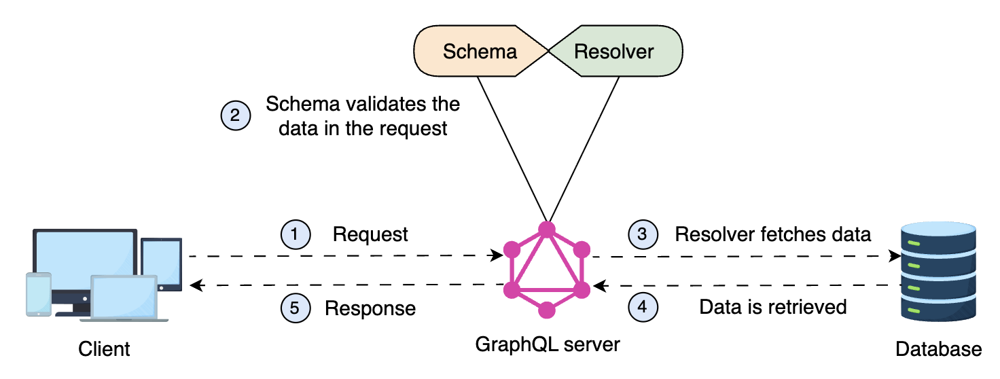
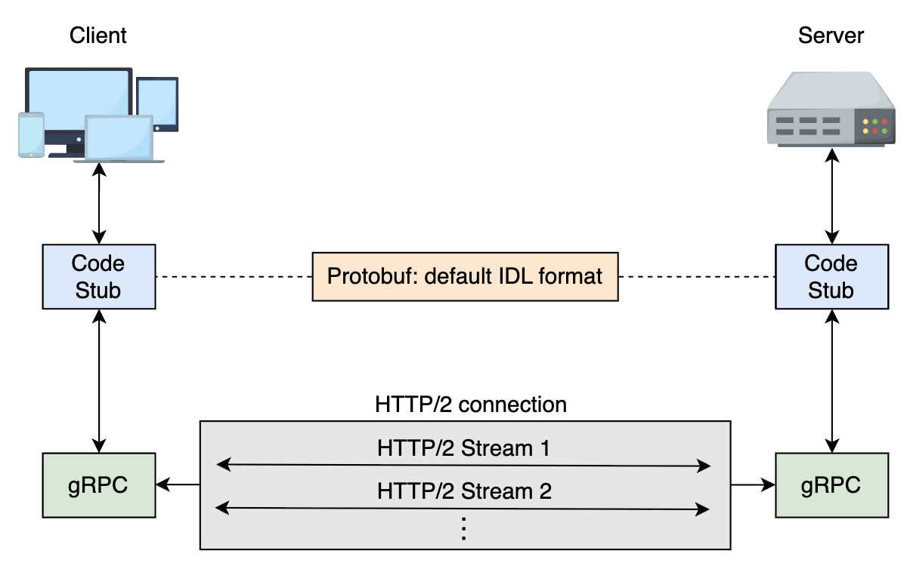

# API Architectural Styles for Frontend Communication

## What is an Architectural Style?

An architectural style defines standardized rules and protocols for designing APIs, ensuring efficiency and consistency. Like design patterns, these styles provide a structured approach, impacting the entire development life cycle.

When determining an architectural style, we must evaluate the characteristics that suit our design problem. Each style serves as a template with constraints, so we must see which suits our requirements. Here are some properties to consider:

### Architectural Style Properties

| Characteristic               | Description                                                                                              |
| ---------------------------- | -------------------------------------------------------------------------------------------------------- |
| Performance                  | Choosing an API to perform well and not to become a bottleneck with a large influx of requests.          |
| Scalability                  | Opt for an API to be easily scalable, such as adding more features and capacity to the back-end servers. |
| Ease of development          | Developers often choose a simple and familiar style to implement a solution.                             |
| Portability                  | The ability to move an API architecture style from one software environment to another.                  |
| Software maintenance support | There is ample support offered by the API providers.                                                     |

Choosing the right style depends on factors like:

- API consumers
- business needs
- functionality or purpose

These are constraints that decide an API architecture style

Switching later can be complex.

## Types of API Architectural Styles

We’ll consider three commonly used architectural styles. Each style has pros and cons, and even if most developers adopt REST, it may not be suitable for our design problem.

### REST

Representational state transfer (REST) is a well-known web architecture style proposed by Roy Fielding in 2000 to solve the web’s scalability problem.

Roy Fielding identified that certain key constraints could direct the web’s scalability, collectively called the web’s architectural style. These constraints also act as a backbone for designing REST APIs.

#### REST Constraints Overview

| Constraint        | Features                                                                                                        | Drawbacks                                                                                                                   |
| ----------------- | --------------------------------------------------------------------------------------------------------------- | --------------------------------------------------------------------------------------------------------------------------- |
| Client-server     | Improves evolvability of clients and servers. Increases scalability.                                            | An enormous number of user requests can overload the server. Network disconnectivity may cause an interruption in services. |
| Cache             | Reduces latency by storing data on the client side.                                                             | Reduces consistency if the stale data in cache varies considerably from the data in the recent response from the server.    |
| Stateless         | Improves reliability. Increases scalability of incoming requests. Improves visibility of requests for analysis. | Reduces network performance by sending repetitive data in a series of requests.                                             |
| Uniform interface | Improves independent development of components. Smoothens interactions. Improves evolvability.                  | Degrades efficiency and flexibility because information must be sent in a standardized form.                                |
| Layered system    | Improves evolvability and reusability. Enhances decoupling of components.                                       | Reduces performance by increasing processing overhead of layers. High security needed at each layer.                        |
| Code-on-demand    | Improves extensibility. Increases performance.                                                                  | Reduces trackability of requests by monitoring systems. May compromise client security.                                     |

> Note: Adhering to all six constraints is only possible in an ideal scenario. Some constraints are conflicting. API designers should follow the maximum possible constraints while designing a RESTful web API.

Moreover, the client uses APIs to fetch or post data from or to servers, and the API ensures the communication.

The industrial practices for REST API rely heavily on the HTTP protocol and are considered easy to understand, use, and manage.

Its familiarity and simplicity are key strengths, but the request-response model can be inefficient in event-driven environments, as it lacks real-time updates and often requires polling.

Also, it doesn’t support persistent connections like WebSockets, making it unsuitable for instant data synchronization.

> Q: What is the difference between REST and HTTP?

> A: REST is a web architecture **_style_** that proposes some constraints that should be used to design web or mobile applications. However, HTTP is the **_protocol_**, or, in simple words, a method that enables us to achieve the constraints proposed by REST. Although HTTP was designed earlier than REST, fortunately, it has all the features that can be utilized to make the World Wide Web conform to the REST constraints. Therefore, HTTP is widely adopted in this regard.

#### Drawbacks of REST

- **Multiple requests problem:** A REST API sends multiple requests whenever data required by the application resides on **_multiple endpoints_**. A mechanism is needed to fetch data from multiple endpoints in a single request.

- **Overfetching and underfetching:** In a REST API, a single request often retrieves either too much unnecessary data or too little, failing to fully meet the application's needs. Therefore, we need an approach to fetch the exact amount of data an application needs.

In REST, there is no built-in standard mechanism to fetch data from multiple endpoints in a single request. However, common solutions include:

- **_Backend for Frontend (BFF) Pattern_**
  Create dedicated backend endpoints that aggregate data from multiple (REST) services before sending it to the client.
- **_Composite/Aggregation APIs_**
  Design REST endpoints that internally fetch from multiple sources and return combined results.
- **_Batch/Bulk Endpoints_**
  Create endpoints that accept multiple resource IDs and return data for all of them in one response.
- **_HTTP/2 Multiplexing_**
  While not solving the multiple-request issue entirely, HTTP/2 can send multiple requests in parallel over a single connection more efficiently.
- **_Server-Sent Events or WebSockets_**
  For real-time scenarios, these can push data from multiple sources as it becomes available.

GraphQL emerged to address the above drawbacks in the REST API; let’s discuss that.

### GraphQL

GraphQL is an API standard and query language specification developed by Facebook in 2012 to handle problems in REST APIs. Before making it open source in 2015, Facebook used it internally as an alternative to the common REST architecture. GraphQL is analogous to SQL queries in relational databases, where we can build a query to fetch the required data from multiple tables.

GraphQL works similarly for APIs to fetch data from multiple endpoints in a single request.

**_From a client's perspective, it will be a single request_**, but at the server side, we’ll probably need to make many round trips inside the data center to different components, like databases, caches, and so on. However, that isn’t bad because latency inside the data center is very low as compared to latency between client and server.

GraphQL is sometimes confused with the database, but it’s a query language for APIs. Therefore, it can be used in any context where an API can be used. GraphQL, like REST, is not tied to a specific transport protocol but commonly uses HTTP for communication. This means it can work over other protocols (e.g., WebSockets, MQTT) when needed.

The implementation of GraphQL can be divided into two components: the GraphQL server and the GraphQL client. Let’s discuss each component one by one.

#### GraphQL server

The GraphQL server takes our APIs and exposes them to the GraphQL client via an endpoint.

It has two main parts:

- **_Schema_**
  A schema is a model of the data and defines relationships between the data. Based on the schema, the server specifies what types of queries and data a client can request. It's the contract with the world.
  Clients interact with the GraphQL schema by sending queries and mutations.

- **_Resolve functions_**
  A schema can tell us what data types a client can request but lacks information about where the data comes from.
  Here, the resolve functions, or "resolvers", specify how types and fields in the schema are connected to various backends. In other words, the resolve functions provide directions to convert GraphQL operations into data.
  Resolvers are not exposed.
  The resolvers are server-side functions that process these requests, fetch or modify data as needed, and return the results. The client only sees the schema and the data, not the resolver implementation.

#### GraphQL client

The GraphQL client is the front-end component of a GraphQL system.
It allows the client to send queries, connect to the GraphQL endpoint, and issue queries to gather data.
The GraphQL client might be used in a single-page application, a content management system (CMS), a mobile application, or another type of front end client.


GraphQL components

#### GraphQL mutations

GraphQL offers us two types of operations: queries and mutations.

We have seen how data can be fetched using queries.

However, there is also a need to have a mechanism to manipulate data on the server side.

GraphQL uses operations called mutations to insert new data or modify the existing data on the server.

We can think of GraphQL mutations as the equivalent of POST, PUT, PATCH, and DELETE methods used by REST.

The following is an example of inserting new data in the database:

```graphql
mutation AddNewStudent(
  $name: String!
  $rollNo: String!
  $degreeProgram: String!
) {
  addStudent(name: $name, rollNo: $rollNo, degreeProgram: $degreeProgram) {
    name
    rollNumber
    degree
  }
}
```

A GraphQL mutation to add a new student to the database

#### GraphQL request and response format

A GraphQL query requests only the data that is needed.
A query is defined using the word query inside it, we mention other objects and attributes whose values must be fetched.

Following is a GraphQL query requesting the attributes name, length, and cargoCapacity of the object starship having an ID equal to 10.

(A GraphQL query for the Star Wars API (SWAPI)
)

```graphql
query {
  starship(id: 10) {
    name
    length
    cargoCapacity
  }
}
```

The response to the preceding GraphQL query is in JSON format that matches the shape of our query, shown below:

```json
{
  "data": {
    "starship": {
      "name": "Millennium Falcon",
      "length": 34.37,
      "cargoCapacity": 100000
    }
  }
}
```

> Q: Is it possible to imitate the behavior of GraphQL by requesting only the desired data via the REST API?

> A: Yes, REST APIs use a partial response strategy to get the desired data. For example, GET /planets will show all the planets available on the endpoints. However, in the partial response strategy (also called filtering), we define some conditions in the request. For example, GET /planets?result=find(radius, gravity) will return the radius and gravity of all the planets.

---

> Q: If it is possible to fetch only the desired information using the REST API, then why is there a need for GraphQL?
> A: The partial response strategy, or filtering, is a flexible approach to getting the required information via REST APIs from a single endpoint. However, GraphQL benefits us the most in a case when we frequently need to retrieve desired responses from multiple endpoints at the same time. Or the desired data is defined by the client needs flexibly.

Your RESTful API returns nested resources that your UI doesn't always use. Is switching to GraphQL justified? Enter your answer in the widget below.

### gRPC

gRPC—an open-source framework developed by Google, is a high-performance framework that enables communication in distributed systems.

It was developed by Google and is now widely adopted across industries due to its efficiency and strong support for multiple programming languages.

gRPC achieves high performance by leveraging the multiplexing functionality introduced in HTTP/2 to create logical subchannels to support the following types of connections:

- **_Request-response_**: The client can send a single request, and the server can reply with a single response.

- **_Client streaming_**: The client can send multiple requests, and the server can reply with a single response.

- **_Server streaming_**: The client can send a single request, and the server can reply with multiple responses.

- **_Bidirectional streaming_**: The client can send multiple requests, and the server can reply with multiple responses.

#### Why is gRPC Important?

- **Efficiency**: gRPC uses Protocol Buffers (Protobuf) instead of JSON as data format, reducing payload size and improving transmission speed.

- **Multiplexing**: It uses HTTP/2, sending multiple requests simultaneously over a single connection.

- **Strict schema**: Protobuf provides a strict schema, minimizing errors in data communication.

- **Streaming support**: Enables bidirectional streaming, which is beneficial for real-time applications like chat apps or live collaboration tools.

- **Language agnostic**: Works with multiple programming languages, making it flexible for cross-platform applications.

#### How does gRPC work?

gRPC follows a client-server model where:

1 - The client requests the server.

2 - The server processes the request and sends a response.

3 - Communication is done using Protobuf instead of traditional JSON.

4 - The gRPC uses code stubs to enable communication.

The overall workflow of gRPC is the same as the normal RPC architecture.

For example, it calls a remote procedure, then the local code abstraction is handled by the gRPC client stub.

It then communicates with the server-side gRPC over an HTTP channel, executes the remote procedure using the server stub, and finally returns the result.

However, gRPC has added many improvements by using HTTP/2 streams and other components.

In gRPC, Protobuf is the default interface definition language (IDL), which provides a mechanism for serializing data into a cross-platform binary format that can compress headers to achieve high performance.


Client-server communication using gRPC framework

gRPC also introduced a built-in method for generating client and server code stubs to speed up the development process and manage changes later.

Although gRPC was released in 2016, it has quickly gained popularity, and companies such as CoreOS, Cisco, Square, Netflix, Carbon3D, Allo, Google Cloud Services, and others are using it in their production environments.

### Comparison of API Architectural Styles

| API Architecture Style | When to Use                                                                                                                                                       | When to Avoid                                                                                                                                           |
| ---------------------- | ----------------------------------------------------------------------------------------------------------------------------------------------------------------- | ------------------------------------------------------------------------------------------------------------------------------------------------------- |
| REST                   | When performing CRUD operations on resources. To achieve stateless behavior. When fetching data from a couple of resources. As a wrapper around other frameworks. | In event-driven systems. In big data processing and analytics systems.                                                                                  |
| GraphQL                | When an application is gathering data from multiple data sources. When multiple applications share a single data source.                                          | In server-to-server communication.                                                                                                                      |
| gRPC                   | When building low latency, highly scalable distributed system. To create a backend system with a large number of microservices.                                   | If the developer's or consumer’s language is not supported by the framework. In applications if they are calling a limited number of back-end services. |

---

REST follows a resource-based approach but may lead to over/under-fetching.

GraphQL offers flexibility with precise queries but adds complexity.

gRPC provides high performance with efficient binary serialization and bidirectional streaming.

Each has its strengths, and we can choose the right one based on our specific use cases.
