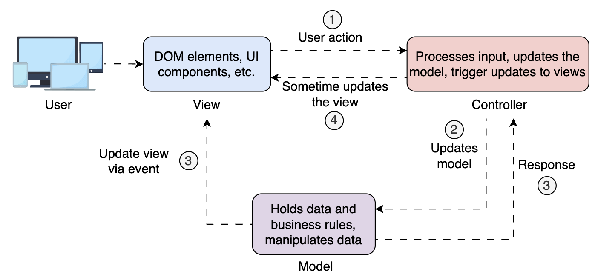

# Architecture Patterns in Frontend System Design

Learn the architecture patterns in frontend System Design, such as

- MVC
- MVVM
- MVP

to design scalable applications.

---

## Introduction

In frontend System Design, having a clear structure is essential because managing UI logic, business rules, and data flow becomes increasingly complex as applications grow. How we organize the relationship between these layers defines how maintainable, testable, and scalable our applications will be. This is where frontend architectural patterns come in.

Though the patterns emerged from desktop and backend development, they have evolved to serve modern frontend development, from web apps to native apps, from monoliths to micro-frontends.

Choosing the right pattern is essential for code maintainability, scalability, testability, and user experience.

---

## Frontend Architectural Patterns

Frontend architectural patterns are structured design methodologies that help organize and manage the complexity of modern web applications.

These patterns define how different components of an application, such as user interface, business logic, and data handling, should interact to perform intended operations.

By separating concerns, frontend architectural patterns improve code readability, facilitate teamwork, and enhance user experience.

Among the most commonly used patterns are:

- **MVC (Model-View-Controller)**
- **MVVM (Model-View-ViewModel)**
- **MVP (Model-View-Presenter)**

Each of these architectural patterns offers a different way to organize the flow of data and interaction between the UI and the business logic.

Let’s break them down individually and compare them side-by-side with real-world analogies.

---

## MVC (Model-View-Controller)

Model-View-Controller (MVC) is one of the earliest and most influential software architectural patterns. It was originally formulated to help organize user interface code in desktop applications and later evolved to become a widely adopted standard in web and frontend development.

The core idea is to separate concerns, breaking our application into three distinct components that handle different responsibilities:

### Model

Holds the application’s data and business rules. It doesn’t know anything about the UI or how data is presented. Its job is to store and update data in response to interactions or operations triggered by the user or application logic.

In frontend apps, this could be:

- JavaScript objects representing the state
- Services fetching data from APIs
- Local storage/IndexedDB management
- Logic for transforming raw API responses

  > Tip: **_Think of the Model as the brain that knows the data, where it comes from, and how it should be used._**

### View

What the user sees—the presentation layer of the application. It renders the data provided by the Model and displays it on the screen.

In frontend, it contains:

- DOM elements
- HTML templates
- UI components in frameworks (React, Vue, etc.)

  > Note: **_The View is intentionally kept simple, containing only the logic necessary to present the data to the user._**

### Controller

Acts as the bridge between the Model and the View. It listens to user input (e.g., clicks, form submissions), decides what needs to be done, updates the Model, and may trigger updates to the View.

> Note: **_The Controller is the translator between the user and the system. It interprets user actions and determines what needs to happen in the system._**



In short:

- The user interacts with the View, e.g., clicks a button.

- The Controller processes the input and updates the model.

- The Model changes and notifies View of changes.

Finally, the View rerenders to reflect the new state.

Example (in a simple JavaScript/HTML app):

Suppose you have a form to add a new todo item:

```html
<input id="todo-input" type="text" />
<button id="add-btn">Add</button>
<ul id="todo-list"></ul>
```

The Controller logic might look like this:

```javascript
// Model
const todos = [];

// View update function
function renderTodos() {
  const list = document.getElementById("todo-list");
  list.innerHTML = "";
  todos.forEach((todo) => {
    const li = document.createElement("li");
    li.textContent = todo;
    list.appendChild(li);
  });
}

// Controller
document.getElementById("add-btn").addEventListener("click", function () {
  const input = document.getElementById("todo-input");
  if (input.value.trim()) {
    todos.push(input.value.trim()); // Update Model
    renderTodos(); // Update View
    input.value = "";
  }
});
```

Here, the Controller is the event listener for the button. It reads user input, updates the Model (todos array), and triggers the View update (renderTodos).

**_Key Controller Responsibilities_**
The Controller in this example demonstrates the core responsibilities mentioned in the documentation:

- Listens to user input: Binds event handlers to capture clicks, form submissions, etc.
- Decides what needs to be done: The "handle" methods contain the logic to determine what action to take based on user input
- Updates the Model: Calls appropriate Model methods to change the application state
- Triggers View updates: Ensures the View reflects the current state of the Model

**_The "Translator" Role_**
Notice how the Controller acts as a translator - it takes raw user events (button clicks, form inputs) and translates them into meaningful business operations (add todo, delete todo, etc.).

It doesn't know how the data is stored (Model's job) or how it's displayed (View's job), but it orchestrates the flow between them.

This separation allows each component to focus on its specific responsibility while the Controller manages the coordination between them.

**_Event Handlers vs Controllers_**
Event handlers are the specific functions that respond to DOM events.

Controllers are the orchestrating layer that contains and coordinates multiple event handlers plus additional logic:

**_Controllers Include More Than Just Event Handlers_**
Controllers also handle:

- Coordination logic between Model and View
- Application flow and navigation
- Validation and business rules
- State management decisions
- Error handling strategies

**_In Modern Frontend Frameworks_**
In React, you might think of controllers as:

- Custom hooks that manage state and side effects
- Container components that handle logic and pass data to presentational components
- Context providers that coordinate global state

So while event handlers are the "entry points" where user interactions enter the controller layer, the controller encompasses the broader orchestration logic that decides what happens after those events occur.

But React does not follow that architecture, Angular 1 and Backbone do.

### Models in React

In React applications, the Model concept is distributed across several patterns and tools, since React doesn't enforce a strict MVC architecture.

### MVC Summary

While MVC aims to separate concerns, real-world apps are far from ideal and often blur these lines. For example, data-fetching services or transformation logic might blur the line between the Model and Controller.

MVC laid the foundation for modern frontend architecture. Its simplicity and clarity make it a great choice for:

- Beginners learning design patterns
- Small to mid-size applications
- Projects needing clean separation between data, logic, and UI

However, for reactive, data-driven apps where the view needs to auto-update when the model changes, MVC may show its limitations.

That’s where MVVM comes in.

### MVVM (Model-View-ViewModel)

Model-View-ViewModel (MVVM) is another powerful architectural pattern designed to separate the UI (View) from business logic and state (Model) using a middle layer (ViewModel) that keeps them in sync. It’s a popular pattern for frontend development that helps keep your code clean, testable, and easy to maintain, especially in apps with lots of user interaction.

Microsoft introduced MVVM to simplify UI development in WPF (Windows Presentation Foundation), but it has since become a foundation for modern frontend frameworks like Angular, Vue.js, and Knockout.js, thanks to its emphasis on two-way data binding and reactive interfaces.

Let’s explore the components of the MVVM pattern:

#### Model

The Model remains the same as in MVC, handling raw data, requests, etc. Importantly, in MVVM, the Model doesn’t talk directly to the View but interacts with the ViewModel.

#### ViewModel

The ViewModel is the heart of MVVM and serves as the middle layer between the View and the Model. It:

Prepares data from the Model in a format that’s easy for the View to consume.

Listens to changes in the Model and updates the View automatically (and vice versa).

Contains UI state, computed values, and presentation logic.

Handles user actions like clicks or input.

Note: While MVC separates the View from the Model conceptually, the Controller often ends up tightly coupled with both. MVVM introduces the ViewModel as an intermediary, enabling better decoupling by handling state and logic without direct reference to the View, making data binding more robust.

View: The View is the user interface, but unlike in MVC, it’s passive and entirely driven by bindings to the ViewModel. The View doesn’t contain logic or make decisions; it just binds to the ViewModel’s data and renders it.

Press

- to interact

An overview of the MVVM pattern

An overview of the MVVM pattern
In MVVM, the View has no real logic and displays whatever it pulls data from the ViewModel. As shown in the structure above, View is automatically updated when changes occur in the ViewModel. On the other hand, when the user interacts with the View, changes flow back through the ViewModel.

An example code for MVVM is provided below:

Saved
Ace Editor
A sample Model for a counter app—MVVM
While MVVM simplifies development through data binding and declarative state management, it can sometimes blur the boundaries between logic and presentation. Even though convenient, the automatic binding between View and ViewModel may lead to less control over when and how UI updates occur, especially in highly interactive or test-driven environments.

To address these limitations, we turn to a more explicit and controlled pattern: Model-View-Presenter (MVP). Let’s break it down in the next section.

MVP (Model-View-Presenter)
Model-View-Presenter (MVP) is an architectural pattern that, like MVC and MVVM, aims to separate concerns within an application. Its distinguishing feature is the Presenter’s explicit control over the View and the Model. Unlike MVVM, which uses data binding, MVP avoids automatic binding. The Presenter explicitly handles every interaction and UI update, offering greater control over the logic flow, making the application easier to test and debug.

MVP is a top choice in front-end development, especially when priorities are testability, control, and modularity. It’s particularly popular in environments like native mobile apps (e.g., Android), desktop applications, frontends requiring strict separation of logic and UI, etc.

The components of MVP are:

Model: The Model is the same as in MVC and MVVM, it encapsulates the data layer.

View: In MVP, the View is completely passive. It contains only the DOM rendering logic and UI structure and sets up event listeners to forward user interactions (like clicks or inputs) to the Presenter for handling.

Note: The View has no authority to change the Model or make decisions. Instead, it notifies the Presenter when something happens and waits for instructions on how to update.

Point to Ponder!

In MVP, the View cannot directly update the Model. How does this differ from patterns like MVVM?

Show Answer
Did you find this helpful?
Presenter: The Presenter is the brains of the operation. It:

Receives input from the View.

Calls the Model for data updates.

Tells the View how to update based on the state.

This separation means the Presenter can be fully unit-tested without UI dependencies.

Press

- to interact

An overview of MVP architecture pattern

An overview of MVP architecture pattern
The user interacts with the View, which delegates events to the Presenter. The presenter updates the Model or retrieves data.

An example code is shown below:

Saved
Ace Editor
A sample Model for a counter app—MVP
Points to Ponder!

1.  How is a Presenter in MVP different from a Controller in MVC?

Show Answer
Q1 / Q4
The following table provides a comparison of each architectural pattern based on different aspects:

Aspect

MVC

MVVM

MVP

Pros

Clear separation of concerns

Simple and intuitive

Well-suited for small to medium apps

Two-way data binding reduces boilerplate

Great for reactive UIs

Easy to maintain and scale

Excellent testability

Explicit control over UI flow

The View is fully decoupled from logic

Cons

Tight coupling between Controller and View

Hidden data flows can make debugging harder

Overhead in simple apps

ViewModel can become bloated

More boilerplate

Manual updates for UI

Slightly more complex structure

View role

Semi-passive, updated via Controller

Reactive and declarative

Fully passive, relies entirely on the Presenter

Testability

Moderate

High (ViewModel is testable)

Very High (Presenter can be tested in isolation)

Data binding

Manual

Two-way, Automatic

One-way, manual

Best for

Simpler apps or those with mostly static UIs

Interactive, real-time, component-driven UIs

Enterprise apps, high test coverage, or where UI must remain dumb

You’re building a complex analytics dashboard where each widget fetches and updates its data independently and frequently. The UI needs to stay in sync with real-time data with minimal manual updates.

In this scenario, which architecture pattern (MVC, MVP, or MVVM) is more suitable, and why?

Want to know the correct answer?
Architecture Pattern for Dynamic Dashboards

Test your understanding!

1.  When is MVC a suitable architectural pattern in Frontend System Design?

A.
When building highly dynamic applications with frequent UI updates

B.
When developing a static or simple application with minimal interactivity

C.
When you want automatic synchronization between the model and the view

D.
When the UI is complex and tightly coupled with business logic

1 / 2
Submit Answer
Conclusion
Understanding architectural patterns like MVC, MVVM, and MVP is crucial, as each pattern offers a different lens through which we can structure our application, delegate responsibilities, and manage complexity.

Frontend systems aren’t always built with just one of these patterns. Many complex applications mix and match. A React application, for example, may use MVVM-style state binding for UI components, MVP-style containers for business logic isolation, and an MVC-like routing structure at the application level. The key is knowing what each pattern offers and applying it strategically based on our needs rather than rigidly following one paradigm.
