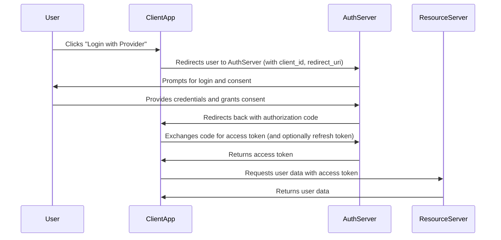

### What are OAuth and OpenID Connect?

- **OAuth** is an open standard for access delegation, commonly used to grant websites or applications limited access to user information without exposing passwords. It allows users to log in with third-party providers (like Google, Facebook) securely.

- **OpenID Connect** is an authentication layer built on top of OAuth 2.0. It provides identity verification and user profile information, making it suitable for single sign-on (SSO) and secure user authentication in modern web apps.

**In React apps:**

- Use libraries like `react-oauth2`, `oidc-client`, or authentication services (Auth0, Azure AD, Okta) to implement these flows securely.
- Never store sensitive tokens in localStorage; prefer httpOnly cookies.

# OAuth Detailed Explanation

OAuth is a protocol that allows applications to access user data from another service (like Google, Facebook, GitHub) without exposing the user's password. It is widely used for secure delegated access and third-party logins.

## OAuth 2.0 Authorization Code Flow

Below is a typical sequence for OAuth 2.0 Authorization Code Flow:

## Key Points

- The user's password is never shared with the client app.
- The access token is used to access protected resources.
- The refresh token (if provided) allows the client to obtain new access tokens without user interaction.
- Always use HTTPS for all OAuth flows.

## Further Reading

- [OAuth 2.0 Authorization Framework (RFC 6749)](https://datatracker.ietf.org/doc/html/rfc6749)
- [OAuth 2.0 and OpenID Connect in React](https://auth0.com/docs/quickstart/spa/react)
