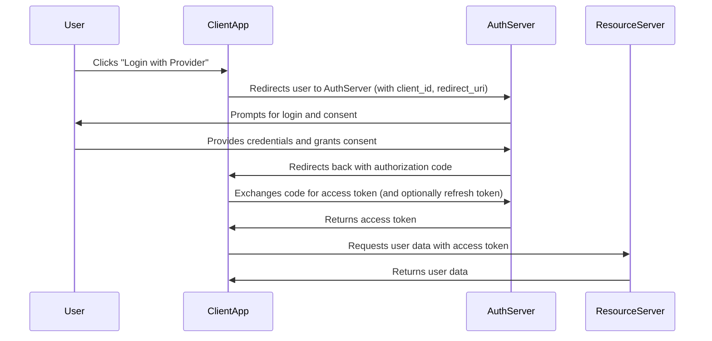

# React Security Checklist

Follow these best practices to secure your React application:

---

## 1. Cross-Site Scripting (XSS)

- Never dangerously set inner HTML with untrusted data. If done, sanitize the input.
  - Use libraries like `dompurify` to sanitize HTML.
- Always escape user input before rendering.
  - Use React's built-in escaping for text content (e.g., using `{}` in JSX).

## 2. Authentication & Authorization

- Use secure authentication flows (OAuth, OpenID Connect).

### What are OAuth and OpenID Connect?

- **OAuth** is an open standard for access delegation, commonly used to grant websites or applications limited access to user information without exposing passwords. It allows users to log in with third-party providers (like Google, Facebook) securely.

- **OpenID Connect** is an authentication layer built on top of OAuth 2.0. It provides identity verification and user profile information, making it suitable for single sign-on (SSO) and secure user authentication in modern web apps.

**In React apps:**

- Use libraries like `react-oauth2`, `oidc-client`, or authentication services (Auth0, Azure AD, Okta) to implement these flows securely.
- Never store sensitive tokens in localStorage; prefer httpOnly cookies.

## 3. Secure API Communication

- Always use HTTPS for API requests.
  **_- Validate and sanitize data on the server, not just the client._**
- Use libraries like `axios` or `fetch` with proper error handling.

## 4. Protect Sensitive Data

- Never expose secrets, API keys, or credentials in client-side code.
- Use environment variables and server-side storage for secrets.

## 5. Dependency Management

- Keep dependencies up to date.
- Audit packages for vulnerabilities (e.g., with npm audit).

## 6. Content Security Policy (CSP)

- Set CSP headers to restrict sources for scripts, styles, and other resources.

**Content Security Policy (CSP)** is a browser security feature that helps prevent attacks like Cross-Site Scripting (XSS) and data injection by specifying which sources are allowed to load content on your site.

**How it works:**

- You set a CSP header in your server response (e.g., `Content-Security-Policy`).
- The browser enforces the policy, blocking resources from unauthorized sources.

**Example CSP header:**

```
Content-Security-Policy: default-src 'self'; script-src 'self' https://apis.example.com; style-src 'self' https://fonts.googleapis.com
```

**Practical tips for React apps:**

- Use `'self'` to allow only your own domain for scripts and styles.
- Whitelist trusted third-party sources (e.g., Google Fonts, API endpoints).
- Avoid using `unsafe-inline` or `unsafe-eval` unless absolutely necessary.
- Test your CSP policy to ensure it doesn't break legitimate functionality.

**Tools:**

- Use Helmet (Node.js/Express middleware) to set CSP headers easily:
  ```js
  const helmet = require("helmet");
  app.use(
    helmet.contentSecurityPolicy({
      directives: {
        defaultSrc: ["'self'"],
        scriptSrc: ["'self'", "https://apis.example.com"],
        styleSrc: ["'self'", "https://fonts.googleapis.com"],
      },
    })
  );
  ```

## 7. Prevent CSRF

- Use CSRF tokens for state-changing requests if your app interacts with cookies.

**Cross-Site Request Forgery (CSRF)** is an attack where a malicious website tricks a user's browser into making unwanted requests to your app, using the user's credentials (e.g., cookies).

**How CSRF works:**

- The attacker lures the user to a malicious site.
- The site makes a request to your app (e.g., POST, PUT, DELETE) using the user's cookies, without their consent.

**How to prevent CSRF:**

- Use CSRF tokens: Generate a unique token for each user session and require it in every state-changing request (e.g., form submission, API call).
- The server validates the token before processing the request.

**In React/Node apps:**

- For apps using cookies for authentication, always implement CSRF protection on the backend (e.g., Express with `csurf` middleware).
- For APIs using JWT in headers (not cookies), CSRF is less of a concern, but still validate origins and use CORS.

**Example (Express + csurf):**

```js
const csurf = require("csurf");
app.use(csurf({ cookie: true }));

// In your React app, include the CSRF token in requests:
fetch("/api/data", {
  method: "POST",
  headers: {
    "CSRF-Token": csrfToken,
  },
  body: JSON.stringify(data),
});
```

**Tips:**

- Always use same-site cookies (`SameSite=Strict` or `Lax`) for authentication cookies.
- Never trust requests from unknown origins; validate the `Origin` and `Referer` headers on the server.

## 8. Avoid Open Redirects

- Validate redirect URLs to prevent attackers from sending users to malicious sites.

## 9. Secure File Uploads

- Validate file types and sizes on both client and server.

## 10. Error Handling

- Avoid exposing stack traces or sensitive error details to users.

---

## References

- [OWASP Cheat Sheet: React Security](https://cheatsheetseries.owasp.org/cheatsheets/React_Security_Cheat_Sheet.html)
- [OWASP Top 10](https://owasp.org/www-project-top-ten/)

---

# OAuth Detailed Explanation

OAuth is a protocol that allows applications to access user data from another service (like Google, Facebook, GitHub) without exposing the user's password. It is widely used for secure delegated access and third-party logins.

## OAuth 2.0 Authorization Code Flow

Below is a typical sequence for OAuth 2.0 Authorization Code Flow:



## Key Points

- The user's password is never shared with the client app.
- The access token is used to access protected resources.
- The refresh token (if provided) allows the client to obtain new access tokens without user interaction.
- Always use HTTPS for all OAuth flows.

## Further Reading

- [OAuth 2.0 Authorization Framework (RFC 6749)](https://datatracker.ietf.org/doc/html/rfc6749)
- [OAuth 2.0 and OpenID Connect in React](https://auth0.com/docs/quickstart/spa/react)
