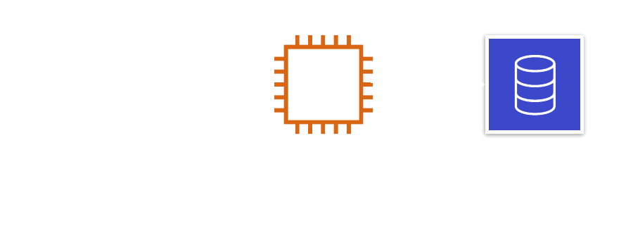
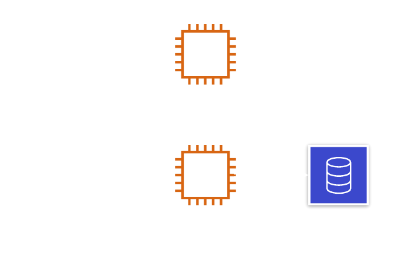

# Common Backend System Architectures

## Monolithic

Overview
Monolithic architecture has all functionalities tightly coupled, running in the same system.
This architecture is simple to develop, test, and deploy due to its unified system.

Pros

- Simplicity: Easier to develop, test, and deploy due to unified system.
- Consistency: Allows for uniformity in handling requests as every module uses the same set of procedures.
- Efficiency: Since all the functionalities are interconnected, it can be more efficient in terms of inter-process communication.

Cons

- Limited Scalability: Scaling specific functions of a system is not possible. The entire system needs to be scaled.
- Lack of Flexibility: Changes to a single component can require the entire system to be redeployed.
- Complexity: The system can become too complex and hard to manage as the application grows.

Use Cases

- Small-scale applications: Given its simplicity, a monolithic architecture is often suitable for small-scale applications or startups where the application's scope is clear and unlikely to drastically change or scale.
- Applications with simple, well-defined business processes: Monolithic architecture can be beneficial in scenarios where the business processes are simple and unlikely to require significant changes or additions.
- Applications where high performance is critical: Since all functionalities are interconnected, a monolithic architecture can provide faster inter-process communication compared to other architectures.

## Distributed (service-oriented)

Definition
Generic services and/or microservices architecture is a method of developing software systems that are loosely coupled and independently deployable smaller services, which run in their own processes.

Overview
This architecture allows for continuous delivery and deployment of large, complex applications. It also enhances an organization's capability to innovate and reduces the time to market for new features.

Definition
"Generic services" often refers to a component of an application that provides specific functionality for the platform.

"Generic services" could be part of a monolithic application where all services run within the same process, or it could be part of a distributed system where services may run in separate processes or on separate machines.

### Distributed (generic services)

### Distributed (microservices)

Definition
"Microservices" are a specific style of service-based architecture. In a microservices architecture, each service is small, independent, and loosely coupled.

"Microservices" run in their own process and communicate with other "services" using protocols such as HTTP/REST or messaging queues. They can be developed, deployed, and scaled independently, which offers more flexibility than traditional service architectures.

### Distributed (service-oriented) Pros and Cons

Pros

- Independent Development: Each service can be developed independently by a team that is focused on that service.
- Independent Deployment: Services can be deployed independently.
- Fault Isolation: A process failure should not bring the whole system down.
- Mixed Technology Stack: Different services can use different technologies.

Cons

- Distributed System Complexity: Developers must deal with the additional complexity of creating a distributed system.
- Development and Testing: Writing and testing applications is more difficult due to it being a distributed system.
- Data Management: Managing data consistency can be challenging.
- Network Latency: Communication between services can introduce latency.
- Communication Complexity and Overhead:
  Services need to communicate over a network, which can introduce complexity and overhead.

### Use Cases

- E-commerce platforms: They often need to handle high volumes of transactions and user interactions, which can be efficiently managed through independent microservices.

- Social media platforms: The various functionalities like posting, messaging, and notifications can be divided into separate microservices.

- Streaming services: Microservices can help handle the heavy load and deliver smooth streaming experience.

- Online gaming platforms: They can use microservices to manage game logic, player data, and real-time multiplayer interactions separately.

- Large-scale IoT systems: Each device or sensor type can be managed by a dedicated microservice.

## Serverless

Definition
Serverless architecture refers to applications that significantly depend on third-party services (backend-as-a-service or "BaaS") or on custom code that's run in ephemeral containers (function as a service or "FaaS").
