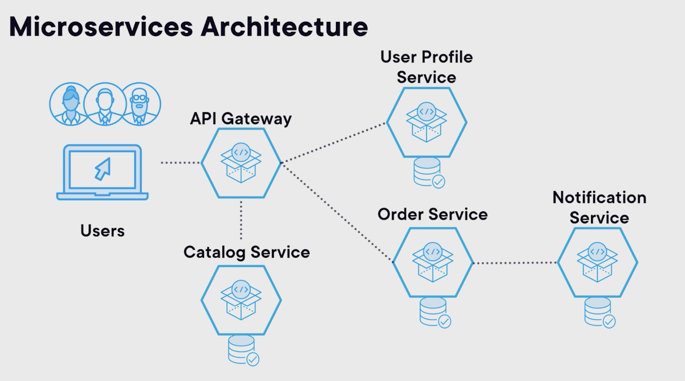

## Distributed (service-oriented)

Definition
Generic services and/or microservices architecture is a method of developing software systems that are loosely coupled and independently deployable smaller services, which run in their own processes.

Overview
This architecture allows for continuous delivery and deployment of large, complex applications. It also enhances an organization's capability to innovate and reduces the time to market for new features.

Definition
"Generic services" often refers to a component of an application that provides specific functionality for the platform.

"Generic services" could be part of a monolithic application where all services run within the same process, or it could be part of a distributed system where services may run in separate processes or on separate machines.

### Issues with monolithic

- Long development cycles due to the need for coordination between teams and code changes impact
- Lack of flexibility in technology choices, as the entire application is built with a single stack
- Difficulties in scaling specific components, as the entire application must be scaled together
- Lack of fault isolation, as a failure in one component can bring down the entire application

### Distributed (generic services)

### Distributed (microservices)

Definition
"Microservices" are a specific style of service-based architecture. In a microservices architecture, each service is small, independent, and loosely coupled.

"Microservices" run in their own process and communicate with other "services" using protocols such as HTTP/REST or messaging queues. They can be developed, deployed, and scaled independently, which offers more flexibility than traditional service architectures.

### Distributed (service-oriented) Pros and Cons

Pros

- Independent Development: Each service can be developed independently by a team that is focused on that service.
- Independent Deployment: Services can be deployed independently.
- Fault Isolation: A process failure should not bring the whole system down.
- Mixed Technology Stack: Different services can use different technologies.

Cons

- Distributed System Complexity: Developers must deal with the additional complexity of creating a distributed system.
- Development and Testing: Writing and testing applications is more difficult due to it being a distributed system.
- Data Management: Managing data consistency can be challenging.
- Network Latency: Communication between services can introduce latency.
- Communication Complexity and Overhead:
  Services need to communicate over a network, which can introduce complexity and overhead.

### Use Cases

- E-commerce platforms: They often need to handle high volumes of transactions and user interactions, which can be efficiently managed through independent microservices.

- Social media platforms: The various functionalities like posting, messaging, and notifications can be divided into separate microservices.

- Streaming services: Microservices can help handle the heavy load and deliver smooth streaming experience.

- Online gaming platforms: They can use microservices to manage game logic, player data, and real-time multiplayer interactions separately.

- Large-scale IoT systems: Each device or sensor type can be managed by a dedicated microservice.

## Serverless

Definition
Serverless architecture refers to applications that significantly depend on third-party services (backend-as-a-service or "BaaS") or on custom code that's run in ephemeral containers (function as a service or "FaaS").

# Definitions

Adrian Cockcroft defines the microservices architecture as a service‑oriented architecture composed of loosely coupled elements that have bounded context.

According to Martin Fowler, it's an approach to developing a single application as a suite of small services, each running in its own process and communicating with lightweight mechanisms, often an HTTP resource API.

These services are built around business capabilities and independently deployable by fully automated deployment machinery.

Chris Richardson states that the microservices architecture is an architectural style that functionally decomposes an application into a set of services.

Note that this definition doesn't say anything about size. Instead, what matters is that each service has a focused cohesive set of responsibilities.

And finally, Sam Newman says that microservices are small, autonomous services that work together.

As you can see, the definitions differ, and they emphasize different aspects.

## SMALL

The "micro" name implies that the services are small. This is somewhat misleading, as it is not the most important requirement.

As we will see, one of the main advantages of microservices is that they enable large organizations to work effectively by organizing themselves into small, autonomous teams. So although some authors propose that the size of a microservice should be small enough that it can be written from scratch in a couple of weeks, a more realistic requirement for it is that it should be easily handled by a small team of up to around eight people (two‑pizza team).

## BOUNDED CONTEXT

The services should be organized around bounded context. This is a term that comes from Eric Evans' book, Domain‑Driven Design

The key idea is that the definitions of terms like customer, order or account, which constitute the domain models and entities of our design, really depend on the context.

Our applications will be better designed if we only use the elements of the entity that each context needs instead of having what is sometimes called a god class

Imagine that in an events application, an order could potentially contain hundreds of elements from the credit card information to the customer details or the artist details and details from the venue where the event is happening, etc.

By using bounded context, we ensure that, for example, when the order service deals with an order to process the payment, it only has to deal with the information that it cares about like credit card number and not the details from the artist.

## Loosely Coupled / Interfaces based

Microservices should also be loosely coupled, which basically means that one service can change without affecting others.

This is usually achieved by a combination of factors.

First, increasing the cohesion of each service, which essentially means that services perform a specific task instead of having multiple unrelated responsibilities.

Secondly, by communicating mostly over APIs, which are the only interface that a service has. This means that as long as the interface does not change, any change on the behavior of the system won't need to propagate to other changes into other systems.

## Autonomy / Encapsulation

This leads nicely into the next feature, which is autonomy, which states that teams do exercise this ability to change services independently of others.

This is one of the most important features of microservices, as this is what really enables teams to own different services without needing to coordinate between themselves for every change.

**_And this is what other service‑oriented architectures don't have and where microservices really shine. _**

Let's look at some of the elements that enable this autonomy.

First, services should be independently deployable.
Teams should be able to ship changes to a service independently of any others.
If they need to coordinate the changes or have any kind of release schedule, the services are not really independently deployable, and therefore, they are not using microservices.

Next, there should be no shared databases. Each service has their own database, and therefore, any changes to the schema, any migrations or even a complete change from SQL to NoSQL only affects that particular service. This also enables teams to choose and manage each database independently of other teams.

Finally, as mentioned before, the services can only communicate through APIs, and they can't share data in the database, memory or any other form. This enables, for example, to rewrite part of the service or even the whole service without affecting any of its consumers.

Without all these essential ingredients for effective microservices, teams risk creating a **_distributed monolith_**, which has the worst of both worlds, all the disadvantages of the monolithic architecture with all the complexity of distributed systems.

## Independent Processes

Which essentially means that the microservices can share memory or other resources and must communicate over a remote protocol.

## Lightweight Communication

And finally, this form of communication should be lightweight. Some service‑oriented architectures have the philosophy of heavy protocols, what is sometimes called smart pipes, but microservices focus on dumb pipes or simple protocols containing only data, although the specific format can vary.

# Key considerations

Let's now close our introduction to microservices with exploring what are some of the considerations, practices, and technologies that go hand in hand with microservices.

With distributed systems come some challenges about observability.

With monolith, it's easy to look at logs and track a bug throughout the code. But with microservices, there are dozens or even hundreds of different applications producing logs in different machines and tracing becomes a challenge.
Metrics about the system also become really central to debug, understand, and prevent issues. Testing a single application is usually simpler, as it normally can run into a developer's laptop.
However, testing a distributed architecture is more challenging, including how services integrate with each other, their API contracts, load testing, and their performance characteristics, and also, issues around consistency, network issues or partial failures of other services.

To really leverage the autonomy and agility that microservices bring, teams need a continuous integration pipeline where they can deploy changes into production many times per day without having to coordinate releases with other teams.

This greatly reduces the number of bugs and the impact they have as features are implemented incrementally and can be rolled back more easily with less impact for customers. Virtualization technologies such as Docker and Kubernetes really complement microservices, as well as a good DevOps culture, which allows developers to be more productive.

This is so essential that even Martin Fowler included it in his definition of microservices earlier.

Finally, securing a microservices application can be more challenging than monolith, so this is also a key concern for organizations.
