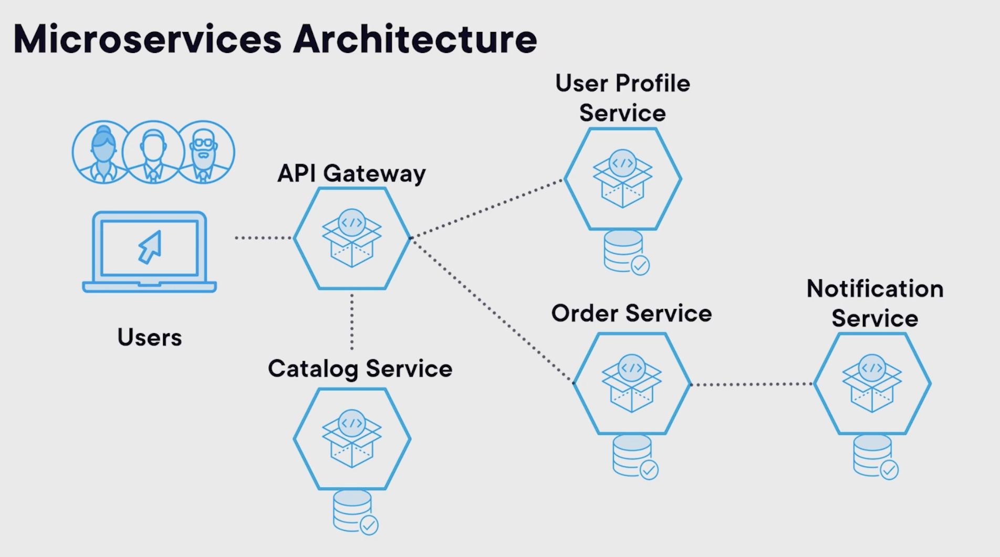
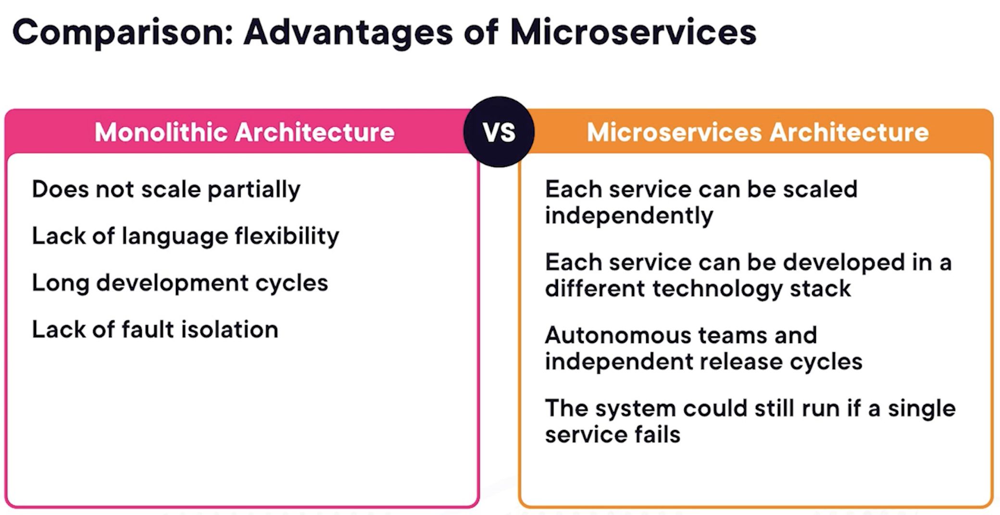
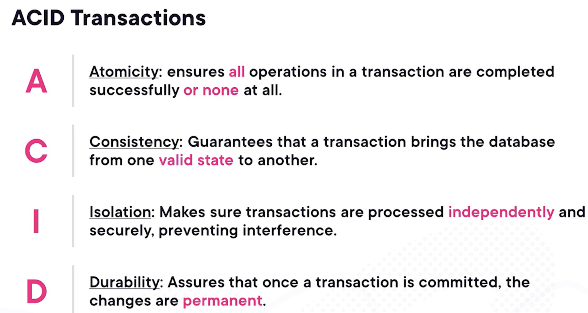
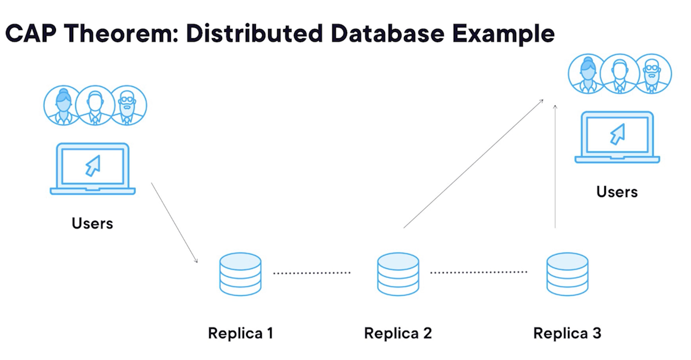
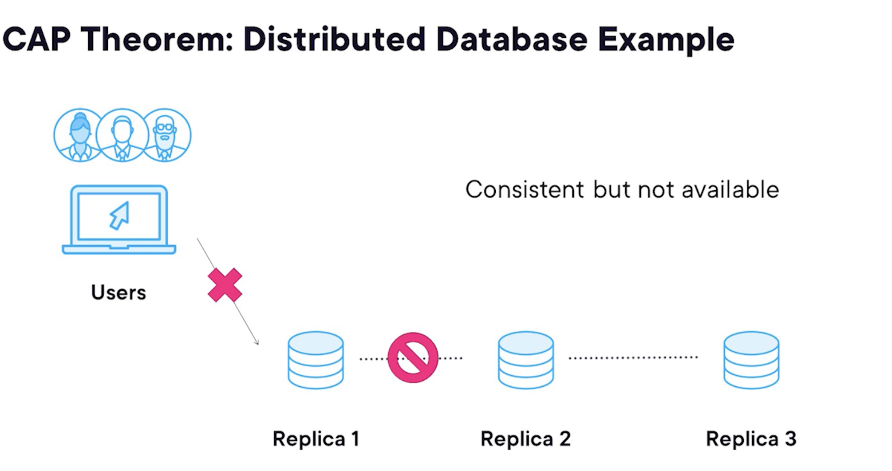
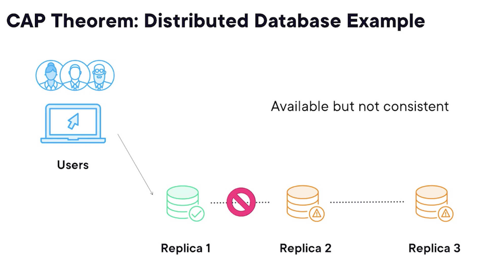
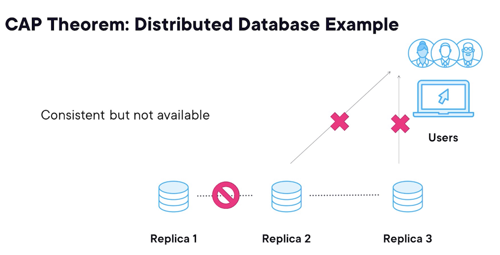
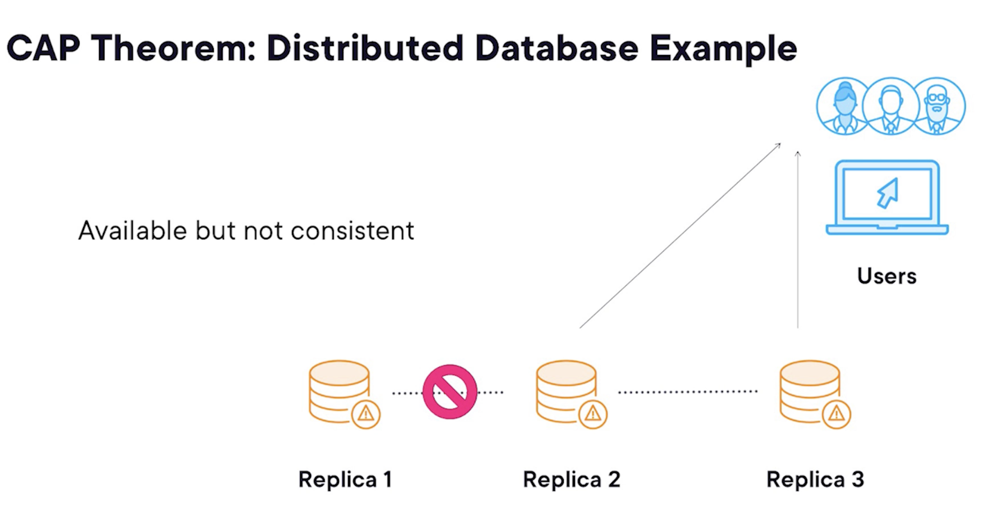

## Imaginary system for booking events

Microservices architecture diagram

Elements:
Users
API Gateway
Catalog Service

Functional decomposition: Each service is responsible for a specific functionality, such as user management, event catalog, booking, and payment processing.

Microservices are a type of SOA, but not all SOA implementations are microservices. Microservices are smaller, more focused services that can be developed, deployed, and scaled independently.

### Benefits of a Microservices Architecture for the Event Booking System

#### Independent scalability

Each service can be scaled independently based on its load and performance requirements. For example, if the booking service experiences high traffic during a sale, it can be scaled up without affecting other services.

For one event, the traffic is expected to spike dramatically. In a monolith, you'd have to scale the entire application, consuming vast resources.

With microservices, on the other hand, you can scale just the specific services that will be under heavy load like the order service without affecting the others.

#### Technology diversity

Each service could potentially be developed using a different technology. Different tasks might require different tools.

Let's see how this could be a major win for our event system.
Imagine they initially built their platform using Java. Now they want to integrate a cutting‑edge recommendation engine that would be better suited for Python. In a monolithic architecture, that's a tough call, but in a microservices environment, they could easily add a new service using Python without disrupting the rest of the system.

But it's not just about languages. It's also about frameworks. Perhaps one service benefits from Spring Boot's robust feature set while another might require Node.js for its event‑driven architecture.

Although this sounds great in theory, in practice, companies often restrict the choices to a couple of languages and frameworks, as otherwise, it's challenging to move people around to deal with technologies they are not familiar with.

With the current monolithic architecture, the event system engineers are stuck in old versions of libraries since updating them is not a priority for all teams. And with time, this becomes harder and harder and riskier.

#### Independent deployment

Each service is autonomous and can be released independently of others. In a monolithic system, deploying a small change often requires the entire application to be redeployed.

This is not just resource‑intensive, but also risky.
A single error can bring down the whole system.
As a result, multiple teams must coordinate for even minor changes, creating bottlenecks and slowing down development.
In microservices architecture, on the contrary, each service is independent, meaning it can be developed, deployed, and scaled separately from the rest, as we already saw.

Each team owns a different set of services, which speeds up feature development and allows teams to be more agile. So, if the company decides to update their order service to add a new recommendation engine, they can do this without impacting other parts of the system.

This agility makes it easier to roll out a new feature or do A/B testing and quickly rectify any issues. But autonomy also brings ownership. When a team owns a service, they are responsible for it from end to end, design, development, deployment, and maintenance.

This fosters a sense of accountability and encourages teams to build a high quality service.

If an issue arises, then there's no ambiguity about who's responsible for fixing it. This shift towards teams' autonomy and ownership can also have a profound impact on the company culture.
It empowers teams, boosts their morale, and often leads to higher job satisfaction.

#### Fault isolation

And finally, resilience by fault isolation. One of the defining characteristics of a successful online platform is its ability to stay up and running no matter what.

Unexpected downtimes can be a nightmare, both for the user experience and for the company's reputation.

In a monolithic system, a failure in one component could potentially bring down the entire application. In a microservices architecture, each service operates independently. So if, for instance, the catalog service fails, it won't directly impact the ticket purchasing or user authentication.

Each service is isolated, ensuring that failure in one system doesn't cascade into a system‑wide outage.

### Costs or challenges of a Microservices Architecture

- Harder to test
  In a monolithic architecture, you can usually spin up the entire application on your log machine to test how components interact. But with microservices, there are complex workflows in which multiple services interact with each other. Integration tests need to account for this, making sure that services are working well together. This is not only harder to set up, but also more time‑consuming to run, usually requiring a separate test environment more powerful than the developer's laptop. End‑to‑end testing is another beast altogether.
  A distributed system would need to simulate the entire process of a user buying a ticket from log in to payment to issuing the ticket. Since each of these steps could be handled by a different microservice, end‑to‑end tests becomes significantly more challenging.

You are no longer just checking a single codebase. You are testing an entire ecosystem of interacting services. Creating realistic test environments for microservices is also complex. You need to mimic service dependencies, databases, and even network latency. It's almost like needing to recreate a mini version of your production environment just for testing purposes.

Last, but not least, running these comprehensive tests can be resource‑intensive. Unlike monolith where a single test suite may suffice, we would potentially need to maintain multiple test suits for each service, requiring more computational resources and consequently increasing costs.

- Harder to deploy
  Second, deployment is also hard. Yes, each service can be deployed independently. That's great for flexibility and speed, but it also means that a single change can have ripple effects across other services

  Eventually the time will come when a feature will require coordination across many services. For instance, a new feature might require to change the order service, catalog service, and user service, which will inevitably require coordinations between teams.

  Hopefully, the flexibility they gain with microservices will give them more options on how to deal with this. In a microservices world, services communicate via APIs. We usually want to make our APIs backwards compatible so that all consumers of the API can still communicate with newer versions of the service.

  But from time to time, a breaking change will be introduced, and the team will need to have a robust API versioning strategy to ensure that older and newer versions of services can coexist and communicate without breaking each other.

  And what if something goes wrong? Rollbacks are significantly more complicated in a microservices setup. You would need to coordinate the rollback across multiple services, which can be a logistical nightmare.

  ### Complexity of deployment

  Lastly, the complexity of deployment pipeline increases. We will likely have a different pipeline for each microservice. Managing these pipelines, especially when services are interdependent, requires advanced CI/CD strategies and tools.

  Third, engineers are now dealing with a distributed system as multiple services are communicating over an unreliable network where packages can get lost, arrive out of order, services can go down, become unresponsive or even the network can become partitioned into disconnected pieces for a period of time.

  In a microservices architecture, services often need to work together to complete tasks. For us, this could be as simple as validating a user and processing payment to issue a ticket.
  In the monolith, these steps would typically be part of a single coordinated process, but in a distributed setup, each service might be running in a different location, possibly even on different continents.

  ### Fourth, increased codebase complexity

  Switching to microservices means would would be transitioning from a single codebase to potentially dozens or even hundreds of smaller services. While this enhances modularity and scalability, it also increases complexity exponentially.

  Each service now has its own database, its own unique set of dependencies, and its own development and deployment pipeline.
  Handling the state in a distributed system adds another layer of complexity.
  We needs to know, for example, whether a ticket has been paid for, is pending or has been canceled. The move to microservices isn't just a tech switch.

  It's an architectural evolution. Microservices require a high level of architectural maturity.

  For instance, you'll need to tackle questions like:

  - how will services communicate?
  - How will data consistency be maintained?
  - How will you ensure transactional integrity across multiple services?

  This means a significant investment in upskilling the team.

  ### Fifth, observability is a challenge

  In a monolithic architecture, monitoring, logging, and tracing are centralized. You could look at the single application's performance metrics, errors, and logs all flowing linearly, and this makes it relatively simple to troubleshoot issues.

  But with a transition to microservices, each service can generate its own metrics and logs. So the monitoring setup must be distributed across multiple services, each potentially running in its own environment.

  This requires advanced solutions that can aggregate logs and metrics from different services to give you a cohesive view of what's happening.

  When a user goes through the process of buying a ticket, that transaction might pass through several microservices. Tracing this transaction end to end becomes important for debugging and performance.

### And finally, we need to deal with the CAP theorem and eventual consistency.

The CAP theorem states that in a distributed system, you can only achieve two out of the following three guarantees, consistency, availability, and partition tolerance. For instance, if you prioritize consistency and partition tolerance, you might have to sacrifice availability.

## CAP theorem

But why should we care about the CAP theorem?

Well, in a monolithic setup, consistency is relatively straightforward because there's usually a single centralized database where ACID transactions are possible.

ACID stands for Atomic, Consistent, Isolated, and Durable.

However, in a microservice's work, ensuring that data is consistent across multiple services and databases becomes a complex task.

If, for instance, someone buys the last ticket to an event, that information must propagate quickly across all related services to prevent overselling.

To understand this, let's look at an example with database replica.

In a distributed database system, you don't just have one copy of your data. You have multiple replicas often spread across different servers or even geographical locations. This is done for fault tolerance, load balancing, and improving data availability.

When a client writes data to this kind of system, the write ideally should be reflected across all replicas. Similarly, when a client reads data, it expects to see the most recent write. In a perfect world, this would always happen instantaneously.

But as I mentioned before, networks can and do fail. Let's say a network partition occurs, separating these replicas into isolated subnets.

Now, if a client writes data to one set of replicas, how do you ensure this write is consistent across all replicas when some are unreachable? You have a dilemma.

If you aim for **_consistency_**, you'd refuse the write until you can update all replicas, making the system unavailable for that time.

But if you aim for **_availability_**, you'd accept the write on the accessible replicas, but this means the system is now in an inconsistent state until the partition is resolved.

Similarly, when a client tries to read data during a partition, what do you serve them? If you aim for **_consistency_**, you'd refuse to serve the read request until you can guarantee it reflects the most recent write, making the system unavailable.

But if you aim for **_availability_**, you'd serve the data from the nearest accessible replica, knowing well that it might not reflect the most recent write, thereby compromising consistency.

The CAP theorem essentially acts as a guiding principle here. If the team opts for strong consistency, they might end up compromising the speed at which their services can read or write the data, affecting user experience.

On the flip side, if they choose to optimize for **_availability_**, they risk ending up with data that's not consistent across all services, which could lead to confusing or incorrect displays of information.

To erase these pains, we could adopt an eventually consistent model. This means that while data might be inconsistent for a brief period, it will eventually become consistent across all services.

## Hidden costs

It's worth mentioning that microservices can come with some hidden costs that you will need to be aware of.

These are often overlooked, but are equally crucial.

### Infrastructure costs

While it's true that microservices can be more efficient in utilizing system resources, the need for more powerful observability and monitoring tools and databases for each service and other support services can drive up infrastructure costs.

### Tooling and platforms

Specialized tools for continuous integration, continuous deployment, API gateways, service measures and the like aren't cheap. You will need a comprehensive toolset to manage their new architecture effectively, and this can represent a substantial investment.

### Development and maintenance costs

Despite the advantages of smaller codebases and team autonomy, maintaining multiple codebases, libraries, and databases for each service can be a daunting task.
This can slow down your development cycle and increase the cost in terms of developer time.

### Complexity costs

We've talked about the increased complexity several times, but it's a cost in itself. You will need expertise in distributed systems, and that expertise comes at a premium.

The cognitive load on developers and the organization as a whole shouldn't be underestimated.

## When to use microservices

Microservices are not a silver bullet.

They come with their own set of challenges and costs that you needs to be fully aware of.

Making informed decisions about whether to adopt this architectural style will be critical to your long‑term success.

It's vital to emphasize one key point. The right architectural choice is highly contextual.

The decision to move to a microservice architecture is based on specific needs around scalability, resilience, and flexibility.

Project requirements matter.

Each company and system has its set of challenges and goals, just as your own projects will have their own unique requirements.

Whether it's dealing with legacy systems, specific compliance needs or the team's skill set, each factor will influence the best architectural path forward.

Timing is also important. Sometimes, the timing is right to make a shift. The growth and the demands on the user base necessitated a more robust and scalable architecture.

But for a new startup or a smaller team, a monolithic approach might be more suitable, at least initially.

Next, consider long‑term implications. Moving to microservices is a significant investment, both in time and resources.

You have to consider long‑term implications, including complexities and costs. If these are misaligned with your project's long‑term vision, then the move could do more harm than good.

Finally, it's a continuous assessment. Keep in mind that architectural decisions aren't set in stone. You will likely continue to assess the performance, costs, and benefits of your new architecture, adapting as your needs evolve. So should you.
