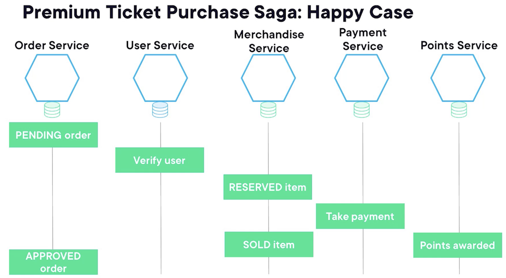
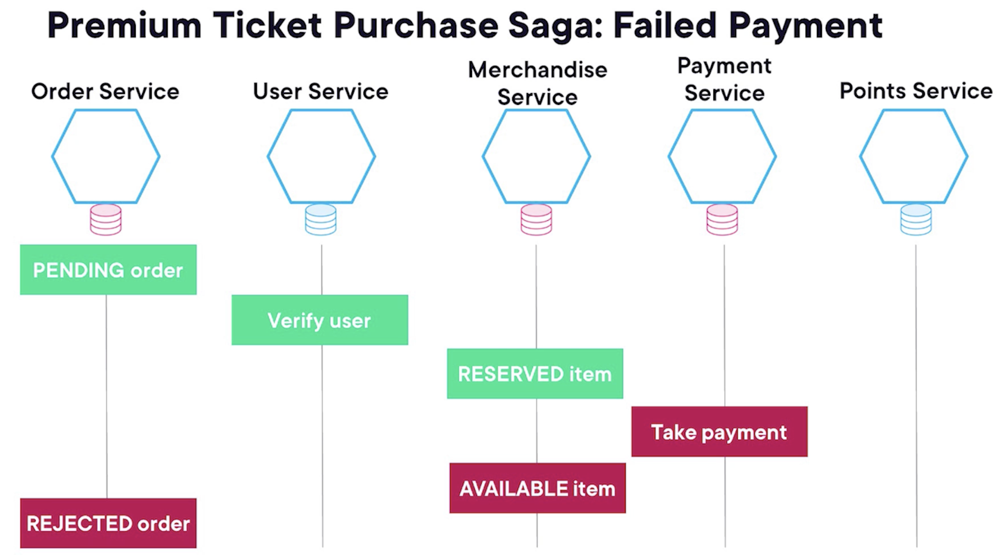

# Service Coordinations

_Coordination patterns for orchestrating and managing microservices interactions._

---

> We will talk about how microservices coordinate actions and data across different services in a distributed environment.

As we saw when we discussed the disadvantages of microservices, dealing with distributed systems can be challenging, and this extra complexity should not be underestimated.

---

### Monolithic vs Distributed Coordination

**Monolithic systems:**

- Easy to coordinate between different parts (same process, shared memory)
- ACID transactions and locking mechanisms (mutex, semaphores) guarantee consistency

**Distributed systems:**

- Locking is challenging for two main reasons:
  - **Performance degradation:** Locks create bottlenecks, slowing down the system.
  - **Deadlocks:** Multiple services requesting locks can cause a system to come to a grinding halt.

---

### Distributed Transactions

Distributed transactions extend the idea of local transactions, but across multiple services.

**Example:**

- **Two‑phase commit**
  - Distributed transaction protocol that enables multiple resources to agree on committing or aborting a transaction.
  - Each participant can have consistent transactions locally, and this protocol relies on that fact.

> Two‑phase commit may sound promising, but it has significant drawbacks:

**Drawbacks:**

1. **Blocking nature:** If one participant crashes after the prepare phase, other participants are left hanging, unsure whether to commit or abort.
2. **Single point of failure:** The coordinator itself can become a bottleneck or point of failure.
3. **Lacks scalability:** The more services involved, the more complex and time‑consuming the protocol becomes.

> Recall that, as we saw in a previous module, distributed systems are affected by the **CAP theorem**. So, if they want to be able to tolerate network partitions, they have to choose between availability and consistency.

Distributed transactions lower the availability of the system by trying to impose stronger consistency guarantees.

> Given these problems, distributed transactions and two‑phase commit are often considered too risky or too cumbersome for microservices architectures.

> They simply don't align well with the principles of loose coupling and scalability that microservices aim to achieve.

## Solution: SAGA pattern

So what can we do to achieve consistency in microservices and coordinate between different services?

> We still have functional requirements, of course. For example, the event booking system does not want to sell more tickets than are available for a given venue or to charge a customer twice because they can't guarantee consistency.

---

### What is the SAGA Pattern?

- A **saga** is a sequence of local transactions, which updates data in a single service using ACID transactions and local locking mechanisms to achieve consistency.

**Key points:**

- Coordination is done with asynchronous messages to avoid the issues with two‑phase commit and other distributed transactions.
- Services are not blocked in a pending state while waiting for other nodes, allowing them to process other tasks.

---

### Trade-offs

- Sagas lack **isolation** (the "I" in ACID).
  - In ACID transactions, one update does not interfere with others.
  - With sagas, many can happen concurrently and may interfere with each other.

---

### Handling Failures

> Sagas deal with problems and partial failures not by locking resources and waiting for all participants to commit or roll back, but by issuing a **compensating transaction**.

- A compensating transaction is an "undo" operation to bring the system to the desired state when the saga could not be completed.

### Example

Let's see one example of a saga for an event's booking system's application.

Imagine there's one benefit that premium users of an event's booking system have where each time they buy tickets for a concert, they get awarded loyalty points, and also, they get a merchandise gift like a T‑shirt or an album of the artist they bought the ticket for.

For this example, let's assume an event's booking system has an order service, which will store the data of orders, a user service, which holds details from the user, for example, if they are a premium user or not.
Then there's the merchandise service, which stores data about the merchandise items.

The payment service holds the payment details and talks to external APIs to charge the user's credit card.

And finally, the points service manages the loyalty points for the users.
So let's first see how the saga proceeds in the happy case.

In this diagram, time flows towards the lower part of the screen.

First, the **_order service_** creates an order in the pending state. This is a local transaction that commits to the order service database, so no locks exists.
This service just forgets about this and continues doing other things.

The **_user service_** will verify if the user is indeed a premium user before proceeding with the purchase.

Then the **_merchandise service_** will verify that the item is available and will commit a local transaction to its database, changing the state to reserved so no other customers can buy the same item.

Next, the **_payment service_** will process the user's credit card and take payment, updating the payment details in its local database with a transaction.

Next, the **_merchandise service_** will set the item status as sold, and also the **_points service_** will award the loyalty points to the user's account.

And finally, the **_order service_** will update the order status to approved.

Let's now go back and imagine what happens if the user's credit card is rejected.

!

The **_payment service_** can't take the payment. Therefore, it commits a local transaction in its database indicating that.

Next, the **_merchandise service_** will commit a local compensating transaction, which undoes the original reservation transaction, taking the item back to available status so other customers can now buy it.

And finally, the **_order service_** issues a local compensating transaction for the pending order rejecting it so now other customers can buy the same seat for the event.

Note that no loyalty points were ever awarded in this scenario.

This was a simplified case. In a real example, the saga will contemplate the possibility of each step going wrong and all compensating transactions that can happen.
